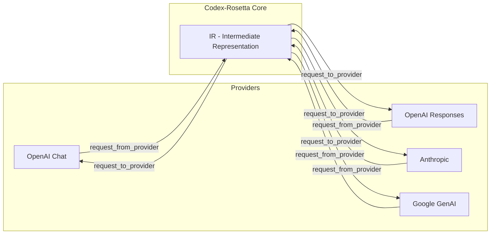
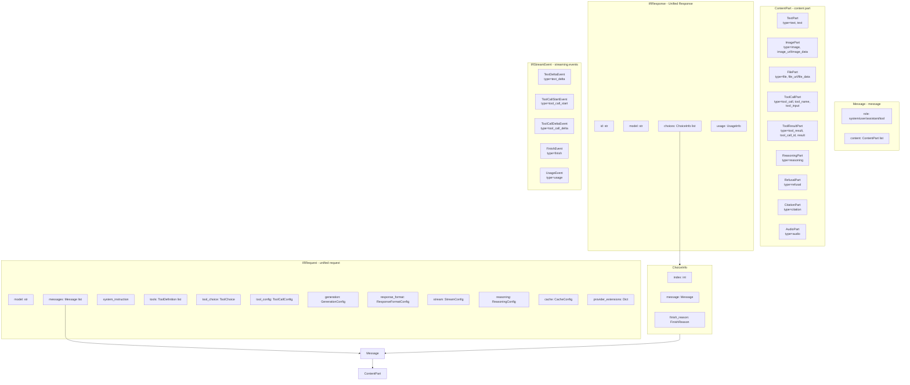
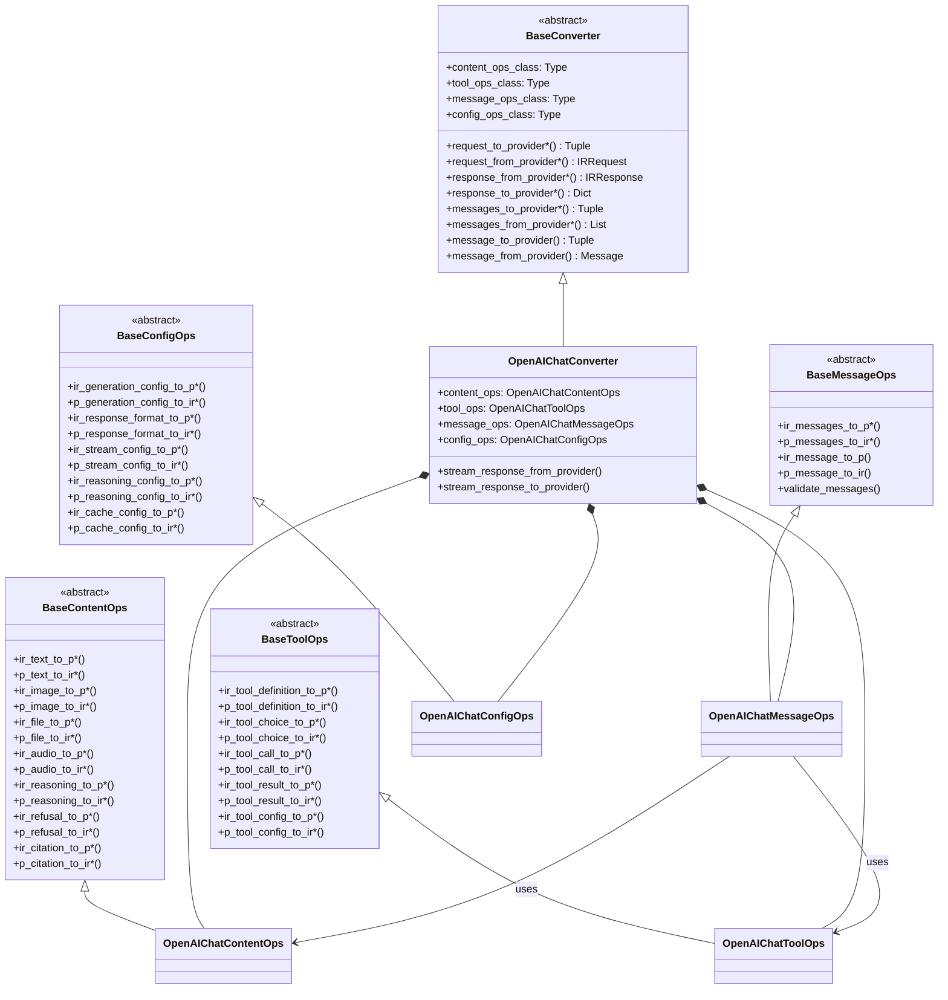
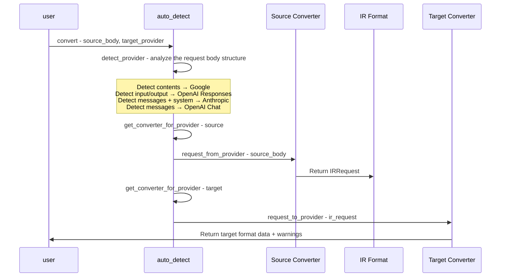
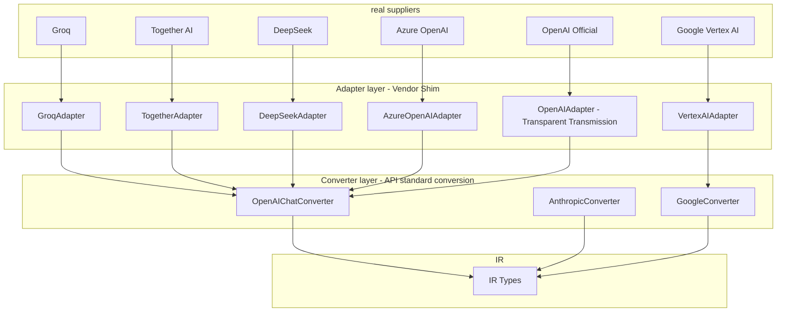
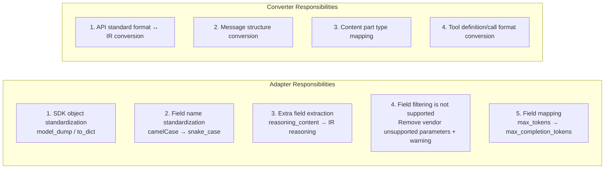
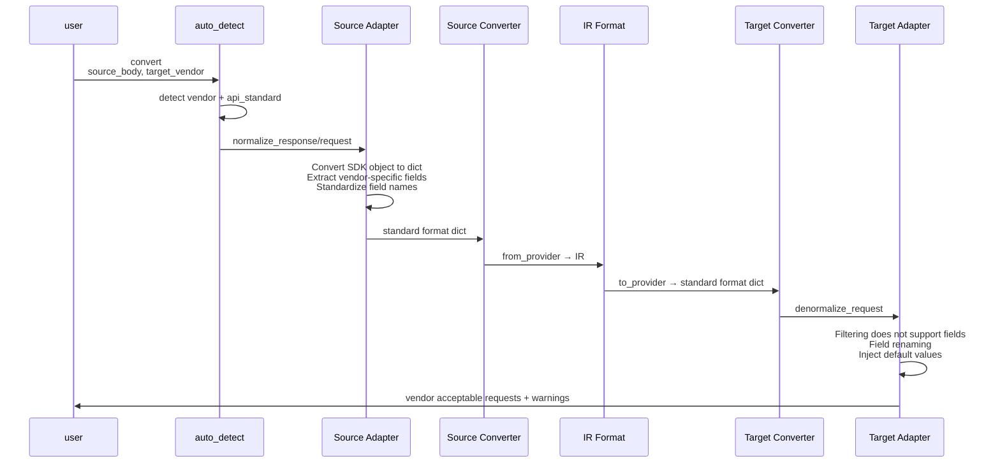

# Codex-Rosetta Project Architecture

Codex-Rosetta (LLM Intermediate Representation) is a Python library for converting between different LLM Provider API formats. The core idea is to use a unified intermediate representation (IR) as a hub to realize format conversion between Providers.

## 1. Overall Architecture: Hub-and-Spoke



Conversion process: `Provider A format → Converter A.request_from_provider → IRRequest → Converter B.request_to_provider → Provider B format`

Response process: `Provider Response → Converter.response_from_provider → IRResponse → Converter.response_to_provider → Provider Response`

Streaming process: `Provider SSE Chunk → Converter.stream_response_from_provider → IRStreamEvent → Converter.stream_response_to_provider → Provider SSE Chunk`

## 2. Package structure overview

```mermaid
graph TB
    subgraph codex-rosetta - top-level package
        init[__init__.py<br/>Exports core types and convenience functions]
        auto[auto_detect.py<br/>Provider automatic detection and convenient conversion]
    end

    subgraph types - type definitions
        subgraph ir - IR type
            parts[parts.py<br/>ContentPart type]
            messages[messages.py<br/>Message type]
            tools[tools.py<br/>Tool definition and selection]
            configs[configs.py<br/>Generate/Inference/Streaming/Cache Configuration]
            request[request.py<br/>IRRequest]
            response[response.py<br/>IRResponse]
            ir_stream[stream.py<br/>IRStreamEvent]
            extensions[extensions.py<br/>ExtensionItem]
            helpers[helpers.py<br/>helper function]
            type_guards[type_guards.py<br/>Type guards]
        end
        subgraph openai_types[openai/chat - OpenAI types fork]
            req_types[request_types.py]
            msg_types[message_types.py]
            resp_types[response_types.py]
        end
    end

    subgraph converters – converters
        subgraph base_pkg[base/ - abstract base class]
            base_conv[converter.py - BaseConverter ABC]
            base_content[content.py - BaseContentOps ABC]
            base_tools[tools.py - BaseToolOps ABC]
            base_messages[messages.py - BaseMessageOps ABC]
            base_configs[configs.py - BaseConfigOps ABC]
        end
        subgraph openai_chat_pkg[openai_chat/ ✅]
            oc_conv[converter.py]
            oc_content[content_ops.py]
            oc_tools[tool_ops.py]
            oc_messages[message_ops.py]
            oc_configs[config_ops.py]
        end
        subgraph anthropic_pkg[anthropic/ ✅]
            an_conv[converter.py]
            an_content[content_ops.py]
            an_tools[tool_ops.py]
            an_messages[message_ops.py]
            an_configs[config_ops.py]
        end
        subgraph google_pkg[google_genai/ ✅]
            go_conv[converter.py]
            go_content[content_ops.py]
            go_tools[tool_ops.py]
            go_messages[message_ops.py]
            go_configs[config_ops.py]
        end
        subgraph openai_resp_pkg[openai_responses/ ✅]
            or_conv[converter.py]
            or_content[content_ops.py]
            or_tools[tool_ops.py]
            or_messages[message_ops.py]
            or_configs[config_ops.py]
        end
    end

    init --> auto
    init --> ir

    oc_conv --> base_conv
    oc_content --> base_content
    oc_tools --> base_tools
    oc_messages --> base_messages
    oc_configs --> base_configs

    an_conv --> base_conv
    an_content --> base_content
    an_tools --> base_tools
    an_messages --> base_messages
    an_configs --> base_configs

    go_conv --> base_conv
    go_content --> base_content
    go_tools --> base_tools
    go_messages --> base_messages
    go_configs --> base_configs

    or_conv --> base_conv
    or_content --> base_content
    or_tools --> base_tools
    or_messages --> base_messages
    or_configs --> base_configs

    auto --> converters
```

## 3. IR type system



## 4. Bottom-Up Converter Ops Pattern

All 4 converters have completed the Bottom-Up Ops Pattern reconstruction and adopted the Ops combination mode.

### 4.1 Ops layered design

```mermaid
graph TB
    subgraph L3 - Converter top level
        direction LR
        req_to[request_to_provider]
        req_from[request_from_provider]
        resp_to[response_to_provider]
        resp_from[response_from_provider]
        msg_to[messages_to_provider]
        msg_from[messages_from_provider]
        stream_from[stream_response_from_provider]
        stream_to[stream_response_to_provider]
    end

    subgraph L2 - ConfigOps
        direction LR
        gen_to[ir_generation_config_to_p]
        gen_from[p_generation_config_to_ir]
        rf_to[ir_response_format_to_p]
        rf_from[p_response_format_to_ir]
        sc_to[ir_stream_config_to_p]
        sc_from[p_stream_config_to_ir]
        rc_to[ir_reasoning_config_to_p]
        rc_from[p_reasoning_config_to_ir]
        cc_to[ir_cache_config_to_p]
        cc_from[p_cache_config_to_ir]
    end

    subgraph L1 - MessageOps
        direction LR
        msgs_to[ir_messages_to_p]
        msgs_from[p_messages_to_ir]
    end

    subgraph L0.5 - ToolOps
        direction LR
        td_to[ir_tool_definition_to_p]
        td_from[p_tool_definition_to_ir]
        tc_to[ir_tool_choice_to_p]
        tc_from[p_tool_choice_to_ir]
        tcall_to[ir_tool_call_to_p]
        tcall_from[p_tool_call_to_ir]
        tr_to[ir_tool_result_to_p]
        tr_from[p_tool_result_to_ir]
        tcfg_to[ir_tool_config_to_p]
        tcfg_from[p_tool_config_to_ir]
    end

    subgraph L0 - ContentOps
        direction LR
        text_to[ir_text_to_p]
        text_from[p_text_to_ir]
        img_to[ir_image_to_p]
        img_from[p_image_to_ir]
        file_to[ir_file_to_p]
        file_from[p_file_to_ir]
        audio_to[ir_audio_to_p]
        audio_from[p_audio_to_ir]
        reason_to[ir_reasoning_to_p]
        reason_from[p_reasoning_to_ir]
        refusal_to[ir_refusal_to_p]
        refusal_from[p_refusal_to_ir]
        cite_to[ir_citation_to_p]
        cite_from[p_citation_to_ir]
    end

    req_to --> msgs_to
    req_to --> gen_to
    req_to --> rf_to
    req_to --> sc_to
    req_to --> rc_to
    req_to --> cc_to
    req_to --> td_to
    req_to --> tc_to
    req_to --> tcfg_to

    req_from --> msgs_from
    req_from --> gen_from
    req_from --> td_from
    req_from --> tc_from

    resp_from --> msgs_from
    resp_to --> msgs_to

    msgs_to --> text_to
    msgs_to --> img_to
    msgs_to --> tcall_to
    msgs_to --> tr_to
    msgs_to --> reason_to

    msgs_from --> text_from
    msgs_from --> img_from
    msgs_from --> tcall_from
    msgs_from --> tr_from
    msgs_from --> reason_from
```



### 4.2 Converter Composition



### 4.3 Refactoring Status

| Converter | Status | File Structure | PR |
|-----------|------|----------|----|
| OpenAI Chat | ✅ Completed | `content_ops.py` + `tool_ops.py` + `message_ops.py` + `config_ops.py` + `converter.py` | PR #16 |
| Anthropic | ✅ Completed | `content_ops.py` + `tool_ops.py` + `message_ops.py` + `config_ops.py` + `converter.py` | PR #22 |
| Google GenAI | ✅ Completed | `content_ops.py` + `tool_ops.py` + `message_ops.py` + `config_ops.py` + `converter.py` | PR #23 |
| OpenAI Responses | ✅ Completed | `content_ops.py` + `tool_ops.py` + `message_ops.py` + `config_ops.py` + `converter.py` | PR #24 |

## 5. Auto-Detection and Convenience Conversion Flow



## 6. Provider Format Comparison

| Concepts | OpenAI Chat | OpenAI Responses | Anthropic | Google GenAI |
| --------- | --------------------- | ----------------------- | --------------- | -------------------------- |
| message container | messages | input/output | messages | contents |
| system instructions | messages role=system | instructions | system parameters | system_instruction |
| assistant role | assistant | assistant | assistant | model |
| tool calls | tool_calls array | function_call item | tool_use block | function_call Part |
| tool result | tool role message | function_call_output item | tool_result block | function_response Part |
| image | image_url type | input_image type | image + source | inline_data Part |
| file | not supported | input_file type | document type | inline_data/file_data Part |
| reasoning | not supported | reasoning item | thinking block | thought=true Part |
| Maximum Token | max_completion_tokens | max_output_tokens | max_tokens required | config.max_output_tokens |

## 7. Adapter Layer Design Proposal

### Problem Analysis

In the current architecture, Converter directly faces the "API standard format" (such as the OpenAI Chat Completions standard). But actual network vendors (Vendors) differ when using these standards:

| Difference Type | Example |
| ---------------- | ---------------------------------------------------------------------------------------------------- |
| **Subset implementation** | Groq does not support `response_format.json_schema`; Together AI does not support `logprobs` |
| **Extra fields** | DeepSeek adds `reasoning_content` in assistant message; Azure OpenAI adds `content_filter_results` |
| **Field rename** | Some vendors use `max_tokens` instead of `max_completion_tokens` |
| **Default value differences** | Some vendors' `temperature` default values are different, or their ranges are different |
| **SDK object differences** | Pydantic model vs plain dict, camelCase vs snake_case |

"Implicit shims" already in the current code:

- All 4 converters have `model_dump()` calls to process SDK objects
- Google converter handles both `function_call` (SDK) and `functionCall` (REST) naming
- The `provider_extensions` field is used to transparently transmit vendor-specific parameters

### Proposal: Introduce an Adapter Layer

Introduce the Adapter layer between the Converter and the real Vendor as a shim between the API standard and the specific Vendor implementation:



### Adapter Responsibilities



### Interface design

```python
class BaseAdapter:
    # Adapter identification
    vendor_name: str           # e.g. 'groq', 'deepseek', 'azure'
    api_standard: str          # e.g. 'openai_chat', 'anthropic', 'google'

    # Capability statement: subset of features supported by this vendor
    supported_features: set    # e.g. {'tools', 'streaming', 'json_mode'}
    unsupported_fields: set    # e.g. {'logprobs', 'response_format.json_schema'}

    def normalize_request(self, vendor_request: Any) -> dict:
        """Vendor request → API standard format dict"""
        # 1. SDK object to dict
        # 2. Field name standardization
        # 3. Extract vendor-specific fields to provider_extensions
        pass

    def normalize_response(self, vendor_response: Any) -> dict:
        """Vendor response → API standard format dict"""
        # 1. SDK object to dict
        # 2. Extract additional fields (such as reasoning_content)
        pass

    def denormalize_request(self, standard_request: dict) -> dict:
        """API standard format dict → Vendor acceptable requests"""
        # 1. Filter unsupported fields (+ generate warning)
        # 2. Field renaming
        # 3. Inject vendor-specific default values
        pass

    def get_warnings(self, standard_request: dict) -> list:
        """Check whether the request uses features that are not supported by the vendor"""
        pass
```

### Concrete Adapter Example

```python
class GroqAdapter(BaseAdapter):
    vendor_name = 'groq'
    api_standard = 'openai_chat'
    unsupported_fields = {'logprobs', 'top_logprobs', 'response_format.json_schema', 'n'}

    def denormalize_request(self, standard_request):
        result = {k: v for k, v in standard_request.items()
                  if k not in self.unsupported_fields}
        # Groq uses max_tokens instead of max_completion_tokens
        if 'max_completion_tokens' in result:
            result['max_tokens'] = result.pop('max_completion_tokens')
        return result

class DeepSeekAdapter(BaseAdapter):
    vendor_name = 'deepseek'
    api_standard = 'openai_chat'

    def normalize_response(self, vendor_response):
        data = super().normalize_response(vendor_response)
        # Extract DeepSeek-specific reasoning_content
        for choice in data.get('choices', []):
            msg = choice.get('message', {})
            if 'reasoning_content' in msg:
                # Convert reasoning_content to standard reasoning structure
                # For Converter to further convert to IR ReasoningPart
                msg['_vendor_reasoning'] = msg.pop('reasoning_content')
        return data

class PassthroughAdapter(BaseAdapter):
    """Transparent Adapter, used in scenarios where the official SDK/API does not require additional processing"""
    def normalize_request(self, request): return request
    def normalize_response(self, response): return response
    def denormalize_request(self, request): return request
```

### Complete Conversion Flow with Adapters



### Key Design Principles

1. **Adapter is optional**: For scenarios that directly use the standard API format, you can skip the Adapter (use PassthroughAdapter)
2. **Adapter only does standardization, not format conversion**: format conversion (such as messages ↔ contents) is still responsible for Converter
3. **Multiple Vendors share one Converter**: Groq, Together AI, and DeepSeek all use OpenAIChatConverter, but each has a different Adapter
4. **Vendor changes only change the Adapter**: When a vendor updates the API, only the corresponding Adapter needs to be modified, and the Converter remains stable.
5. **Capability declarative**: Adapter declares capabilities through `supported_features` / `unsupported_fields` to facilitate automatic generation of compatibility reports

### Suggested Directory Structure

```
src/codex-rosetta/
├── adapters/ # Add Adapter layer
│   ├── __init__.py
│   ├── base.py                  # BaseAdapter
│   ├── passthrough.py           # PassthroughAdapter
│ ├── openai_compatible/ # OpenAI compatible series
│   │   ├── __init__.py
│ │ ├── openai.py # OpenAI official
│   │   ├── azure.py             # Azure OpenAI
│   │   ├── groq.py              # Groq
│   │   ├── together.py          # Together AI
│   │   └── deepseek.py          # DeepSeek
│ ├── anthropic_compatible/ # Anthropic compatible series
│   │   ├── __init__.py
│ │ └── anthropic.py # Anthropic Official
│ └── google_compatible/ # Google compatible series
│       ├── __init__.py
│       ├── google.py            # Google GenAI
│       └── vertex.py            # Vertex AI
├── converters/ # Existing Converter layer (unchanged)
│   ├── base/
│   ├── anthropic/
│   ├── google_genai/
│   ├── openai_chat/
│   └── openai_responses/
└── types/ # Existing type definition (unchanged)
```

## 8. Test Structure

```
tests/
├── test_auto_detect.py # Automatic detection test
├── test_converters_base.py # Basic converter test
├── test_ir_types.py # IR type test
├── converters/
│ ├── test_base.py # Base converter test
│ ├── openai_chat/ # Layered testing ✅
│   │   ├── test_content_ops.py
│   │   ├── test_tool_ops.py
│   │   ├── test_message_ops.py
│   │   ├── test_config_ops.py
│   │   └── test_converter.py
│ ├── anthropic/ # stratified testing ✅
│   │   ├── test_content_ops.py
│   │   ├── test_tool_ops.py
│   │   ├── test_message_ops.py
│   │   ├── test_config_ops.py
│   │   └── test_converter.py
│ ├── google_genai/ # Layered testing ✅
│   │   ├── test_content_ops.py
│   │   ├── test_tool_ops.py
│   │   ├── test_message_ops.py
│   │   ├── test_config_ops.py
│   │   └── test_converter.py
│ └── openai_responses/ # Layered testing ✅
│       ├── test_content_ops.py
│       ├── test_tool_ops.py
│       ├── test_message_ops.py
│       ├── test_config_ops.py
│       └── test_converter.py
├── integration/
│   ├── test_openai_chat_sdk_e2e.py
│   ├── test_openai_chat_rest_e2e.py
│   ├── test_anthropic_sdk_e2e.py
│   ├── test_anthropic_rest_e2e.py
│   ├── test_google_genai_sdk_e2e.py
│   ├── test_google_genai_rest_e2e.py
│   ├── test_openai_responses_sdk_e2e.py
│   └── test_openai_responses_rest_e2e.py
└── test_types/
    ├── ir/test_ir_types.py
    ├── openai/chat/test_type_compatibility.py
    ├── google_genai/test_type_compatibility.py
    ├── openai_responses/test_type_compatibility.py
    └── test_anthropic_types.py
```
