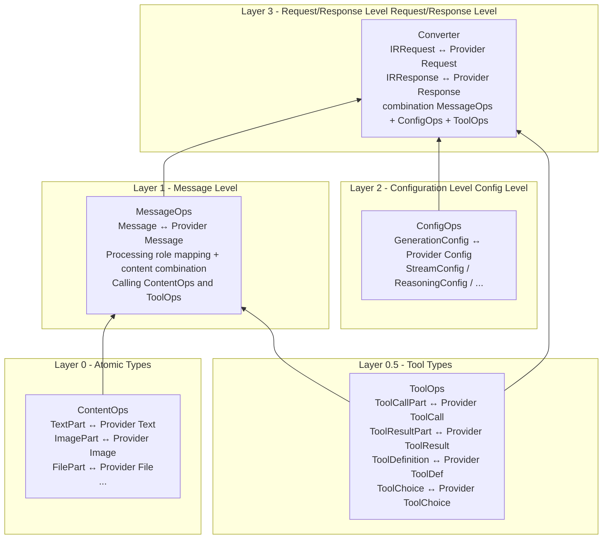
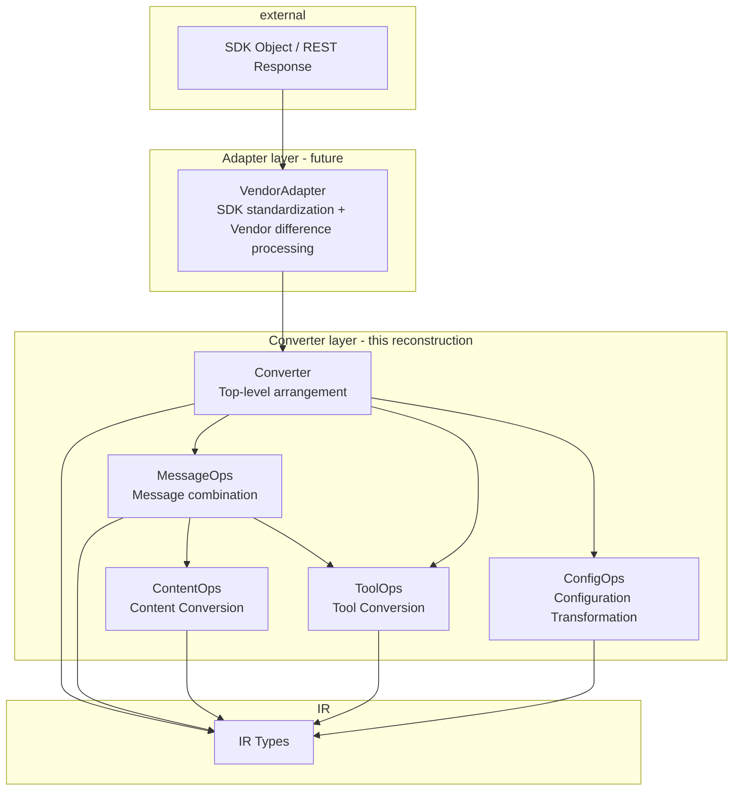

# Converter Refactoring Design

## 1. Design principles

### Bottom-Up Translation

The data structures for each LLM API are nested. Our translation strategy is to start from the most fine-grained atom type and combine it layer by layer:



### Responsibility Boundaries by Layer

| Hierarchy | Classes | Input/Output | Responsibilities |
|------|-----|----------|------|
| L0 | ContentOps | IR Part ↔ Provider Part | Format conversion of a single content part (pure data mapping) |
| L0.5 | ToolOps | IR Tool* ↔ Provider Tool* | Tool definition/call/result format conversion |
| L1 | MessageOps | IR Message ↔ Provider Message | role mapping + content list traversal + call L0/L0.5 |
| L2 | ConfigOps | IR Config ↔ Provider Config | Field mapping and range conversion of configuration parameters |
| L3 | Converter | IRRequest ↔ Provider Request | Top-level orchestration: combination messages + tools + configs |

## 2. Interface design

### Layer 0: ContentOps (static method, stateless)

```python
class OpenAIChatContentOps(BaseContentOps):
    """Content conversion of OpenAI Chat"""

    @staticmethod
    def ir_text_to_p(ir_text: TextPart) -> dict:
        return {"type": "text", "text": ir_text["text"]}

    @staticmethod
    def p_text_to_ir(p_text: dict) -> TextPart:
        return TextPart(type="text", text=p_text["text"])

    @staticmethod
    def ir_image_to_p(ir_image: ImagePart) -> dict:
        # Handle the difference between image_url / image_data
        ...

    @staticmethod
    def p_image_to_ir(p_image: dict) -> ImagePart:
        # Process data URI parsing, etc.
        ...

    # ir_file_to_p → Not supported, throws NotImplementedError
    # ir_reasoning_to_p → Not supported, returns None + warning
```

### Layer 0.5: ToolOps (static method, stateless)

```python
class OpenAIChatToolOps(BaseToolOps):
    """Tool-related conversions for OpenAI Chat"""

    @staticmethod
    def ir_tool_definition_to_p(ir_tool: ToolDefinition) -> dict:
        return {
            "type": "function",
            "function": {
                "name": ir_tool["name"],
                "description": ir_tool.get("description", ""),
                "parameters": ir_tool.get("parameters", {}),
            }
        }

    @staticmethod
    def ir_tool_call_to_p(ir_tc: ToolCallPart) -> dict:
        return {
            "id": ir_tc["tool_call_id"],
            "type": "function",
            "function": {
                "name": ir_tc["tool_name"],
                "arguments": json.dumps(ir_tc["tool_input"]),
            }
        }

    @staticmethod
    def ir_tool_choice_to_p(ir_tc: ToolChoice) -> Union[str, dict]:
        mode = ir_tc.get("mode")
        if mode == "auto": return "auto"
        if mode == "none": return "none"
        if mode == "required": return "required"
        if mode == "tool":
            return {"type": "function", "function": {"name": ir_tc["tool_name"]}}
```

### Layer 1: MessageOps (can have state, such as context)

```python
class OpenAIChatMessageOps(BaseMessageOps):
    """Message level conversion of OpenAI Chat"""

    def __init__(self, content_ops, tool_ops):
        self.content_ops = content_ops
        self.tool_ops = tool_ops

    def ir_message_to_p(self, ir_msg: Message, context=None) -> Tuple[list, list]:
        """Single IR Message → one or more Provider Messages

        Note: A user message of IR may contain tool_result,
        In OpenAI Chat, it needs to be split into user message + tool messages
        """
        role = ir_msg["role"]
        warnings = []

        if role == "system":
            text = self._extract_text(ir_msg["content"])
            return [{"role": "system", "content": text}], warnings

        elif role == "user":
            # Traverse content and call content_ops to convert each part
            user_parts = []
            tool_messages = []
            for part in ir_msg["content"]:
                if part["type"] == "tool_result":
                    tool_messages.append({
                        "role": "tool",
                        "tool_call_id": part["tool_call_id"],
                        "content": str(part["result"]),
                    })
                else:
                    converted = self._convert_content_part(part)
                    if converted: user_parts.append(converted)

            messages = []
            if user_parts:
                messages.append({"role": "user", "content": user_parts})
            messages.extend(tool_messages)
            return messages, warnings

        elif role == "assistant":
            # Process text + tool_calls
            ...
```

### Layer 2: ConfigOps (static method)

```python
class OpenAIChatConfigOps(BaseConfigOps):
    """OpenAI Chat configuration conversion"""

    @staticmethod
    def ir_generation_config_to_p(ir_config: GenerationConfig) -> dict:
        result = {}
        field_map = {
            "temperature": "temperature",
            "top_p": "top_p",
            "max_tokens": "max_completion_tokens",
            "frequency_penalty": "frequency_penalty",
            "presence_penalty": "presence_penalty",
            "seed": "seed",
            "logprobs": "logprobs",
            "n": "n",
        }
        for ir_field, p_field in field_map.items():
            if ir_field in ir_config:
                result[p_field] = ir_config[ir_field]

        # stop_sequences → stop
        if "stop_sequences" in ir_config:
            stop = list(ir_config["stop_sequences"])
            result["stop"] = stop[0] if len(stop) == 1 else stop

        return result
```

### Layer 3: Converter (top-level orchestration)

```python
class OpenAIChatConverter(BaseConverter):
    """OpenAI Chat Completions API Converter"""

    # Declare the Ops class used
    content_ops_class = OpenAIChatContentOps
    tool_ops_class = OpenAIChatToolOps
    message_ops_class = OpenAIChatMessageOps
    config_ops_class = OpenAIChatConfigOps

    def __init__(self):
        self.content_ops = self.content_ops_class()
        self.tool_ops = self.tool_ops_class()
        self.message_ops = self.message_ops_class(self.content_ops, self.tool_ops)
        self.config_ops = self.config_ops_class()

    def request_to_provider(self, ir_request: IRRequest) -> Tuple[dict, list]:
        """IRRequest → OpenAI Chat request body dict"""
        warnings = []
        result = {"model": ir_request["model"]}

        # 1. system_instruction → system message
        if "system_instruction" in ir_request:
            result.setdefault("messages", []).append(
                {"role": "system", "content": ir_request["system_instruction"]}
            )

        # 2. messages → call message_ops
        messages, msg_warnings = self.message_ops.ir_messages_to_p(ir_request["messages"])
        warnings.extend(msg_warnings)
        result.setdefault("messages", []).extend(messages)

        # 3. tools → call tool_ops
        if "tools" in ir_request:
            result["tools"] = [self.tool_ops.ir_tool_definition_to_p(t) for t in ir_request["tools"]]

        # 4. tool_choice → call tool_ops
        if "tool_choice" in ir_request:
            result["tool_choice"] = self.tool_ops.ir_tool_choice_to_p(ir_request["tool_choice"])

        # 5. generation config → call config_ops
        if "generation" in ir_request:
            result.update(self.config_ops.ir_generation_config_to_p(ir_request["generation"]))

        # 6. Other configurations...
        ...

        return result, warnings

    def request_from_provider(self, provider_request: dict) -> IRRequest:
        """OpenAI Chat request body dict → IRRequest"""
        # Standardize SDK objects
        provider_request = self._normalize(provider_request)
        ...

    def response_from_provider(self, provider_response: dict) -> IRResponse:
        """OpenAI Chat response body dict → IRResponse"""
        provider_response = self._normalize(provider_response)
        ...

    def response_to_provider(self, ir_response: IRResponse) -> dict:
        """IRResponse → OpenAI Chat response body dict"""
        ...

    @staticmethod
    def _normalize(data: Any) -> dict:
        """Normalized input: SDK object → dict"""
        if hasattr(data, "model_dump"):
            return data.model_dump()
        if not isinstance(data, dict):
            raise ValueError("Input must be a dict or SDK object with model_dump()")
        return data
```

## 3. Advantages of Bottom-Up Translation

```mermaid
graph LR
    subgraph current issue
        P1[1100+ lines single file Converter]
        P2 [all logic mixed together]
        P3 [difficult to test individual transformations]
        P4 [Duplicate model_dump logic]
    end

    After subgraph reconstruction
        R1[ContentOps: ~100 lines<br/>Pure data mapping, easy to test]
        R2[ToolOps: ~100 lines<br/>Tool format conversion, easy to test]
        R3[MessageOps: ~150 lines<br/>Message composition logic]
        R4 [ConfigOps: ~100 lines<br/>Configuration field mapping]
        R5[Converter: ~200 lines<br/>Top level layout]
    end

    P1 --> R1
    P1 --> R2
    P1 --> R3
    P1 --> R4
    P1 --> R5
```

### Concrete Advantages

1. **Independently testable**: Each Ops class is a static method and can be directly unit tested
   ```python
   def test_text_to_provider():
       result = OpenAIChatContentOps.ir_text_to_p(TextPart(type="text", text="hello"))
       assert result == {"type": "text", "text": "hello"}
   ```

2. **Reusable**: Different Converters can share part of Ops (for example, OpenAI Chat and OpenAI Responses can share part of the implementation of ContentOps)

3. **Separation of Concerns**: Each layer only cares about its own structural differences.
   - ContentOps: `TextPart.text` → `{"type": "text", "text": ...}`
   - MessageOps: `Message(role, content)` → `{"role": ..., "content": [...]}`
   - Converter: `IRRequest(model, messages, tools, ...)` → `{"model": ..., "messages": [...], "tools": [...]}`

4. **Progressive implementation**: ContentOps + ToolOps can be implemented first, then MessageOps, and finally Converter

## 4. File structure

```
src/codex-rosetta/converters/
├── base/
│   ├── __init__.py
│ ├── converter.py # BaseConverter (explicit interface)
│   ├── content.py        # BaseContentOps
│   ├── tools.py          # BaseToolOps
│   ├── messages.py       # BaseMessageOps
│   └── configs.py        # BaseConfigOps
├── openai_chat/
│   ├── __init__.py
│ ├── converter.py # OpenAIChatConverter (~200 lines, top-level arrangement)
│ ├── content_ops.py # OpenAIChatContentOps (~100 lines)
│ ├── tool_ops.py # OpenAIChatToolOps (~100 lines)
│ ├── message_ops.py # OpenAIChatMessageOps (~line 150)
│ └── config_ops.py # OpenAIChatConfigOps (~100 lines)
├── anthropic/
│   ├── converter.py
│   ├── content_ops.py
│   ├── tool_ops.py
│   ├── message_ops.py
│   └── config_ops.py
├── google/
│   └── ...
└── openai_responses/
    └── ...
```

## 5. Implementation Plan

Starting with OpenAI Chat Converter:

1. **Phase 1**: Implement `OpenAIChatContentOps` (bidirectional conversion of TextPart and ImagePart)
2. **Phase 2**: Implement `OpenAIChatToolOps` (bidirectional conversion of ToolDefinition, ToolCallPart, ToolResultPart, ToolChoice)
3. **Phase 3**: Implement `OpenAIChatMessageOps` (bidirectional conversion of Message, calling ContentOps + ToolOps)
4. **Phase 4**: Implement `OpenAIChatConfigOps` (bidirectional conversion of GenerationConfig, StreamConfig, etc.)
5. **Phase 5**: Implement `OpenAIChatConverter` (top-level orchestration, implement explicit interface)
6. **Phase 6**: Migration testing to ensure all existing tests pass
7. **Phase 7**: Remove old converter implementation

## 6. Relationship with the Adapter Layer



- **This reconstruction**: focus on splitting the Converter layer from the bottom up
- **Adapter layer**: subsequent independent implementation, does not affect the design of the Converter
- **Converter only accepts standard dict**: Adapter is responsible for standardization of SDK objects → dict
- **Transition period**: Converter's built-in `_normalize()` method is compatible with SDK object input
