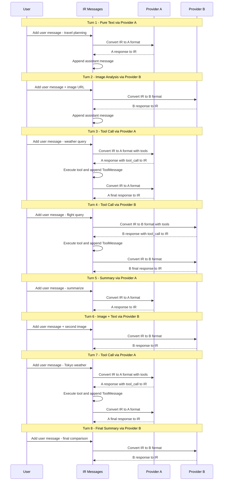
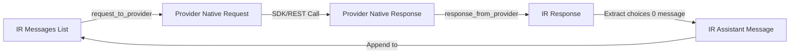
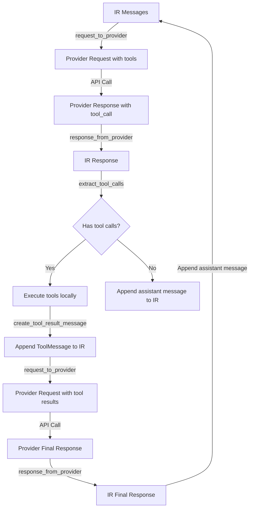

# Cross-Provider Multi-Turn Conversation Examples Architecture

## 1. Overview

This document designs cross-provider multi-round dialogue examples of the Codex-Rosetta project, showing pairwise cross-provider multi-round dialogue between four API standards, including images and tool calls. Provides two implementation methods: REST and SDK.

### 1.1 Four Providers

| Abbreviation | Provider | Converter class | SDK calling method |
|------|----------|-------------|-------------|
| `oc` | OpenAI Chat Completions | `OpenAIChatConverter` | `openai.chat.completions.create()` |
| `or` | OpenAI Responses | `OpenAIResponsesConverter` | `openai.responses.create()` |
| `an` | Anthropic Messages | `AnthropicConverter` | `anthropic.messages.create()` |
| `gg` | Google GenAI | `GoogleGenAIConverter` | `genai.Client.models.generate_content()` |

### 1.2 Six pairs of combinations

| # | Combination | File suffix |
|---|------|---------|
| 1 | OpenAI Chat ↔ Anthropic | `oc_an` |
| 2 | OpenAI Chat ↔ Google GenAI | `oc_gg` |
| 3 | OpenAI Chat ↔ OpenAI Responses | `oc_or` |
| 4 | Anthropic ↔ Google GenAI | `an_gg` |
| 5 | Anthropic ↔ OpenAI Responses | `an_or` |
| 6 | Google GenAI ↔ OpenAI Responses | `gg_or` |

---

## 2. Unified Conversation Flow

Design an **8-round** unified dialogue path, covering plain text, images, tool calls, and multiple rounds of context continuation.

For each combination A ↔ B, the two providers handle requests alternately: A for odd numbers and B for even numbers.

### 2.1 Conversation Flow Overview

```
Turn 1 [Provider A] - Plain text: say hello + set role
Turn 2 [Provider B] - Image Analysis: Send image URL, request description
Turn 3 [Provider A] - Tool call: Query weather (trigger get_current_weather)
Turn 4 [Provider B] - Tool call: query flights (trigger get_flight_info)
Turn 5 [Provider A] - Plain text: Summary based on previous weather and flight information
Turn 6 [Provider B] - Image + Text: Send a second image and ask questions in context
Turn 7 [Provider A] - Tool call: Query weather again (different city)
Turn 8 [Provider B] - Plain text: Final summary of the entire conversation
```

### 2.2 Detailed Conversation Flow

#### Turn 1: Plain text — say hello + set role [Provider A]

- **User message**: `"You are a helpful travel assistant. I'm planning a trip and need your help with weather, flights, and sightseeing. Let's start - what should I consider when planning a trip to San Francisco?"`
- **INCLUDES IMAGE**: No
- **Include tool calls**: No
- **Conversion process**: IR messages → Provider A native request → Provider A API call → Provider A response → IR messages
- **Expected**: Model returns plain text travel advice

#### Turn 2: Image Analysis — Send Image URL [Provider B]

- **User message**: `"I found this photo of a landmark. Can you tell me what it is and whether it's worth visiting?"` + ImagePart(url)
- **INCLUDES IMAGE**: Yes (Golden Gate Bridge image)
- **Include tool calls**: No
- **Conversion process**: IR messages (including history) → Provider B native request → Provider B API call → Provider B response → IR messages
- **Expected**: The model recognizes the image and gives suggestions

#### Turn 3: Tool call — Query weather [Provider A]

- **User message**: `"Great! What's the current weather like in San Francisco? I want to know if I should pack warm clothes."`
- **INCLUDES IMAGE**: No
- **Include tool calls**: Yes (`get_current_weather(location="San Francisco, CA")`)
- **Conversion Process**:
  1. IR messages → Provider A native request (including tools) → Provider A API call
  2. Provider A response (`tool_call`) → IR messages
  3. Execute tool → Create ToolMessage → Append to IR messages
  4. IR messages → Provider A native request → Provider A API call
  5. Provider A response (final text) → IR messages
- **Expected**: The model calls the weather tool and gives dressing suggestions after obtaining the results.

#### Turn 4: Tool call — Query flights [Provider B]

- **User message**: `"I'll be flying from New York. Can you check flight information from New York to San Francisco?"`
- **INCLUDES IMAGE**: No
- **Include tool calls**: Yes (`get_flight_info(origin="New York", destination="San Francisco")`)
- **Conversion process**: Same as Turn 3, but using Provider B
- **Expected**: The model calls the flight tool, and flight information is given after obtaining the results.

#### Turn 5: Plain text — context-based summary [Provider A]

- **User message**: `"Based on the weather and flight information, what's your recommendation for the best time to visit? Please summarize what we know so far."`
- **INCLUDES IMAGE**: No
- **Include tool calls**: No
- **Conversion process**: IR messages (including complete history) → Provider A native request → Provider A API call → Provider A response → IR messages
- **Expected**: The model combines previous weather and flight information to give recommendations

#### Turn 6: Image + Text — Second Image [Provider B]

- **User message**: `"I also want to visit Tokyo after San Francisco. Here's a photo from Tokyo. What landmarks can you see, and how does it compare to San Francisco?"` + ImagePart(url)
- **INCLUDES IMAGE**: Yes (Tokyo Tower image)
- **Include tool calls**: No
- **Conversion process**: IR messages (including history + new image) → Provider B native request → Provider B API call → Provider B response → IR messages
- **Expected**: Model recognizes images of Tokyo, compared to San Francisco

#### Turn 7: Tool call — Query Tokyo weather [Provider A]

- **User message**: `"What's the weather like in Tokyo right now? I want to compare it with San Francisco."`
- **INCLUDES IMAGE**: No
- **Includes tool calls**: Yes (`get_current_weather(location="Tokyo")`)
- **Conversion process**: Same as Turn 3
- **Expected**: The model calls the weather tool to query the weather in Tokyo and compare it with San Francisco

#### Turn 8: Plain Text — Final Summary [Provider B]

- **User message**: `"Thank you! Please give me a final summary comparing San Francisco and Tokyo as travel destinations, including weather, landmarks, and your overall recommendation."`
- **INCLUDES IMAGE**: No
- **Include tool calls**: No
- **Conversion process**: IR messages (complete history) → Provider B native request → Provider B API call → Provider B response → IR messages
- **Expected**: The model gives a complete travel comparison summary

### 2.3 Conversation Flow Diagram



---

## 3. Shared Resource Design

### 3.1 File: `examples/common.py`

Contains all resources shared by example.

#### 3.1.1 Tool definition (IR ToolDefinition format)

```python
tools_spec = [
    {
        "type": "function",
        "name": "get_current_weather",
        "description": "Get the current weather in a given location",
        "parameters": {
            "type": "object",
            "properties": {
                "location": {
                    "type": "string",
                    "description": "The city and state, e.g. San Francisco, CA",
                },
                "unit": {"type": "string", "enum": ["celsius", "fahrenheit"]},
            },
            "required": ["location"],
        },
    },
    {
        "type": "function",
        "name": "get_flight_info",
        "description": "Get flight information between two locations",
        "parameters": {
            "type": "object",
            "properties": {
                "origin": {"type": "string", "description": "The origin city"},
                "destination": {
                    "type": "string",
                    "description": "The destination city",
                },
            },
            "required": ["origin", "destination"],
        },
    },
]
```

#### 3.1.2 Image URL

Using public images from Wikipedia (stable and accessible):

```python
IMAGE_URLS = {
    "golden_gate": "https://upload.wikimedia.org/wikipedia/commons/thumb/0/0c/GoldenGateBridge-001.jpg/1280px-GoldenGateBridge-001.jpg",
    "tokyo_tower": "https://upload.wikimedia.org/wikipedia/commons/thumb/3/37/TaijuInada_%2822262641988%29.jpg/800px-TaijuInada_%2822262641988%29.jpg",
}
```

#### 3.1.3 Tool execution simulation function

Reuse existing functions in `examples/tools.py` and re-export them in `common.py`:

```python
from examples.tools import available_tools, get_current_weather, get_flight_info
```

#### 3.1.4 Shared Helper Functions

```python
def display_turn_header(turn: int, provider_name: str, description: str) -> None:
    """Display a formatted turn header."""

def display_assistant_response(message: Message) -> None:
    """Display assistant's response including text and tool calls."""

def execute_tool_calls(
    tool_calls: List[ToolCallPart], ir_messages: List[Message]
) -> None:
    """Execute all tool calls and append results to message history."""

def send_to_provider_sdk(
    converter, client, model, ir_messages, tools_spec=None, tool_choice=None,
    provider_type="openai_chat"
) -> Message:
    """
    Unified SDK send function.
    Handles the full cycle: IR → provider request → API call → IR response.
    Supports tool call loops (call → execute → re-send).
    """

def send_to_provider_rest(
    converter, api_url, headers, model, ir_messages, tools_spec=None,
    tool_choice=None, provider_type="openai_chat", extra_body=None
) -> Message:
    """
    Unified REST send function.
    Handles the full cycle: IR → provider request → HTTP POST → IR response.
    Supports tool call loops.
    """
```

#### 3.1.5 Conversation Flow Definition

```python
CONVERSATION_TURNS = [
    {
        "turn": 1,
        "provider_index": 0,  # Provider A
        "user_text": "You are a helpful travel assistant...",
        "image_url": None,
        "expects_tool_call": False,
        "description": "Pure text - travel planning intro",
    },
    {
        "turn": 2,
        "provider_index": 1,  # Provider B
        "user_text": "I found this photo of a landmark...",
        "image_url": IMAGE_URLS["golden_gate"],
        "expects_tool_call": False,
        "description": "Image analysis - Golden Gate Bridge",
    },
    # ... remaining turns
]
```

### 3.2 Keep existing `examples/tools.py`

The existing `tools.py` remains unchanged and `common.py` is imported from.

---

## 4. File structure design

### 4.1 New `examples/` directory structure

```
examples/
├── common.py # Public resources: tool definition, image URL, auxiliary function, conversation path
├── tools.py # Tool simulation function (existing, remain unchanged)
├── README.md # Examples documentation
│
├── sdk_based/
│ ├── multi_turn_chat.py # Existing multi-provider rotation example (reserved)
│   ├── cross_oc_an.py                 # OpenAI Chat ↔ Anthropic
│   ├── cross_oc_gg.py                 # OpenAI Chat ↔ Google GenAI
│   ├── cross_oc_or.py                 # OpenAI Chat ↔ OpenAI Responses
│   ├── cross_an_gg.py                 # Anthropic ↔ Google GenAI
│   ├── cross_an_or.py                 # Anthropic ↔ OpenAI Responses
│   └── cross_gg_or.py                 # Google GenAI ↔ OpenAI Responses
│
├── rest_based/
│ ├── test_openai_chat_rest.py # Existing (reserved)
│ ├── test_anthropic_rest.py # Existing (reserved)
│ ├── test_google_rest.py # Already (reserved)
│ ├── test_openai_responses_rest.py # Already (reserved)
│ ├── test_google_sequential_calls.py # Already (reserved)
│ ├── test_google_sequential_with_tools.py # Existing (reserved)
│ ├── test_google_thought_signature.py # Already (reserved)
│   ├── cross_oc_an_rest.py            # OpenAI Chat ↔ Anthropic (REST)
│   ├── cross_oc_gg_rest.py            # OpenAI Chat ↔ Google GenAI (REST)
│   ├── cross_oc_or_rest.py            # OpenAI Chat ↔ OpenAI Responses (REST)
│   ├── cross_an_gg_rest.py            # Anthropic ↔ Google GenAI (REST)
│   ├── cross_an_or_rest.py            # Anthropic ↔ OpenAI Responses (REST)
│   └── cross_gg_or_rest.py            # Google GenAI ↔ OpenAI Responses (REST)
```

### 4.2 Naming convention

- SDK version: `cross_{provider_a}_{provider_b}.py`
- REST version: `cross_{provider_a}_{provider_b}_rest.py`
- Provider abbreviation: `oc` (OpenAI Chat), `or` (OpenAI Responses), `an` (Anthropic), `gg` (Google GenAI)
- Abbreviations are in alphabetical order: `an` < `gg` < `oc` < `or`, so the actual file names are:
  - `cross_an_gg.py`, `cross_an_oc.py`, `cross_an_or.py`
  - `cross_gg_oc.py`, `cross_gg_or.py`
  - `cross_oc_or.py`

> **Correction**: For readability, use alphabetical order above.

---

## 5. Code skeleton design

### 5.1 SDK version code skeleton

Take `cross_an_oc.py` (Anthropic ↔ OpenAI Chat) as an example:

```python
#!/usr/bin/env python
"""
Cross-Provider Multi-Turn Conversation: Anthropic ↔ OpenAI Chat (SDK)

Demonstrates Codex-Rosetta's ability to maintain a unified conversation history
across Anthropic Messages API and OpenAI Chat Completions API,
with image analysis and tool calling.

Requirements:
    pip install -e ".[openai,anthropic]"

Proxy Note:
    OpenAI API calls may require proxy configuration.
    Set HTTP_PROXY/HTTPS_PROXY environment variables if needed.
"""

import os
import sys
from typing import List

import anthropic
from dotenv import load_dotenv
from openai import OpenAI

sys.path.insert(0, os.path.join(os.path.dirname(__file__), "../.."))

from examples.common import (
    CONVERSATION_TURNS,
    IMAGE_URLS,
    display_assistant_response,
    display_turn_header,
    execute_tool_calls,
    tools_spec,
)
from codex-rosetta.converters.anthropic import AnthropicConverter
from codex-rosetta.converters.openai_chat import OpenAIChatConverter
from codex-rosetta.types.ir import (
    Message,
    create_tool_result_message,
    extract_text_content,
    extract_tool_calls,
)

load_dotenv()


# ============================================================================
# Provider Configuration
# ============================================================================

PROVIDERS = {
    "anthropic": {
        "name": "Anthropic",
        "converter": AnthropicConverter(),
        "client": anthropic.Anthropic(api_key=os.getenv("ANTHROPIC_API_KEY")),
        "model": os.getenv("ANTHROPIC_MODEL", "claude-3-haiku-20240307"),
    },
    "openai_chat": {
        "name": "OpenAI Chat",
        "converter": OpenAIChatConverter(),
        "client": OpenAI(
            api_key=os.getenv("OPENAI_API_KEY"),
            base_url=os.getenv("OPENAI_BASE_URL", "https://api.openai.com/v1"),
        ),
        "model": os.getenv("OPENAI_MODEL", "gpt-4.1-nano"),
    },
}

# Provider order: A=anthropic, B=openai_chat
PROVIDER_ORDER = ["anthropic", "openai_chat"]


# ============================================================================
# Provider-Specific Send Functions
# ============================================================================


def send_anthropic(converter, client, model, ir_messages, with_tools=False):
    """Send request via Anthropic SDK and return IR messages."""
    # Build IRRequest
    ir_request = {
        "model": model,
        "messages": ir_messages,
    }
    if with_tools:
        ir_request["tools"] = tools_spec
        ir_request["tool_choice"] = {"mode": "auto", "tool_name": ""}

    # Convert to provider format
    provider_request, warnings = converter.request_to_provider(ir_request)

    # Anthropic requires max_tokens (already handled by converter, default 4096)
    # Call API
    response = client.messages.create(**provider_request)

    # Convert response to IR
    ir_response = converter.response_from_provider(response.model_dump())

    # Extract assistant message from IRResponse
    return ir_response["choices"][0]["message"]


def send_openai_chat(converter, client, model, ir_messages, with_tools=False):
    """Send request via OpenAI Chat SDK and return IR messages."""
    ir_request = {
        "model": model,
        "messages": ir_messages,
    }
    if with_tools:
        ir_request["tools"] = tools_spec
        ir_request["tool_choice"] = {"mode": "auto", "tool_name": ""}

    provider_request, warnings = converter.request_to_provider(ir_request)

    response = client.chat.completions.create(**provider_request)

    ir_response = converter.response_from_provider(response.model_dump())

    return ir_response["choices"][0]["message"]


SEND_FUNCTIONS = {
    "anthropic": send_anthropic,
    "openai_chat": send_openai_chat,
}


# ============================================================================
# Main Conversation Loop
# ============================================================================


def build_user_message(turn_info):
    """Build an IR user message from turn info."""
    content = [{"type": "text", "text": turn_info["user_text"]}]
    if turn_info.get("image_url"):
        content.append({"type": "image", "image_url": turn_info["image_url"]})
    return {"role": "user", "content": content}


def main():
    print("=" * 80)
    print("CROSS-PROVIDER CONVERSATION: Anthropic <-> OpenAI Chat")
    print("=" * 80)

    ir_messages: List[Message] = []

    for turn_info in CONVERSATION_TURNS:
        provider_key = PROVIDER_ORDER[turn_info["provider_index"]]
        provider = PROVIDERS[provider_key]
        send_fn = SEND_FUNCTIONS[provider_key]

        display_turn_header(
            turn_info["turn"], provider["name"], turn_info["description"]
        )

        # Build and append user message
        user_msg = build_user_message(turn_info)
        ir_messages.append(user_msg)
        print(f"User: {turn_info['user_text']}")
        if turn_info.get("image_url"):
            print(f"  [Image: {turn_info['image_url'][:60]}...]")

        # Send to provider
        with_tools = turn_info.get("expects_tool_call", False)
        assistant_msg = send_fn(
            provider["converter"],
            provider["client"],
            provider["model"],
            ir_messages,
            with_tools=with_tools,
        )
        ir_messages.append(assistant_msg)
        display_assistant_response(assistant_msg)

        # Handle tool calls if any
        tool_calls = extract_tool_calls(assistant_msg)
        if tool_calls:
            execute_tool_calls(tool_calls, ir_messages)

            # Re-send to get final response after tool execution
            final_msg = send_fn(
                provider["converter"],
                provider["client"],
                provider["model"],
                ir_messages,
                with_tools=with_tools,
            )
            ir_messages.append(final_msg)
            display_assistant_response(final_msg)

        print()

    # Summary
    print("=" * 80)
    print("CONVERSATION COMPLETE")
    print(f"Total messages in history: {len(ir_messages)}")
    print(f"Providers used: {', '.join(p['name'] for p in PROVIDERS.values())}")
    print("=" * 80)


if __name__ == "__main__":
    main()
```

### 5.2 REST version code skeleton

Take `cross_an_oc_rest.py` (Anthropic ↔ OpenAI Chat REST) as an example:

```python
#!/usr/bin/env python
"""
Cross-Provider Multi-Turn Conversation: Anthropic ↔ OpenAI Chat (REST)

Uses raw HTTP requests instead of SDK wrappers.

Proxy Note:
    OpenAI API calls may require proxy. Use proxychains or set
    HTTP_PROXY/HTTPS_PROXY environment variables.
"""

import json
import os
import sys
from typing import Any, Dict, List

import requests
from dotenv import load_dotenv

sys.path.insert(0, os.path.join(os.path.dirname(__file__), "../.."))

from examples.common import (
    CONVERSATION_TURNS,
    IMAGE_URLS,
    display_assistant_response,
    display_turn_header,
    execute_tool_calls,
    tools_spec,
)
from codex-rosetta.converters.anthropic import AnthropicConverter
from codex-rosetta.converters.openai_chat import OpenAIChatConverter
from codex-rosetta.types.ir import (
    Message,
    extract_tool_calls,
)

load_dotenv()


# ============================================================================
# REST API Configuration
# ============================================================================

PROVIDERS = {
    "anthropic": {
        "name": "Anthropic",
        "converter": AnthropicConverter(),
        "api_url": os.getenv("ANTHROPIC_BASE_URL", "https://api.anthropic.com")
        + "/v1/messages",
        "headers": {
            "x-api-key": os.getenv("ANTHROPIC_API_KEY", ""),
            "anthropic-version": "2023-06-01",
            "Content-Type": "application/json",
        },
        "model": os.getenv("ANTHROPIC_MODEL", "claude-3-5-sonnet-20241022"),
    },
    "openai_chat": {
        "name": "OpenAI Chat",
        "converter": OpenAIChatConverter(),
        "api_url": os.getenv("OPENAI_BASE_URL", "https://api.openai.com/v1")
        + "/chat/completions",
        "headers": {
            "Authorization": f"Bearer {os.getenv('OPENAI_API_KEY', '')}",
            "Content-Type": "application/json",
        },
        "model": os.getenv("OPENAI_MODEL", "gpt-4.1-nano"),
    },
}

PROVIDER_ORDER = ["anthropic", "openai_chat"]


# ============================================================================
# REST Send Functions
# ============================================================================


def send_rest(provider_config, ir_messages, with_tools=False):
    """Send request via REST API and return IR assistant message."""
    converter = provider_config["converter"]

    ir_request = {
        "model": provider_config["model"],
        "messages": ir_messages,
    }
    if with_tools:
        ir_request["tools"] = tools_spec
        ir_request["tool_choice"] = {"mode": "auto", "tool_name": ""}

    provider_request, warnings = converter.request_to_provider(ir_request)

    # POST to REST API
    response = requests.post(
        provider_config["api_url"],
        headers=provider_config["headers"],
        json=provider_request,
        timeout=60,
    )
    response.raise_for_status()
    response_data = response.json()

    print(f"  [REST] Status: {response.status_code}")

    # Convert response to IR
    ir_response = converter.response_from_provider(response_data)
    return ir_response["choices"][0]["message"]


# ============================================================================
# Main (same loop structure as SDK version)
# ============================================================================


def build_user_message(turn_info):
    """Build an IR user message from turn info."""
    content = [{"type": "text", "text": turn_info["user_text"]}]
    if turn_info.get("image_url"):
        content.append({"type": "image", "image_url": turn_info["image_url"]})
    return {"role": "user", "content": content}


def main():
    print("=" * 80)
    print("CROSS-PROVIDER CONVERSATION (REST): Anthropic <-> OpenAI Chat")
    print("=" * 80)

    ir_messages: List[Message] = []

    for turn_info in CONVERSATION_TURNS:
        provider_key = PROVIDER_ORDER[turn_info["provider_index"]]
        provider = PROVIDERS[provider_key]

        display_turn_header(
            turn_info["turn"], provider["name"], turn_info["description"]
        )

        user_msg = build_user_message(turn_info)
        ir_messages.append(user_msg)
        print(f"User: {turn_info['user_text']}")

        with_tools = turn_info.get("expects_tool_call", False)

        try:
            assistant_msg = send_rest(provider, ir_messages, with_tools=with_tools)
            ir_messages.append(assistant_msg)
            display_assistant_response(assistant_msg)

            # Handle tool calls
            tool_calls = extract_tool_calls(assistant_msg)
            if tool_calls:
                execute_tool_calls(tool_calls, ir_messages)
                final_msg = send_rest(provider, ir_messages, with_tools=with_tools)
                ir_messages.append(final_msg)
                display_assistant_response(final_msg)

        except requests.exceptions.RequestException as e:
            print(f"  [ERROR] HTTP Error: {e}")
            if hasattr(e, "response") and e.response is not None:
                print(f"  Response: {e.response.text[:200]}")

        print()

    print("=" * 80)
    print("CONVERSATION COMPLETE")
    print(f"Total messages: {len(ir_messages)}")
    print("=" * 80)


if __name__ == "__main__":
    main()
```

### 5.3 Differences in the Send function of each Provider

Differences that each provider's send function needs to handle:

| Provider | SDK calling method | Special processing |
|----------|------------|---------|
| OpenAI Chat | `client.chat.completions.create(**provider_request)` | Expand provider_request directly |
| OpenAI Responses | `client.responses.create(model=..., input=..., tools=..., tool_choice=...)` | Parameters need to be passed separately and cannot be expanded directly |
| Anthropic | `client.messages.create(**provider_request)` | `max_tokens` has been automatically added by converter |
| Google GenAI | `client.models.generate_content(model=..., contents=..., config=...)` | Need to pass model/contents/config separately |

### 5.4 Special processing of Google GenAI

The dict returned by Google GenAI's `request_to_provider` contains three top-level fields: `model`, `contents`, and `config`. SDK needs to be split when calling:

```python
def send_google(converter, client, model, ir_messages, with_tools=False):
    ir_request = {"model": model, "messages": ir_messages}
    if with_tools:
        ir_request["tools"] = tools_spec

    provider_request, warnings = converter.request_to_provider(ir_request)

    # Google SDK requires separate parameters
    response = client.models.generate_content(
        model=provider_request["model"],
        contents=provider_request["contents"],
        config=provider_request.get("config"),
    )

    ir_response = converter.response_from_provider(response.model_dump())
    return ir_response["choices"][0]["message"]
```

### 5.5 Special processing of OpenAI Responses

OpenAI Responses API uses `input` instead of `messages`, and the SDK calling method is different:

```python
def send_openai_responses(converter, client, model, ir_messages, with_tools=False):
    ir_request = {"model": model, "messages": ir_messages}
    if with_tools:
        ir_request["tools"] = tools_spec
        ir_request["tool_choice"] = {"mode": "auto", "tool_name": ""}

    provider_request, warnings = converter.request_to_provider(ir_request)

    # Responses API uses different parameter names
    response = client.responses.create(
        model=provider_request["model"],
        input=provider_request["input"],
        tools=provider_request.get("tools"),
        tool_choice=provider_request.get("tool_choice"),
    )

    ir_response = converter.response_from_provider(response.model_dump())
    return ir_response["choices"][0]["message"]
```

---

## 6. Detailed explanation of conversion process

### 6.1 Core conversion process

The core conversion process of each round of dialogue:



### 6.2 Expansion process of tool calling

When the model returns a tool call:



### 6.3 Key points across providers

The core of cross-provider conversations is that the list of IR messages is shared. Whichever provider handles the current round, it receives the complete IR history, and the converter is responsible for converting it to that provider's native format.

```
Turn 1: [user_msg_1] → Provider A → [user_msg_1, assistant_msg_1]
Turn 2: [user_msg_1, assistant_msg_1, user_msg_2] → Provider B → [..., assistant_msg_2]
Turn 3: [..., user_msg_3] → Provider A → [..., assistant_msg_3]
...
```

Each converter's `request_to_provider` method will:
- Convert IR messages to the provider's message format
- Handle role mapping (like Google's `model` vs `assistant`)
- Handle content format differences (such as Anthropic's `tool_use` vs OpenAI's `tool_calls`)
- Handle structural differences (e.g. Google's `contents` vs OpenAI's `messages`)

---

## 7. Things to note

### 7.1 Network proxy

- **OpenAI** and **Google** APIs may require proxy access
- SDK version: Indicate in the code comments that the `HTTP_PROXY`/`HTTPS_PROXY` environment variables need to be set
- REST version: can be run via `proxychains -q python script.py`, or configure proxies in `requests`
- **Anthropic** Usually no proxy required

### 7.2 Anthropic’s `max_tokens`

- Anthropic API requires `max_tokens` parameter
- `AnthropicConverter.request_to_provider()` is automatically handled: if `generation` is not specified in the configuration, it defaults to 4096
- No additional processing required in example

### 7.3 Structural differences of Google GenAI

- Google uses `contents` instead of `messages`
- Google uses the `config` object to contain tools, generation parameters, etc.
- `GoogleGenAIConverter.request_to_provider()` returns `{"model": ..., "contents": ..., "config": ..., "system_instruction": ...}`
- Need to split parameters when calling SDK

### 7.4 Flat structure of OpenAI Responses

- Responses API uses `input` (flat item list) instead of `messages`
- `output` is also a flat item list
- `OpenAIResponsesConverter.request_to_provider()` returns `{"model": ..., "input": [...], "tools": [...], ...}`
- You need to pass parameters separately when calling the SDK

### 7.5 Image Support Differences

- All 4 providers support image URL input
- IR uses `ImagePart` to express uniformly: `{"type": "image", "image_url": "https://..."}`
- Each converter automatically handles format conversion:
  - OpenAI Chat: `{"type": "image_url", "image_url": {"url": "..."}}`
  - OpenAI Responses: `{"type": "input_image", "image_url": "..."}`
  - Anthropic: `{"type": "image", "source": {"type": "url", "url": "..."}}`
  - Google: `{"file_data": {"file_uri": "...", "mime_type": "image/jpeg"}}`

### 7.6 API interface selection

New examples should use the **new 6-interface API** (`request_to_provider`, `response_from_provider`, etc.) instead of the old `to_provider`/`from_provider` backwards compatibility methods. This works:
- Show the complete `IRRequest` → provider request → provider response → `IRResponse` process
- Leveraging the structured `choices` field of `IRResponse`
- Avoid the problem of inconsistent return types of `from_provider` of different converters

### 7.7 Environment variables

All examples require the following environment variables (either via `.env` files or environment settings):

```bash
# OpenAI Chat
OPENAI_API_KEY=sk-...
OPENAI_BASE_URL=https://api.openai.com/v1  # optional
OPENAI_MODEL=gpt-4.1-nano                  # optional

# OpenAI Responses (may use different key/model)
OPENAI_RESPONSES_API_KEY=sk-...
OPENAI_RESPONSES_BASE_URL=https://api.openai.com/v1  # optional
OPENAI_RESPONSES_MODEL=gpt-4o                        # optional

# Anthropic
ANTHROPIC_API_KEY=sk-ant-...
ANTHROPIC_MODEL=claude-3-haiku-20240307  # optional

# Google GenAI
GOOGLE_API_KEY=AI...
GOOGLE_MODEL=gemini-1.5-flash-latest     # optional
```

### 7.8 Error handling

Each example should contain basic error handling:
- API key missing check (skip the provider instead of crashing)
- HTTP error handling (REST version)
- SDK exception handling
- Tool call execution error handling

---

## 8. Implement priority

It is recommended to implement in the following order:

1. **`examples/common.py`** — Common resources and helper functions
2. **`examples/sdk_based/cross_an_oc.py`** — First SDK example (Anthropic ↔ OpenAI Chat, the most common combination)
3. **`examples/rest_based/cross_an_oc_rest.py`** — the corresponding REST version
4. **5 SDK Examples Remaining** — Quick creation based on templates from the first example
5. **5 REST Examples Remaining** — Quickly Create Based on REST Templates
6. **`examples/README.md`** — Documentation

---

## 9. Code reuse strategy

### 9.1 Templating

All 12 cross-provider files (6 SDK + 6 REST) share the same conversation loop structure. The only difference is:
- Provider configuration (client initialization, model name)
- Send function (SDK calling method is different)

### 9.2 Responsibilities of `common.py`

`common.py` takes care of most of the logic:
- Conversation path definition (`CONVERSATION_TURNS`)
- User message build (`build_user_message`)
- Response display (`display_assistant_response`)
- Tool execution (`execute_tool_calls`)
- Turn header display (`display_turn_header`)

### 9.3 Responsibilities of each cross-provider file

Each file only needs:
1. Define the configuration of two providers
2. Define the send functions of two providers
3. Run the dialog loop

This makes each file about 100-150 lines concise and easy to understand.
