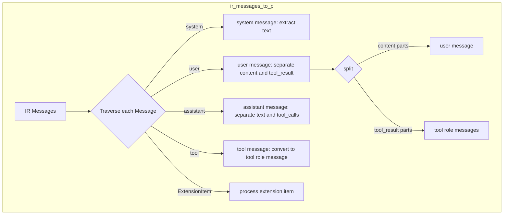
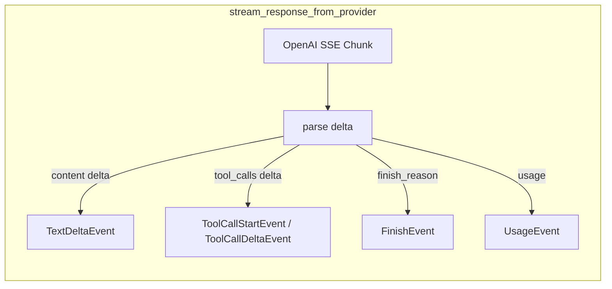

# Comprehensive OpenAI Chat Converter Refactoring Plan

## 1. Overview

Based on the bottom-up translation design of `plans/converter_redesign.md`, OpenAI Chat Completions Converter is completely reconstructed. Split the existing 1100+ line single file converter into 5 independent modules, and add stream support and IRStreamEvent type.

## 2. Current-State Analysis

### Problems with existing code

- [`converter.py`](../../../src/codex_rosetta/converters/openai_chat/converter.py) contains 1102 lines of code, all logic mixed together
- Using the old `to_provider`/`from_provider` universal interface requires internal type checking
- The old implementation depended on `ToolCallConverter`, `ToolConverter`, and `FieldMapper` under `utils/` (historical utilities no longer retained). Their logic belongs inside the Ops classes.
- Does not support stream chunk level conversion
- Missing explicit interfaces such as `request_to_provider` and `request_from_provider`

### Existing Base Classes

- [`BaseConverter`](../../../src/codex_rosetta/converters/base/converter.py) - 6 explicit abstract methods defined
- [`BaseContentOps`](../../../src/codex_rosetta/converters/base/content.py) - Bidirectional conversion abstract method defined for all content types
- [`BaseToolOps`](../../../src/codex_rosetta/converters/base/tools.py) - Bidirectional conversion abstract method for defined tool definition/selection/invocation/result/configuration
- [`BaseMessageOps`](../../../src/codex_rosetta/converters/base/messages.py) - Batch message conversion abstract method defined
- [`BaseConfigOps`](../../../src/codex_rosetta/converters/base/configs.py) - Bidirectional conversion abstract method that defines build/response format/streaming/inference/caching configurations

## 3. Target file structure

```
src/codex-rosetta/converters/openai_chat/
├── __init__.py # Export OpenAIChatConverter and various Ops classes
├── converter.py # OpenAIChatConverter - top-level layout (~250 lines)
├── content_ops.py # OpenAIChatContentOps - content conversion (~120 lines)
├── tool_ops.py # OpenAIChatToolOps - tool conversion (~150 lines)
├── message_ops.py # OpenAIChatMessageOps - Message conversion (~200 lines)
└── config_ops.py # OpenAIChatConfigOps - Configuration conversion (~120 lines)

src/codex-rosetta/types/ir/
└── stream.py # IRStreamEvent type definition (~line 80)

tests/converters/openai_chat/
├── __init__.py
├── test_content_ops.py # ContentOps unit test
├── test_tool_ops.py # ToolOps unit test
├── test_message_ops.py # MessageOps unit test
├── test_config_ops.py # ConfigOps unit test
├── test_converter.py # Converter integration test (non-stream + stream)
└── test_full_conversion.py # Complete round-trip conversion test
```

## 4. Detailed Module Designs

### 4.1 IRStreamEvent type (`src/codex-rosetta/types/ir/stream.py`)

A new stream event type at the IR level is added to support real-time conversion at the SSE chunk level.

```python
class TextDeltaEvent(TypedDict):
    type: Required[Literal["text_delta"]]
    text: Required[str]
    choice_index: NotRequired[int]

class ToolCallStartEvent(TypedDict):
    type: Required[Literal["tool_call_start"]]
    tool_call_id: Required[str]
    tool_name: Required[str]
    choice_index: NotRequired[int]

class ToolCallDeltaEvent(TypedDict):
    type: Required[Literal["tool_call_delta"]]
    tool_call_id: Required[str]
    arguments_delta: Required[str]  # JSON string fragment
    choice_index: NotRequired[int]

class FinishEvent(TypedDict):
    type: Required[Literal["finish"]]
    finish_reason: Required[FinishReason]
    choice_index: NotRequired[int]

class UsageEvent(TypedDict):
    type: Required[Literal["usage"]]
    usage: Required[UsageInfo]

IRStreamEvent = Union[
    TextDeltaEvent,
    ToolCallStartEvent,
    ToolCallDeltaEvent,
    FinishEvent,
    UsageEvent,
]
```

### 4.2 OpenAIChatContentOps (`content_ops.py`)

Static method, stateless. Handle bidirectional conversion of TextPart and ImagePart.

**Key conversion logic:**

| method | input | output | description |
|------|------|------|------|
| `ir_text_to_p` | `TextPart` | `dict` | `{"type": "text", "text": ...}` |
| `p_text_to_ir` | `dict/str` | `TextPart` | Supports both string and dict inputs |
| `ir_image_to_p` | `ImagePart` | `dict` | URL → `image_url`, base64 → data URI |
| `p_image_to_ir` | `dict` | `ImagePart` | Parse data URI to `image_data` |
| `ir_file_to_p` | `FilePart` | - | throws `NotImplementedError` |
| `ir_audio_to_p` | `AudioPart` | - | throws `NotImplementedError` |
| `ir_reasoning_to_p` | `ReasoningPart` | `None` | Return None + warning |
| `ir_refusal_to_p` | `RefusalPart` | `dict` | Maps to the refusal field of the assistant message |
| `ir_citation_to_p` | `CitationPart` | `dict` | Map to annotations |

**Logic extracted from existing code:**
- [`_ir_image_to_p`](../../../src/codex_rosetta/converters/openai_chat/converter.py) - Image URL/base64 conversion
- [`_p_image_to_ir`](../../../src/codex_rosetta/converters/openai_chat/converter.py) - data URI parsing
- [`_ir_text_to_p`](../../../src/codex_rosetta/converters/openai_chat/converter.py) - Text conversion

### 4.3 OpenAIChatToolOps (`tool_ops.py`)

Static method, stateless. Handles bidirectional conversion of tool definitions, calls, results, and selections.

**Key conversion logic:**

| method | input | output | description |
|------|------|------|------|
| `ir_tool_definition_to_p` | `ToolDefinition` | `dict` | flat → nested `{"type":"function","function":{...}}` |
| `p_tool_definition_to_ir` | `dict` | `ToolDefinition` | Nested → Flat |
| `ir_tool_choice_to_p` | `ToolChoice` | `str/dict` | `mode:"any"` → `"required"` |
| `p_tool_choice_to_ir` | `str/dict` | `ToolChoice` | `"required"` → `mode:"any"` |
| `ir_tool_call_to_p` | `ToolCallPart` | `dict` | `tool_input` dict → JSON string `arguments` |
| `p_tool_call_to_ir` | `dict` | `ToolCallPart` | JSON string → dict |
| `ir_tool_result_to_p` | `ToolResultPart` | `dict` | → `{"role":"tool","tool_call_id":...,"content":...}` |
| `p_tool_result_to_ir` | `dict` | `ToolResultPart` | tool role message → ToolResultPart |
| `ir_tool_config_to_p` | `ToolCallConfig` | `dict` | `disable_parallel` → `parallel_tool_calls` negation |
| `p_tool_config_to_ir` | `dict` | `ToolCallConfig` | `parallel_tool_calls` → `disable_parallel` negation |

**Design Decisions:**
- No longer relies on `utils/ToolCallConverter` and `utils/ToolConverter`, and directly internalizes OpenAI Chat specific conversion logic
- Utility classes in `utils/` are reserved for use by other converters, but OpenAI Chat's Ops class is self-contained

### 4.4 OpenAIChatMessageOps (`message_ops.py`)

Stateful (holds content_ops and tool_ops references). Handles message-level bidirectional conversions.

**Key conversion logic:**



**IR → Provider message mapping:**

| IR Message | Provider Message | Description |
|------------|-----------------|------|
| `role:"system"` | `{"role":"system","content":"..."}` | Text splicing |
| `role:"user"` + TextPart/ImagePart | `{"role":"user","content":[...]}` | Multimodal content |
| `role:"user"` + ToolResultPart | `{"role":"tool","tool_call_id":"...","content":"..."}` | Split into independent tool message |
| `role:"assistant"` + TextPart | `{"role":"assistant","content":"..."}` | Text splicing |
| `role:"assistant"` + ToolCallPart | `{"role":"assistant","tool_calls":[...]}` | Tool call list |
| `role:"tool"` + ToolResultPart | `{"role":"tool","tool_call_id":"...","content":"..."}` | Direct mapping |

**Provider → IR message mapping:**

| Provider Message | IR Message | Description |
|-----------------|------------|------|
| `role:"system"` | `SystemMessage` | Text → TextPart |
| `role:"user"` + string | `UserMessage` | string → TextPart |
| `role:"user"` + array | `UserMessage` | Convert each part separately |
| `role:"assistant"` + content + tool_calls | `AssistantMessage` | Merged into content list |
| `role:"tool"` | `ToolMessage` | → ToolResultPart |
| `role:"function"` | `ToolMessage` | Deprecated, generate legacy ID |

### 4.5 OpenAIChatConfigOps (`config_ops.py`)

Static method, stateless. Handles bidirectional conversion of various configurations.

**GenerationConfig field mapping:**

| IR Field | OpenAI Field | Convert |
|----------|-------------|------|
| `temperature` | `temperature` | direct mapping |
| `top_p` | `top_p` | direct mapping |
| `top_k` | - | Not supported, warning |
| `max_tokens` | `max_completion_tokens` | Field renaming |
| `stop_sequences` | `stop` | List → str/List |
| `frequency_penalty` | `frequency_penalty` | direct mapping |
| `presence_penalty` | `presence_penalty` | direct mapping |
| `logit_bias` | `logit_bias` | direct mapping |
| `seed` | `seed` | direct mapping |
| `logprobs` | `logprobs` | direct mapping |
| `top_logprobs` | `top_logprobs` | direct mapping |
| `n` | `n` | direct mapping |

**Other configurations:**

| Configuration Type | IR → Provider | Provider → IR |
|---------|--------------|--------------|
| StreamConfig | `enabled` → `stream`, `include_usage` → `stream_options` | reverse |
| ReasoningConfig | `effort` → `reasoning_effort` | Reverse |
| CacheConfig | `key` → `prompt_cache_key`, `retention` → `prompt_cache_retention` | Reverse |
| ResponseFormatConfig | `type` + `json_schema` → `response_format` | Reverse |

### 4.6 OpenAIChatConverter (`converter.py`)

Top-level orchestration implements 6 explicit methods + 2 stream methods of BaseConverter.

**Class structure:**

```python
class OpenAIChatConverter(BaseConverter):
    content_ops_class = OpenAIChatContentOps
    tool_ops_class = OpenAIChatToolOps
    message_ops_class = OpenAIChatMessageOps
    config_ops_class = OpenAIChatConfigOps

    def __init__(self):
        self.content_ops = self.content_ops_class()
        self.tool_ops = self.tool_ops_class()
        self.message_ops = self.message_ops_class(self.content_ops, self.tool_ops)
        self.config_ops = self.config_ops_class()

    # Explicit interface
    def request_to_provider(ir_request) -> Tuple[dict, List[str]]
    def request_from_provider(provider_request) -> IRRequest
    def response_from_provider(provider_response) -> IRResponse
    def response_to_provider(ir_response) -> dict
    def messages_to_provider(messages) -> Tuple[List, List[str]]
    def messages_from_provider(provider_messages) -> List[Message]

    # Stream support
    def stream_response_from_provider(chunk: dict) -> List[IRStreamEvent]
    def stream_response_to_provider(ir_event: IRStreamEvent) -> dict

    # Compatibility
    @staticmethod
    def _normalize(data) -> dict # SDK object → dict
```

**`request_to_provider` orchestration process:**

```mermaid
graph TB
    IRReq[IRRequest] --> MODEL[extract model]
    IRReq --> SYS[system_instruction → system message]
    IRReq --> MSGS[messages → message_ops.ir_messages_to_p]
    IRReq --> TOOLS[tools → tool_ops.ir_tool_definition_to_p]
    IRReq --> TC[tool_choice → tool_ops.ir_tool_choice_to_p]
    IRReq --> TCFG[tool_config → tool_ops.ir_tool_config_to_p]
    IRReq --> GEN[generation → config_ops.ir_generation_config_to_p]
    IRReq --> RF[response_format → config_ops.ir_response_format_to_p]
    IRReq --> STR[stream → config_ops.ir_stream_config_to_p]
    IRReq --> RSN[reasoning → config_ops.ir_reasoning_config_to_p]
    IRReq --> CACHE[cache → config_ops.ir_cache_config_to_p]
    IRReq --> EXT[provider_extensions → merge directly]
    
    MODEL --> RESULT[Provider Request Dict]
    SYS --> RESULT
    MSGS --> RESULT
    TOOLS --> RESULT
    TC --> RESULT
    TCFG --> RESULT
    GEN --> RESULT
    RF --> RESULT
    STR --> RESULT
    RSN --> RESULT
    CACHE --> RESULT
    EXT --> RESULT
```



**Stream chunk conversion process:**



## 5. Implementation sequence

Implemented in bottom-up order, each layer can be tested independently after completion:

1. **IRStreamEvent type** - added `src/codex-rosetta/types/ir/stream.py`, updated `__init__.py` export
2. **ContentOps** - the lowest layer, pure data mapping, no dependencies
3. **ToolOps** - bottom layer, pure data mapping, no dependencies
4. **MessageOps** - middle layer, dependent on ContentOps + ToolOps
5. **ConfigOps** - middle layer, no dependencies
6. **Converter** - top level, combines all Ops classes
7. **Update `__init__.py`** - export new module
8. **Unit Test** - Independent testing of each Ops class
9. **Integration Test** - Converter complete test
10. **Migrate existing tests** - Ensure compatibility

## 6. Test strategy

### Unit tests (each Ops class)

Every method of every Ops class needs to be tested:
- Correct conversion of normal input
- Edge cases (null values, missing fields)
- Round trip conversion consistency (IR → Provider → IR)

### Integration Tests (Converter)

- Full `request_to_provider` / `request_from_provider` round trip
- Full `response_from_provider` / `response_to_provider` round trip
- `messages_to_provider` / `messages_from_provider` round trip
- Stream chunk conversion test
- `_normalize` test for SDK object input

### Existing test migration

- Tests formerly in `test_openai_chat_converter.py` (historical test no longer retained) would need migration to the new interface.
- Tests formerly in `test_openai_chat_full_conversion.py` (historical test no longer retained) would need updated import paths.
- The old `to_provider`/`from_provider` interface will be removed and related tests need to be rewritten

## 7. Relationship to Existing Code

### Retained dependencies

- [`BaseConverter`](../../../src/codex_rosetta/converters/base/converter.py) - inheritance
- [`BaseContentOps`](../../../src/codex_rosetta/converters/base/content.py) - inheritance
- [`BaseToolOps`](../../../src/codex_rosetta/converters/base/tools.py) - inheritance
- [`BaseMessageOps`](../../../src/codex_rosetta/converters/base/messages.py) - inheritance
- [`BaseConfigOps`](../../../src/codex_rosetta/converters/base/configs.py) - inheritance
- All IR type definitions - use

### No longer dependent on

- `utils/ToolCallConverter` - OpenAI Chat specific logic is internalized into ToolOps
- `utils/ToolConverter` - OpenAI Chat specific logic is internalized into ToolOps
- `utils/FieldMapper` - no longer need to be compatible with multiple field names, use standard field names directly

### Deleted code

- The existing [`converter.py`](../../../src/codex_rosetta/converters/openai_chat/converter.py) will be completely replaced

## 8. Risks and Mitigations

1. **Backwards Compatibility**: The old `to_provider`/`from_provider` interface will be removed and all callers need to be updated
2. **Test Coverage**: Ensure that the new implementation covers all existing test scenarios
3. **Processing of ToolResultPart in user message**: The user message of IR may contain ToolResultPart and needs to be split into independent tool role messages.
4. **ToolMessage role**: IR has added a new ToolMessage with `role:"tool"`, which needs to be processed correctly.
5. **Stream state management**: stream chunk conversion needs to maintain state (such as tool_call currently being built)
