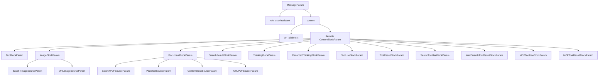

# Anthropic MessageParam Type Definitions

## Overview

Anthropic's message type system is based on `MessageParam`. It uses a simplified design that supports only two roles, `user` and `assistant`, while still supporting multiple content types through a rich Content Block system.

## Type Hierarchy



## Primary Type Definition

### MessageParam

**Type**: `TypedDict`
**Characteristics**: Minimal design with only two required fields

```python
class MessageParam(TypedDict, total=False):
    content: Required[
        Union[
            str,
            Iterable[
                Union[
                    TextBlockParam,
                    ImageBlockParam,
                    DocumentBlockParam,
                    SearchResultBlockParam,
                    ThinkingBlockParam,
                    RedactedThinkingBlockParam,
                    ToolUseBlockParam,
                    ToolResultBlockParam,
                    ServerToolUseBlockParam,
                    WebSearchToolResultBlockParam,
                    MCPToolUseBlockParam,
                    MCPToolResultBlockParam,
                    ContentBlock,
                ]
            ],
        ]
    ]
    role: Required[Literal["user", "assistant"]]
```

| Field | Type | Required | Description |
| --- | --- | --- | --- |
| `role` | `Literal["user", "assistant"]` | ✓ | Message role, supports only `user` and `assistant` |
| `content` | `Union[str, Iterable[ContentBlockParam]]` | ✓ | Message content, supporting plain text or an array of content blocks |

**Key characteristics**:

1. **Only two roles**: Unlike OpenAI, which has 6 roles, Anthropic has only `user` and `assistant`
2. **No `system` role**: System prompts are passed through a separate API parameter and do not appear in `messages`
3. **Content block design**: Rich content block types support multimodal and complex interactions

## Content Block Types in Detail

### 1. TextBlockParam

**Purpose**: Text content block

```python
class TextBlockParam(TypedDict, total=False):
    text: Required[str]
    type: Required[Literal["text"]]
    cache_control: Optional[CacheControlEphemeralParam]
    citations: Optional[Iterable[TextCitationParam]]
```

| Field | Type | Required | Description |
| --- | --- | --- | --- |
| `text` | `str` | ✓ | Text content |
| `type` | `Literal["text"]` | ✓ | Content block type identifier |
| `cache_control` | `Optional[CacheControlEphemeralParam]` | ✗ | Cache control breakpoint |
| `citations` | `Optional[Iterable[TextCitationParam]]` | ✗ | Text citations |

### 2. ImageBlockParam

**Purpose**: Image content block, supporting both base64 and URL sources

```python
Source: TypeAlias = Union[Base64ImageSourceParam, URLImageSourceParam]

class ImageBlockParam(TypedDict, total=False):
    source: Required[Source]
    type: Required[Literal["image"]]
    cache_control: Optional[CacheControlEphemeralParam]
```

| Field | Type | Required | Description |
| --- | --- | --- | --- |
| `source` | `Union[Base64ImageSourceParam, URLImageSourceParam]` | ✓ | Image source |
| `type` | `Literal["image"]` | ✓ | Content block type identifier |
| `cache_control` | `Optional[CacheControlEphemeralParam]` | ✗ | Cache control breakpoint |

#### Base64ImageSourceParam

```python
class Base64ImageSourceParam(TypedDict, total=False):
    data: Required[Annotated[Union[str, Base64FileInput], PropertyInfo(format="base64")]]
    media_type: Required[Literal["image/jpeg", "image/png", "image/gif", "image/webp"]]
    type: Required[Literal["base64"]]
```

**Supported image formats**: JPEG, PNG, GIF, WebP

#### URLImageSourceParam

```python
class URLImageSourceParam(TypedDict, total=False):
    type: Required[Literal["url"]]
    url: Required[str]
```

### 3. DocumentBlockParam

**Purpose**: Document content block, supporting PDF and plain text

```python
Source: TypeAlias = Union[
    Base64PDFSourceParam,
    PlainTextSourceParam,
    ContentBlockSourceParam,
    URLPDFSourceParam
]

class DocumentBlockParam(TypedDict, total=False):
    source: Required[Source]
    type: Required[Literal["document"]]
    cache_control: Optional[CacheControlEphemeralParam]
    citations: Optional[CitationsConfigParam]
    context: Optional[str]
    title: Optional[str]
```

| Field | Type | Required | Description |
| --- | --- | --- | --- |
| `source` | `Union[Base64PDFSourceParam, PlainTextSourceParam, ...]` | ✓ | Document source |
| `type` | `Literal["document"]` | ✓ | Content block type identifier |
| `cache_control` | `Optional[CacheControlEphemeralParam]` | ✗ | Cache control breakpoint |
| `citations` | `Optional[CitationsConfigParam]` | ✗ | Citation configuration |
| `context` | `Optional[str]` | ✗ | Document context |
| `title` | `Optional[str]` | ✗ | Document title |

### 4. SearchResultBlockParam

**Purpose**: Search result content block

```python
class SearchResultBlockParam(TypedDict, total=False):
    content: Required[Iterable[TextBlockParam]]
    source: Required[str]
    title: Required[str]
    type: Required[Literal["search_result"]]
    cache_control: Optional[CacheControlEphemeralParam]
    citations: CitationsConfigParam
```

| Field | Type | Required | Description |
| --- | --- | --- | --- |
| `content` | `Iterable[TextBlockParam]` | ✓ | Search result content |
| `source` | `str` | ✓ | Source |
| `title` | `str` | ✓ | Title |
| `type` | `Literal["search_result"]` | ✓ | Content block type identifier |
| `cache_control` | `Optional[CacheControlEphemeralParam]` | ✗ | Cache control breakpoint |
| `citations` | `CitationsConfigParam` | ✗ | Citation configuration |

### 5. ThinkingBlockParam

**Purpose**: Thinking process content block, used for reasoning models

```python
class ThinkingBlockParam(TypedDict, total=False):
    signature: Required[str]
    thinking: Required[str]
    type: Required[Literal["thinking"]]
```

| Field | Type | Required | Description |
| --- | --- | --- | --- |
| `signature` | `str` | ✓ | Signature |
| `thinking` | `str` | ✓ | Thinking content |
| `type` | `Literal["thinking"]` | ✓ | Content block type identifier |

### 6. RedactedThinkingBlockParam

**Purpose**: Redacted thinking content block

```python
class RedactedThinkingBlockParam(TypedDict, total=False):
    data: Required[str]
    type: Required[Literal["redacted_thinking"]]
```

| Field | Type | Required | Description |
| --- | --- | --- | --- |
| `data` | `str` | ✓ | Redacted data |
| `type` | `Literal["redacted_thinking"]` | ✓ | Content block type identifier |

### 7. ToolUseBlockParam

**Purpose**: Tool use content block (assistant-initiated tool call)

```python
class ToolUseBlockParam(TypedDict, total=False):
    id: Required[str]
    input: Required[Dict[str, object]]
    name: Required[str]
    type: Required[Literal["tool_use"]]
    cache_control: Optional[CacheControlEphemeralParam]
```

| Field | Type | Required | Description |
| --- | --- | --- | --- |
| `id` | `str` | ✓ | Tool call ID |
| `input` | `Dict[str, object]` | ✓ | Tool input parameters |
| `name` | `str` | ✓ | Tool name |
| `type` | `Literal["tool_use"]` | ✓ | Content block type identifier |
| `cache_control` | `Optional[CacheControlEphemeralParam]` | ✗ | Cache control breakpoint |

### 8. ToolResultBlockParam

**Purpose**: Tool result content block (user returns tool execution results)

```python
Content: TypeAlias = Union[
    TextBlockParam,
    ImageBlockParam,
    SearchResultBlockParam,
    DocumentBlockParam
]

class ToolResultBlockParam(TypedDict, total=False):
    tool_use_id: Required[str]
    type: Required[Literal["tool_result"]]
    cache_control: Optional[CacheControlEphemeralParam]
    content: Union[str, Iterable[Content]]
    is_error: bool
```

| Field | Type | Required | Description |
| --- | --- | --- | --- |
| `tool_use_id` | `str` | ✓ | Corresponding tool call ID |
| `type` | `Literal["tool_result"]` | ✓ | Content block type identifier |
| `cache_control` | `Optional[CacheControlEphemeralParam]` | ✗ | Cache control breakpoint |
| `content` | `Union[str, Iterable[Content]]` | ✗ | Tool result content |
| `is_error` | `bool` | ✗ | Whether this is an error result |

### 9. ServerToolUseBlockParam

**Purpose**: Server-side tool use content block, specific to `web_search`

```python
class ServerToolUseBlockParam(TypedDict, total=False):
    id: Required[str]
    input: Required[Dict[str, object]]
    name: Required[Literal["web_search"]]
    type: Required[Literal["server_tool_use"]]
    cache_control: Optional[CacheControlEphemeralParam]
```

| Field | Type | Required | Description |
| --- | --- | --- | --- |
| `id` | `str` | ✓ | Tool call ID |
| `input` | `Dict[str, object]` | ✓ | Tool input parameters |
| `name` | `Literal["web_search"]` | ✓ | Tool name, fixed to `web_search` |
| `type` | `Literal["server_tool_use"]` | ✓ | Content block type identifier |
| `cache_control` | `Optional[CacheControlEphemeralParam]` | ✗ | Cache control breakpoint |

### 10. WebSearchToolResultBlockParam

**Purpose**: Web search tool result content block

```python
class WebSearchToolResultBlockParam(TypedDict, total=False):
    content: Required[WebSearchToolResultBlockParamContentParam]
    tool_use_id: Required[str]
    type: Required[Literal["web_search_tool_result"]]
    cache_control: Optional[CacheControlEphemeralParam]
```

| Field | Type | Required | Description |
| --- | --- | --- | --- |
| `content` | `WebSearchToolResultBlockParamContentParam` | ✓ | Search result content |
| `tool_use_id` | `str` | ✓ | Corresponding tool call ID |
| `type` | `Literal["web_search_tool_result"]` | ✓ | Content block type identifier |
| `cache_control` | `Optional[CacheControlEphemeralParam]` | ✗ | Cache control breakpoint |

### 11. MCPToolUseBlockParam

**Purpose**: MCP (Model Context Protocol) tool use content block (assistant-initiated MCP tool call)

```python
class MCPToolUseBlockParam(TypedDict, total=False):
    id: Required[str]
    input: Required[Dict[str, object]]
    name: Required[str]
    server_name: Required[str]
    type: Required[Literal["mcp_tool_use"]]
    cache_control: Optional[CacheControlEphemeralParam]
```

| Field | Type | Required | Description |
| --- | --- | --- | --- |
| `id` | `str` | ✓ | Tool call ID |
| `input` | `Dict[str, object]` | ✓ | Tool input parameters |
| `name` | `str` | ✓ | Tool name |
| `server_name` | `str` | ✓ | MCP server name |
| `type` | `Literal["mcp_tool_use"]` | ✓ | Content block type identifier |
| `cache_control` | `Optional[CacheControlEphemeralParam]` | ✗ | Cache control breakpoint |

### 12. MCPToolResultBlockParam

**Purpose**: MCP tool result content block (the model receives MCP tool execution results)

```python
class MCPToolResultBlock(BaseModel):
    content: Union[str, List[TextBlock]]
    is_error: bool
    tool_use_id: str
    type: Literal["mcp_tool_result"]
```

| Field | Type | Required | Description |
| --- | --- | --- | --- |
| `content` | `Union[str, List[TextBlock]]` | ✓ | Tool result content |
| `is_error` | `bool` | ✓ | Whether this is an error result |
| `tool_use_id` | `str` | ✓ | Corresponding tool call ID |
| `type` | `Literal["mcp_tool_result"]` | ✓ | Content block type identifier |

## Helper Types

### CacheControlEphemeralParam

**Purpose**: Cache control configuration, an Anthropic-specific feature

```python
class CacheControlEphemeralParam(TypedDict, total=False):
    type: Required[Literal["ephemeral"]]
    ttl: Literal["5m", "1h"]
```

| Field | Type | Required | Description |
| --- | --- | --- | --- |
| `type` | `Literal["ephemeral"]` | ✓ | Cache type |
| `ttl` | `Literal["5m", "1h"]` | ✗ | Cache time-to-live, default 5 minutes |

**Note**: This is Anthropic's Prompt Caching feature. It lets you set cache breakpoints on content blocks to reduce repeated processing costs.

## MCP Tool Call Related Types

### 1. MCPToolsetParam

**Purpose**: MCP toolset configuration parameters

```python
class MCPToolsetParam(TypedDict, total=False):
    mcp_server_name: Required[str]
    type: Required[Literal["mcp_toolset"]]
    cache_control: Optional[CacheControlEphemeralParam]
    configs: Optional[Dict[str, MCPToolConfigParam]]
    default_config: MCPToolDefaultConfigParam
```

| Field | Type | Required | Description |
| --- | --- | --- | --- |
| `mcp_server_name` | `str` | ✓ | MCP server name |
| `type` | `Literal["mcp_toolset"]` | ✓ | Toolset type identifier |
| `cache_control` | `Optional[CacheControlEphemeralParam]` | ✗ | Cache control breakpoint |
| `configs` | `Optional[Dict[str, MCPToolConfigParam]]` | ✗ | Per-tool configuration overrides, keyed by tool name |
| `default_config` | `MCPToolDefaultConfigParam` | ✗ | Default configuration applied to all tools on this server |

### 2. MCPToolConfigParam

**Purpose**: MCP tool configuration parameters

```python
class MCPToolConfigParam(TypedDict, total=False):
    defer_loading: bool
    enabled: bool
```

| Field | Type | Required | Description |
| --- | --- | --- | --- |
| `defer_loading` | `bool` | ✗ | Whether to defer loading the tool |
| `enabled` | `bool` | ✗ | Whether the tool is enabled |

### 3. MCPToolDefaultConfigParam

**Purpose**: MCP tool default configuration parameters

```python
class MCPToolDefaultConfigParam(TypedDict, total=False):
    defer_loading: bool
    enabled: bool
```

| Field | Type | Required | Description |
| --- | --- | --- | --- |
| `defer_loading` | `bool` | ✗ | Whether to defer loading the tool |
| `enabled` | `bool` | ✗ | Whether the tool is enabled |

### 4. RequestMCPServerURLDefinitionParam

**Purpose**: MCP server URL definition parameters

```python
class RequestMCPServerURLDefinitionParam(TypedDict, total=False):
    name: Required[str]
    type: Required[Literal["url"]]
    url: Required[str]
    authorization_token: Optional[str]
    tool_configuration: Optional[RequestMCPServerToolConfigurationParam]
```

| Field | Type | Required | Description |
| --- | --- | --- | --- |
| `name` | `str` | ✓ | Server name |
| `type` | `Literal["url"]` | ✓ | Definition type identifier |
| `url` | `str` | ✓ | Server URL |
| `authorization_token` | `Optional[str]` | ✗ | Authorization token |
| `tool_configuration` | `Optional[RequestMCPServerToolConfigurationParam]` | ✗ | Tool configuration |

### 5. RequestMCPServerToolConfigurationParam

**Purpose**: MCP server tool configuration parameters

```python
class RequestMCPServerToolConfigurationParam(TypedDict, total=False):
    allowed_tools: Optional[SequenceNotStr[str]]
    enabled: Optional[bool]
```

| Field | Type | Required | Description |
| --- | --- | --- | --- |
| `allowed_tools` | `Optional[SequenceNotStr[str]]` | ✗ | List of allowed tools |
| `enabled` | `Optional[bool]` | ✗ | Whether the tool configuration is enabled |

## Tool Choice Types in Detail

### ToolChoiceParam

**Purpose**: Control whether and how the model uses tools

```python
ToolChoiceParam: TypeAlias = Union[
    ToolChoiceAnyParam,
    ToolChoiceAutoParam,
    ToolChoiceNoneParam,
    ToolChoiceToolParam
]
```

**Possible values**:

1. `ToolChoiceAnyParam` - Allow any tool to be used
2. `ToolChoiceAutoParam` - Automatically decide whether to use tools
3. `ToolChoiceNoneParam` - Do not use any tools
4. `ToolChoiceToolParam` - Specify a particular tool to use

### ToolChoiceAnyParam

**Purpose**: Allow any tool to be used

```python
class ToolChoiceAnyParam(TypedDict, total=False):
    type: Required[Literal["any"]]
    disable_parallel_tool_use: bool
```

| Field | Type | Required | Description |
| --- | --- | --- | --- |
| `type` | `Required[Literal["any"]]` | ✓ | Choice type identifier |
| `disable_parallel_tool_use` | `bool` | ✗ | Whether to disable parallel tool use |

### ToolChoiceAutoParam

**Purpose**: Automatically decide whether to use tools

```python
class ToolChoiceAutoParam(TypedDict, total=False):
    type: Required[Literal["auto"]]
    disable_parallel_tool_use: bool
```

| Field | Type | Required | Description |
| --- | --- | --- | --- |
| `type` | `Required[Literal["auto"]]` | ✓ | Choice type identifier |
| `disable_parallel_tool_use` | `bool` | ✗ | Whether to disable parallel tool use |

### ToolChoiceNoneParam

**Purpose**: Do not use any tools

```python
class ToolChoiceNoneParam(TypedDict, total=False):
    type: Required[Literal["none"]]
```

| Field | Type | Required | Description |
| --- | --- | --- | --- |
| `type` | `Required[Literal["none"]]` | ✓ | Choice type identifier |

### ToolChoiceToolParam

**Purpose**: Specify a particular tool to use

```python
class ToolChoiceToolParam(TypedDict, total=False):
    name: Required[str]
    type: Required[Literal["tool"]]
    disable_parallel_tool_use: bool
```

| Field | Type | Required | Description |
| --- | --- | --- | --- |
| `name` | `Required[str]` | ✓ | Tool name |
| `type` | `Required[Literal["tool"]]` | ✓ | Choice type identifier |
| `disable_parallel_tool_use` | `bool` | ✗ | Whether to disable parallel tool use |

## Key Feature Summary

### 1. Role System

- **Only 2 roles**: `user`, `assistant`
- **No `system` role**: System prompts are passed separately through the API `system` parameter
- **No `tool`/`function` roles**: Tool interactions are represented through content blocks

### 2. Content Block Architecture

- **Unified content block interface**: All content types are content blocks
- **Type identifier**: Every content block has a `type` field
- **Composable**: A single message can include multiple content blocks of different types

### 3. Multimodal Support

- **Text**: `TextBlockParam`
- **Images**: `ImageBlockParam` (supports JPEG, PNG, GIF, WebP)
- **Documents**: `DocumentBlockParam` (supports PDF and plain text)
- **Search results**: `SearchResultBlockParam`

### 4. Tool Call Mechanism

- **Tool use**: `ToolUseBlockParam` (in `assistant` messages)
- **Tool result**: `ToolResultBlockParam` (in `user` messages)
- **Server tools**: `ServerToolUseBlockParam` (specific to `web_search`)
- **MCP tools**: `MCPToolUseBlockParam` (Model Context Protocol tools)
- **Bidirectional flow**: assistant initiates → user responds

### 5. Tool Choice Mechanism

- **Four modes**: `any` (any tool), `auto` (automatic selection), `none` (no tools), `tool` (specific tool)
- **Parallel tool use control**: The `disable_parallel_tool_use` field can be used to control whether tools may be used in parallel
- **Specific tool selection**: The `name` field can be used to select a specific tool

### 6. Advanced Features

- **Prompt Caching**: Implemented via the `cache_control` field
- **Thinking process**: `ThinkingBlockParam` and `RedactedThinkingBlockParam`
- **Citation system**: The `citations` field supports content citations
- **Search integration**: Built-in search result and web search tool support
- **MCP support**: External tool integration via Model Context Protocol

### 7. Main Differences from OpenAI

| Feature | Anthropic | OpenAI |
| --- | --- | --- |
| Number of roles | 2 (`user`, `assistant`) | 6 (`developer`, `system`, `user`, `assistant`, `tool`, `function`) |
| `system` message | API parameter | Message role |
| Tool calls | Content blocks | Message fields |
| Multimodal | Content blocks | Content parts |
| Caching | Built-in support | None |
| Thinking process | Built-in support | None |
| MCP tools | Built-in support | None |

## Examples

### Simple Text Message

```python
# User message
user_msg: MessageParam = {
    "role": "user",
    "content": "Hello, how are you?"
}

# Assistant message
assistant_msg: MessageParam = {
    "role": "assistant",
    "content": "I'm doing well, thank you!"
}
```

### Multimodal User Message

```python
user_msg: MessageParam = {
    "role": "user",
    "content": [
        {
            "type": "text",
            "text": "What's in this image?"
        },
        {
            "type": "image",
            "source": {
                "type": "base64",
                "media_type": "image/jpeg",
                "data": "base64_encoded_image_data..."
            }
        }
    ]
}
```

### Tool Call and Response

```python
# Assistant initiates a tool call
assistant_msg: MessageParam = {
    "role": "assistant",
    "content": [
        {
            "type": "text",
            "text": "Let me check the weather for you."
        },
        {
            "type": "tool_use",
            "id": "toolu_123",
            "name": "get_weather",
            "input": {"location": "San Francisco"}
        }
    ]
}

# User returns the tool result
user_msg: MessageParam = {
    "role": "user",
    "content": [
        {
            "type": "tool_result",
            "tool_use_id": "toolu_123",
            "content": "The weather in San Francisco is sunny, 72°F"
        }
    ]
}
```

### MCP Tool Call Example

```python
# Configure the MCP server in the API request
mcp_servers = [
    {
        "name": "calculator-server",
        "type": "url",
        "url": "https://calculator-mcp-server.example.com",
        "authorization_token": "auth_token_123",
        "tool_configuration": {
            "allowed_tools": ["calc_evaluate", "calc_help"],
            "enabled": True
        }
    }
]

# Assistant initiates an MCP tool call
assistant_msg: MessageParam = {
    "role": "assistant",
    "content": [
        {
            "type": "text",
            "text": "Let me calculate that for you."
        },
        {
            "type": "mcp_tool_use",
            "id": "mcptool_456",
            "server_name": "calculator-server",
            "name": "calc_evaluate",
            "input": {"expression": "26 * 9 / 5 + 32"}
        }
    ]
}

# MCP tool result (handled automatically by the system)
mcp_result = {
    "type": "mcp_tool_result",
    "tool_use_id": "mcptool_456",
    "content": "78.8",
    "is_error": False
}
```

### Using Cache Control

```python
user_msg: MessageParam = {
    "role": "user",
    "content": [
        {
            "type": "text",
            "text": "Long context that should be cached...",
            "cache_control": {"type": "ephemeral", "ttl": "1h"}
        },
        {
            "type": "text",
            "text": "New question about the cached content"
        }
    ]
}
```

### Document Analysis

```python
user_msg: MessageParam = {
    "role": "user",
    "content": [
        {
            "type": "document",
            "source": {
                "type": "base64",
                "media_type": "application/pdf",
                "data": "base64_encoded_pdf_data..."
            },
            "title": "Research Paper",
            "context": "This is a scientific paper about AI"
        },
        {
            "type": "text",
            "text": "Please summarize the key findings"
        }
    ]
}
```

## Notes

1. **Role restrictions**: Only `user` and `assistant` roles are allowed. System prompts must be passed through the API `system` parameter.
2. **Content block order**: The order of content blocks matters and affects the model's understanding.
3. **Tool call flow**:
   - The assistant includes a `tool_use` block in `content`
   - The user must provide a `tool_result` block in the next message
   - The `tool_use_id` in `tool_result` must match the `id` of the `tool_use`
4. **MCP tool calls**:
   - MCP servers must be configured in the API request via the `mcp_servers` parameter
   - MCP tool results are handled automatically by the system and do not need to be provided manually by the user
   - The toolset can be configured via `MCPToolsetParam`
5. **Cache control**:
   - Use only for long-context scenarios
   - Cache breakpoints affect billing
   - TTL defaults to 5 minutes
6. **Type identifiers**: Every content block must have the correct `type` field
7. **Image formats**: Only JPEG, PNG, GIF, and WebP are supported
8. **Document support**: PDF and plain text documents are supported

## Version Information

- **Source**: Anthropic Python SDK
- **Generation method**: Automatically generated from the OpenAPI specification
- **Package path**: `anthropic.types`
