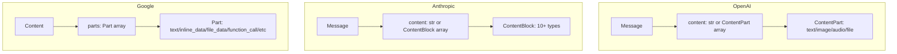

# Provider Message Type Comparison

## Overview

This document compares the message type systems of OpenAI, Anthropic, and Google GenAI LLM providers, identifies their commonalities and differences, and lays the groundwork for designing the intermediate representation (IR).

## Core Type Comparison

| Provider      | Core Type                                                            | Design Philosophy                                              |
| ------------- | -------------------------------------------------------------------- | -------------------------------------------------------------- |
| **OpenAI**    | [`ChatCompletionMessageParam`](openai.md#chatcompletionmessageparam) | Role-based union type with 6 roles, each with its own message type |
| **Anthropic** | [`MessageParam`](anthropic.md#messageparam)                         | Minimal design, only 2 roles, with complex capabilities implemented through content blocks |
| **Google**    | [`ContentListUnionDict`](google.md#contentlistuniondict)            | Highly flexible union type that supports multiple representations (object/dict/string) |

## Role System Comparison

### Role Types

| Role          | OpenAI     | Anthropic       | Google                    | Description                 |
| ------------- | ---------- | --------------- | ------------------------- | -------------------------- |
| **system**    | ✓          | ✗ (system param) | ✗ (GenerateContentConfig) | System prompt              |
| **developer** | ✓          | ✗               | ✗                         | Developer instruction (OpenAI-specific) |
| **user**      | ✓          | ✓               | ✓                         | User message               |
| **assistant** | ✓          | ✓               | ✗ (uses model)            | Assistant/model response   |
| **model**     | ✗          | ✗               | ✓                         | Model response (Google-specific) |
| **tool**      | ✓          | ✗ (content block) | ✗ (Part field)            | Tool response              |
| **function**  | ✓ (deprecated) | ✗            | ✗                         | Function response (deprecated) |

### Role Design Differences

**OpenAI**:

- Maximum number of role types (6)
- Explicitly distinguishes different participants
- The developer role is used for advanced control
- Tool and function roles handle tool calls specifically

**Anthropic**:

- Minimum number of role types (2)
- system is passed through the API's system parameter, supports multiple system messages, and each message can be a text block
- Tool interactions are implemented through content blocks
- Simplified, yet feature-complete

**Google**:

- 2 roles (user, model)
- model replaces assistant
- system is passed through the GenerateContentConfig system_instruction parameter, supporting multiple instructions
- A flexible type system compensates for the small number of roles

## Message Content Structure Comparison

### Content Organization



### Supported Content Types

| Content Type | OpenAI | Anthropic | Google | Implementation |
| ------------ | ------ | --------- | ------ | -------------- |
| **Text**     | ✓      | ✓         | ✓      | Supported by all providers |
| **Image**    | ✓      | ✓         | ✓      | URL or base64 |
| **Audio Input** | ✓   | ✗         | ✗      | OpenAI-specific |
| **Audio Output** | ✓  | ✗         | ✗      | OpenAI-specific (references) |
| **Document** | ✗      | ✓         | ✗      | Anthropic-specific (PDF/text) |
| **File**     | ✓      | ✗         | ✓      | Supported by OpenAI and Google |
| **Search Result** | ✗ | ✓         | ✗      | Anthropic-specific |
| **Thinking** | ✗      | ✓         | ✓      | Supported by Anthropic and Google |
| **Code Execution** | ✗ | ✗        | ✓      | Google-specific |

## Tool Call Mechanism Comparison

### Tool Call Flow

**OpenAI**:

```python
# Assistant initiates
{
    "role": "assistant",
    "tool_calls": [{
        "id": "call_123",
        "type": "function",
        "function": {"name": "get_weather", "arguments": "{}"}
    }]
}

# Tool response
{
    "role": "tool",
    "tool_call_id": "call_123",
    "content": "result"
}
```

**Anthropic**:

```python
# Assistant initiates
{
    "role": "assistant",
    "content": [{
        "type": "tool_use",
        "id": "toolu_123",
        "name": "get_weather",
        "input": {}
    }]
}

# User response
{
    "role": "user",
    "content": [{
        "type": "tool_result",
        "tool_use_id": "toolu_123",
        "content": "result"
    }]
}
```

**Google**:

```python
# Model initiates
{
    "role": "model",
    "parts": [{
        "function_call": {
            "name": "get_weather",
            "args": {}
        }
    }]
}

# User response
{
    "role": "user",
    "parts": [{
        "function_response": {
            "name": "get_weather",
            "response": {}
        }
    }]
}
```

### Tool Call Feature Comparison

| Feature         | OpenAI       | Anthropic      | Google    |
| --------------- | ------------ | -------------- | --------- |
| **Invocation**  | Message field | Content block | Part field |
| **Response role** | tool       | user           | user      |
| **ID linkage**  | tool_call_id | tool_use_id    | name match |
| **Multiple tool calls** | ✓    | ✓              | ✓         |
| **Custom tools** | ✓            | ✗              | ✗         |
| **Server tools** | ✗            | ✓ (web_search) | ✗         |

### Tool Selection Mechanism Comparison

| Feature             | OpenAI                                             | Anthropic                           | Google                                               |
| ------------------ | -------------------------------------------------- | ----------------------------------- | ---------------------------------------------------- |
| **Selection types** | auto/none/any/function                             | auto/none/any/tool                  | AUTO/NONE/ANY                                        |
| **Specify tool**    | `{"type": "function", "function": {"name": "fn"}}` | `{"type": "tool", "name": "tool"}`  | Via the `allowed_function_names` list, with Mode set to ANY |
| **Parallel tool use** | Controlled by the `parallel_tool_calls` parameter | Controlled by `disable_parallel_tool_use` | Decided by the model |
| **Configuration location** | API parameter `tool_choice`               | API parameter `tool_choice`         | Nested config (ToolConfig → FunctionCallingConfig)   |
| **Default behavior** | auto (model decides)                               | auto (model decides)                | AUTO (model decides)                                 |

## Special Feature Comparison

### System Prompt

| Provider      | Supported | Implementation |
| ------------- | --------- | -------------- |
| **OpenAI**    | ✓         | As a message with the `system` role |
| **Anthropic** | ✓         | API `system` parameter, supports multiple text blocks, not part of message history |
| **Google**    | ✓         | `GenerateContentConfig` `system_instruction` parameter, supports multiple instructions |

### Tool Selection Mechanism

| Provider      | Supported | Implementation |
| ------------- | --------- | -------------- |
| **OpenAI**    | ✓         | `tool_choice` parameter, supports four modes: auto/none/any/function |
| **Anthropic** | ✓         | `tool_choice` parameter, supports four modes: auto/none/any/tool |
| **Google**    | ✓         | Nested config object, supports four modes: AUTO/NONE/ANY/ANY+allowed_function_names |

### Prompt Caching

| Provider      | Supported | Implementation |
| ------------- | --------- | -------------- |
| **OpenAI**    | ✗         | Not supported |
| **Anthropic** | ✓         | `cache_control` field |
| **Google**    | ✗         | Not supported |

### Thinking

| Provider      | Supported | Implementation |
| ------------- | --------- | -------------- |
| **OpenAI**    | ✗         | Not supported |
| **Anthropic** | ✓         | ThinkingBlock and RedactedThinkingBlock |
| **Google**    | ✓         | `Part.thought` field |

### Citations

| Provider      | Supported | Implementation |
| ------------- | --------- | -------------- |
| **OpenAI**    | ✗         | Not supported |
| **Anthropic** | ✓         | `citations` field |
| **Google**    | ✗         | Not supported |

## Design Philosophy of the Type System

### OpenAI

- **Strict typing**: Uses TypedDict, with a clear type definition for each role
- **Role-oriented**: Differentiates functionality through different role types
- **Backward compatibility**: Retains deprecated function-related types
- **Multimodal extension**: Supports multiple media types through ContentPart
- **Tool control**: Fine-grained control of tool usage through `tool_choice` and `parallel_tool_calls`

### Anthropic

- **Content block architecture**: All capabilities are implemented through content blocks
- **Minimal roles**: Only user and assistant roles
- **Feature-rich**: 10+ content block types for a wide range of scenarios
- **Caching optimization**: Built-in Prompt Caching support
- **Tool selection**: Supports four tool selection modes, including parallel tool use control

### Google

- **Flexible typing**: The same content can be represented in multiple ways
- **Automatic conversion**: Automatically converts between objects, dicts, and strings
- **Part architecture**: Supports various content forms through different Part fields
- **Code execution**: Built-in code execution support
- **Nested configuration**: Controls function-call behavior through nested config objects

## Conversion Challenges

### 1. Role Mapping

**Challenge**:

- OpenAI has 6 roles, while Anthropic and Google have only 2
- In Anthropic, the system role is the API's system parameter and supports multiple text blocks
- In Google, the system role is the GenerateContentConfig system_instruction parameter and supports multiple instructions
- In Anthropic, the tool role is a content block, and in Google it is a Part field

**Solution**:

- Establish a role mapping table
- Handle system messages specially and convert them to the corresponding API parameters for the target provider
- Convert tool/function messages into the corresponding content blocks or Part fields

### 2. Tool Calls

**Challenge**:

- The tool call mechanisms of the three providers are completely different
- ID linkage differs
- Response roles differ

**Solution**:

- A unified tool-call IR
- Preserve all required ID information
- Regenerate IDs that match the target format during conversion

### 3. Tool Selection Mechanism

**Challenge**:

- Selection mode names differ (auto/AUTO, none/NONE, any/ANY)
- The way specific tools are specified differs
- Parallel tool use control differs
- Google uses nested config objects

**Solution**:

- A unified tool-selection IR
- Standardize selection mode names
- Provide unified control over parallel tool use
- Handle different configuration structures during conversion

### 3. Provider-Specific Features

**Challenge**:

- Some features are supported only by specific providers
- How to handle unsupported features

**Solution**:

- Keep fields for all features in the IR
- Provide downgrade strategies during conversion
- Record unsupported features and warn the user

### 4. Type Flexibility

**Challenge**:

- Google supports multiple representations
- OpenAI and Anthropic use fixed structures

**Solution**:

- Use a normalized structure in the IR
- Normalize input when converting from Google
- Choose the most suitable representation when converting to Google

## Commonalities Summary

Although the three providers differ greatly in design, they all support the following core capabilities:

1. **Basic messages**: Sending and receiving text messages
2. **Role differentiation**: Distinguishing between user and model messages
3. **Multimodality**: Supporting text and images
4. **Tool calls**: Supporting function/tool invocation mechanisms
5. **Tool selection**: Controlling whether and how the model uses tools
6. **Conversation history**: Supporting multi-turn conversations

These commonalities provide the foundation for designing a unified IR.

## Differences Summary

The main differences are:

1. **Role system**: Ranges from 2 to 6 roles
2. **Content organization**: Content parts vs. content blocks vs. Part
3. **Tool calls**: Message fields vs. content blocks vs. Part fields
4. **Tool selection**: Different configuration styles and options, such as parallel tool use control
5. **Special features**: Each provider has its own unique capabilities (caching, thinking, code execution, etc.)
6. **Type flexibility**: Ranges from strict to flexible

These differences need to be carefully considered and handled in IR design.

## Next Steps

Based on the analysis above, we will design an intermediate representation (IR) that needs to:

1. Support the core capabilities of all providers
2. Represent provider-specific capabilities
3. Provide clear conversion rules
4. Handle incompatible cases

See the historical IR design documentation, which is not retained in this repository.
