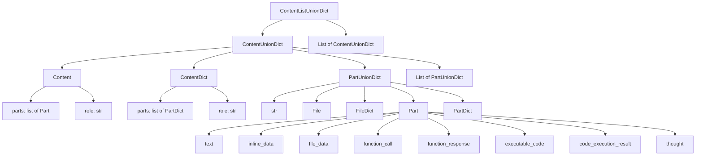

# Google GenAI ContentListUnionDict Type Definitions

## Overview

Google GenAI's message type system is based on `ContentListUnionDict`, a highly flexible union type that supports multiple content representations.

## Type Hierarchy



## Primary Type Aliases

### ContentListUnionDict

**Definition**: `ContentListUnionDict = typing.Union[google.genai.types.Content, google.genai.types.ContentDict, str, google.genai.types.File, google.genai.types.FileDict, google.genai.types.Part, google.genai.types.PartDict, list[typing.Union[str, google.genai.types.File, google.genai.types.FileDict, google.genai.types.Part, google.genai.types.PartDict]], list[typing.Union[google.genai.types.Content, google.genai.types.ContentDict, str, google.genai.types.File, google.genai.types.FileDict, google.genai.types.Part, google.genai.types.PartDict, list[typing.Union[str, google.genai.types.File, google.genai.types.FileDict, google.genai.types.Part, google.genai.types.PartDict]]]]]`

**Members**:

- `<class 'google.genai.types.Content'>`
- `<class 'google.genai.types.ContentDict'>`
- `<class 'str'>`
- `<class 'google.genai.types.File'>`
- `<class 'google.genai.types.FileDict'>`
- `<class 'google.genai.types.Part'>`
- `<class 'google.genai.types.PartDict'>`
- `list[typing.Union[str, google.genai.types.File, google.genai.types.FileDict, google.genai.types.Part, google.genai.types.PartDict]]`
- `list[typing.Union[google.genai.types.Content, google.genai.types.ContentDict, str, google.genai.types.File, google.genai.types.FileDict, google.genai.types.Part, google.genai.types.PartDict, list[typing.Union[str, google.genai.types.File, google.genai.types.FileDict, google.genai.types.Part, google.genai.types.PartDict]]]]`

### ContentUnionDict

**Definition**: `ContentUnionDict = typing.Union[google.genai.types.Content, google.genai.types.ContentDict, str, google.genai.types.File, google.genai.types.FileDict, google.genai.types.Part, google.genai.types.PartDict, list[typing.Union[str, google.genai.types.File, google.genai.types.FileDict, google.genai.types.Part, google.genai.types.PartDict]]]`

**Members**:

- `<class 'google.genai.types.Content'>`
- `<class 'google.genai.types.ContentDict'>`
- `<class 'str'>`
- `<class 'google.genai.types.File'>`
- `<class 'google.genai.types.FileDict'>`
- `<class 'google.genai.types.Part'>`
- `<class 'google.genai.types.PartDict'>`
- `list[typing.Union[str, google.genai.types.File, google.genai.types.FileDict, google.genai.types.Part, google.genai.types.PartDict]]`

### PartUnionDict

**Definition**: `PartUnionDict = typing.Union[str, google.genai.types.File, google.genai.types.FileDict, google.genai.types.Part, google.genai.types.PartDict]`

**Members**:

- `<class 'str'>`
- `<class 'google.genai.types.File'>`
- `<class 'google.genai.types.FileDict'>`
- `<class 'google.genai.types.Part'>`
- `<class 'google.genai.types.PartDict'>`

## Primary Class Definitions

### Content

Contains the multipart content of a message.

**Inherits**: BaseModel

**Fields**:

| Field   | Type                                             | Description |
| ------- | ------------------------------------------------ | ----------- |
| `parts` | `typing.Optional[list[google.genai.types.Part]]` |      |
| `role`  | `typing.Optional[str]`                           |      |

### ContentDict

Contains the multipart content of a message.

**Inherits**: dict

**Fields**:

| Field   | Type                                                 | Description |
| ------- | ---------------------------------------------------- | ----------- |
| `parts` | `typing.Optional[list[google.genai.types.PartDict]]` |      |
| `role`  | `typing.Optional[str]`                               |      |

### File

A file uploaded to the API.

**Inherits**: BaseModel

**Fields**:

| Field            | Type                                             | Description |
| ----------------- | ------------------------------------------------ | ----------- |
| `name`            | `typing.Optional[str]`                           |      |
| `display_name`    | `typing.Optional[str]`                           |      |
| `mime_type`       | `typing.Optional[str]`                           |      |
| `size_bytes`      | `typing.Optional[int]`                           |      |
| `create_time`     | `typing.Optional[datetime.datetime]`             |      |
| `expiration_time` | `typing.Optional[datetime.datetime]`             |      |
| `update_time`     | `typing.Optional[datetime.datetime]`             |      |
| `sha256_hash`     | `typing.Optional[str]`                           |      |
| `uri`             | `typing.Optional[str]`                           |      |
| `download_uri`    | `typing.Optional[str]`                           |      |
| `state`           | `typing.Optional[google.genai.types.FileState]`  |      |
| `source`          | `typing.Optional[google.genai.types.FileSource]` |      |
| `video_metadata`  | `typing.Optional[dict[str, typing.Any]]`         |      |
| `error`           | `typing.Optional[google.genai.types.FileStatus]` |      |

### FileDict

A file uploaded to the API.

**Inherits**: dict

**Fields**:

| Field            | Type                                                 | Description |
| ----------------- | ---------------------------------------------------- | ----------- |
| `name`            | `typing.Optional[str]`                               |      |
| `display_name`    | `typing.Optional[str]`                               |      |
| `mime_type`       | `typing.Optional[str]`                               |      |
| `size_bytes`      | `typing.Optional[int]`                               |      |
| `create_time`     | `typing.Optional[datetime.datetime]`                 |      |
| `expiration_time` | `typing.Optional[datetime.datetime]`                 |      |
| `update_time`     | `typing.Optional[datetime.datetime]`                 |      |
| `sha256_hash`     | `typing.Optional[str]`                               |      |
| `uri`             | `typing.Optional[str]`                               |      |
| `download_uri`    | `typing.Optional[str]`                               |      |
| `state`           | `typing.Optional[google.genai.types.FileState]`      |      |
| `source`          | `typing.Optional[google.genai.types.FileSource]`     |      |
| `video_metadata`  | `typing.Optional[dict[str, typing.Any]]`             |      |
| `error`           | `typing.Optional[google.genai.types.FileStatusDict]` |      |

### Part

A datatype containing media content.

Exactly one field within a Part should be set, representing the specific type
of content being conveyed. Using multiple fields within the same `Part`
instance is considered invalid.

**Inherits**: BaseModel

**Fields**:

| Field                 | Type                                                      | Description |
| ----------------------- | --------------------------------------------------------- | ----------- |
| `media_resolution`      | `typing.Optional[google.genai.types.PartMediaResolution]` |      |
| `code_execution_result` | `typing.Optional[google.genai.types.CodeExecutionResult]` |      |
| `executable_code`       | `typing.Optional[google.genai.types.ExecutableCode]`      |      |
| `file_data`             | `typing.Optional[google.genai.types.FileData]`            |      |
| `function_call`         | `typing.Optional[google.genai.types.FunctionCall]`        |      |
| `function_response`     | `typing.Optional[google.genai.types.FunctionResponse]`    |      |
| `inline_data`           | `typing.Optional[google.genai.types.Blob]`                |      |
| `text`                  | `typing.Optional[str]`                                    |      |
| `thought`               | `typing.Optional[bool]`                                   |      |
| `thought_signature`     | `typing.Optional[bytes]`                                  |      |
| `video_metadata`        | `typing.Optional[google.genai.types.VideoMetadata]`       |      |

### PartDict

A datatype containing media content.

Exactly one field within a Part should be set, representing the specific type
of content being conveyed. Using multiple fields within the same `Part`
instance is considered invalid.

**Inherits**: dict

**Fields**:

| Field                 | Type                                                          | Description |
| ----------------------- | ------------------------------------------------------------- | ----------- |
| `media_resolution`      | `typing.Optional[google.genai.types.PartMediaResolutionDict]` |      |
| `code_execution_result` | `typing.Optional[google.genai.types.CodeExecutionResultDict]` |      |
| `executable_code`       | `typing.Optional[google.genai.types.ExecutableCodeDict]`      |      |
| `file_data`             | `typing.Optional[google.genai.types.FileDataDict]`            |      |
| `function_call`         | `typing.Optional[google.genai.types.FunctionCallDict]`        |      |
| `function_response`     | `typing.Optional[google.genai.types.FunctionResponseDict]`    |      |
| `inline_data`           | `typing.Optional[google.genai.types.BlobDict]`                |      |
| `text`                  | `typing.Optional[str]`                                        |      |
| `thought`               | `typing.Optional[bool]`                                       |      |
| `thought_signature`     | `typing.Optional[bytes]`                                      |      |
| `video_metadata`        | `typing.Optional[google.genai.types.VideoMetadataDict]`       |      |

## Tool Choice Type Details

### ToolConfig

**Purpose**: Configure how the model uses tools

```python
class ToolConfig(TypedDict, total=False):
    function_calling_config: NotRequired[FunctionCallingConfig]
```

| Field                     | Type                    | Required | Description |
| ------------------------- | ----------------------- | -------- | ----------- |
| `function_calling_config` | `FunctionCallingConfig` | ✗        | Function calling configuration |

### FunctionCallingConfig

**Purpose**: Configure function calling behavior

```python
class FunctionCallingConfig(TypedDict, total=False):
    mode: NotRequired[FunctionCallingMode]
    allowed_function_names: NotRequired[List[str]]
    disable_functions: NotRequired[bool]
```

| Field                    | Type                  | Required | Description |
| ------------------------ | --------------------- | -------- | ----------- |
| `mode`                   | `FunctionCallingMode` | ✗        | Function calling mode |
| `allowed_function_names` | `List[str]`           | ✗        | List of function names that may be called |
| `disable_functions`      | `bool`                | ✗        | Whether to disable function calling |

### FunctionCallingMode

**Purpose**: Define function calling modes

```python
class FunctionCallingMode(str, Enum):
    AUTO = "AUTO"
    ANY = "ANY"
    NONE = "NONE"
```

| Value  | Description |
| ------ | ----------- |
| `AUTO` | The model decides automatically whether to call a function |
| `ANY`  | Allows the model to call any available function |
| `NONE` | Does not allow the model to call any function |

## Usage Examples

### Simple Text Message

```python
# Using a string
content = "Hello, how are you?"

# Using a Content object
content = types.Content(parts=[types.Part(text="Hello, how are you?")])

# Using a dictionary
content = {"parts": [{"text": "Hello, how are you?"}]}
```

### Multimodal Message

```python
# Using a Content object
content = types.Content(
    parts=[
        types.Part(text="What's in this image?"),
        types.Part(inline_data=types.Blob(
            mime_type="image/jpeg",
            data=base64.b64encode(image_bytes).decode()
        ))
    ]
)

# Using a dictionary
content = {
    "parts": [
        {"text": "What's in this image?"},
        {"inline_data": {
            "mime_type": "image/jpeg",
            "data": base64.b64encode(image_bytes).decode()
        }}
    ]
}
```

### Conversation History

```python
# Using a list of Content objects
contents = [
    types.Content(role="user", parts=[types.Part(text="Hello, how are you?")]),
    types.Content(role="model", parts=[types.Part(text="I'm doing well, thank you!")]),
    types.Content(role="user", parts=[types.Part(text="Tell me about yourself.")])
]

# Using a list of dictionaries
contents = [
    {"role": "user", "parts": [{"text": "Hello, how are you?"}]},
    {"role": "model", "parts": [{"text": "I'm doing well, thank you!"}]},
    {"role": "user", "parts": [{"text": "Tell me about yourself."}]}
]
```

## Key Feature Summary

### 1. Role System

- **2 roles**: user, model
- **No system role**: system prompts are passed through other API parameters
- **No function role**: function calling is represented through Part fields

### 2. Part Architecture

- **Part interface**: all content types are Part
- **Type marker**: each Part has a `part_type` field
- **Composable**: a single message can contain multiple Part types

### 3. Multimodal Support

- **Text**: TextPart
- **Inline data**: InlineDataPart (supports multiple MIME types)
- **File data**: FilePart (supports multiple file types)
- **Video**: VideoPart (supports multiple video formats)

### 4. Tool Calling Mechanism

- **Function declaration**: FunctionDeclaration
- **Function call**: FunctionCall
- **Function response**: FunctionResponse
- **Bidirectional flow**: model initiates → function responds

### 5. Tool Selection Mechanism

- **Four modes**:
  - AUTO (automatically decide whether to use a function)
  - ANY (allow use of any function)
  - NONE (do not use any function)
  - ANY + `allowed_function_names` (force selection of specific functions)
- **Function name filtering**: `allowed_function_names` can restrict available functions; combined with ANY mode, it forms the fourth mode
- **Fully disabled**: `disable_functions` can completely disable function calling
- **Configuration hierarchy**: set through nested configuration objects (ToolConfig → FunctionCallingConfig)

### 6. Advanced Features

- **Streaming responses**: supports streaming generation and processing
- **Multi-turn conversation**: implemented through message history
- **Safety filtering**: built-in content filtering mechanisms
- **Multiple model support**: adapts to different Google AI models

## MCP Tool Calling Mechanism

### Overview

The Google GenAI SDK supports interacting with external tools through the Model Context Protocol (MCP). MCP is a standardized protocol that allows models to communicate with external services and extend model capabilities.

### Key Components

#### 1. MCP Tool Adapter

The Google GenAI SDK uses the `McpToGenAiToolAdapter` class to convert MCP tools into tools that Gemini can use:

```python
class McpToGenAiToolAdapter:
    """Adapter for working with MCP tools in a GenAI client."""

    def __init__(
        self,
        session: "mcp.ClientSession",
        list_tools_result: "mcp_types.ListToolsResult",
    ) -> None:
        self._mcp_session = session
        self._list_tools_result = list_tools_result

    async def call_tool(
        self, function_call: FunctionCall
    ) -> "mcp_types.CallToolResult":
        """Calls a function on the MCP server."""
        name = function_call.name if function_call.name else ""
        arguments = dict(function_call.args) if function_call.args else {}

        return typing.cast(
            "mcp_types.CallToolResult",
            await self._mcp_session.call_tool(
                name=name,
                arguments=arguments,
            ),
        )

    @property
    def tools(self) -> list[Tool]:
        """Returns a list of Google GenAI tools."""
        return mcp_to_gemini_tools(self._list_tools_result.tools)
```

#### 2. MCP Tool Conversion

The SDK provides functions for converting MCP tools into Gemini tools:

```python
def mcp_to_gemini_tool(tool: McpTool) -> types.Tool:
    """Translates an MCP tool to a Google GenAI tool."""
    return types.Tool(
        function_declarations=[{
            "name": tool.name,
            "description": tool.description,
            "parameters": types.Schema.from_json_schema(
                json_schema=types.JSONSchema(
                    **_filter_to_supported_schema(tool.inputSchema)
                )
            ),
        }]
    )

def mcp_to_gemini_tools(tools: list[McpTool]) -> list[types.Tool]:
    """Translates a list of MCP tools to a list of Google GenAI tools."""
    return [mcp_to_gemini_tool(tool) for tool in tools]
```

#### 3. MCP Session Handling

The SDK supports detecting and handling MCP sessions:

```python
def has_mcp_tool_usage(tools: types.ToolListUnion) -> bool:
    """Checks whether the list of tools contains any MCP tools or sessions."""
    if McpClientSession is None:
        return False
    for tool in tools:
        if isinstance(tool, McpTool) or isinstance(tool, McpClientSession):
            return True
    return False

def has_mcp_session_usage(tools: types.ToolListUnion) -> bool:
    """Checks whether the list of tools contains any MCP sessions."""
    if McpClientSession is None:
        return False
    for tool in tools:
        if isinstance(tool, McpClientSession):
            return True
    return False
```

### Workflow

1. **Initialize the MCP server**: create the MCP server parameters and initialize the connection
2. **Create the MCP session**: create a ClientSession using the server connection
3. **Pass the MCP session to the model**: pass the MCP session as a tool in the `generate_content` call
4. **Automatic tool calling**: the SDK automatically handles tool calls and responses

### Example

```python
import os
import asyncio
from datetime import datetime
from mcp import ClientSession, StdioServerParameters
from mcp.client.stdio import stdio_client
from google import genai

client = genai.Client()

# Create server parameters for a stdio connection
server_params = StdioServerParameters(
    command="npx",  # executable
    args=["-y", "@philschmid/weather-mcp"],  # MCP server
    env=None,  # optional environment variables
)

async def run():
    async with stdio_client(server_params) as (read, write):
        async with ClientSession(read, write) as session:
            # Prompt for today's weather in London
            prompt = f"What is the weather in London in {datetime.now().strftime('%Y-%m-%d')}?"

            # Initialize the connection between the client and server
            await session.initialize()

            # Send a request to the model with MCP function declarations
            response = await client.aio.models.generate_content(
                model="gemini-2.5-flash",
                contents=prompt,
                config=genai.types.GenerateContentConfig(
                    temperature=0,
                    tools=[session],  # Use the session; tools will be called automatically
                    # Uncomment the following lines if you do not want the SDK to call tools automatically
                    # automatic_function_calling=genai.types.AutomaticFunctionCallingConfig(
                    #     disable=True
                    # ),
                ),
            )
            print(response.text)

# Start the asyncio event loop and run the main function
asyncio.run(run())
```

### Internal Behavior

1. **Tool conversion**: when an MCP session or tool is detected, the SDK converts it into a Gemini-compatible tool format
2. **Automatic function calling**: by default, the SDK handles function calling automatically, but this can be disabled through configuration
3. **Session management**: the SDK manages the lifecycle of MCP sessions to ensure they are initialized and closed correctly
4. **Error handling**: the SDK provides error handling mechanisms that can catch and process errors in MCP tool calls

### Notes

1. **Asynchronous operations**: MCP tool calls are asynchronous and must be used in an async environment
2. **Tool compatibility**: not all MCP tools are compatible with automatic function calling; the SDK warns when it detects incompatible tools
3. **Version marker**: the SDK adds an MCP version marker to API request headers to help track usage
4. **JSON Schema conversion**: the SDK filters MCP tool input schemas to ensure they include only fields supported by Gemini

## Notes

1. **Type flexibility**: Google GenAI's type system is very flexible, and the same content can have multiple representations
2. **Automatic conversion**: the API automatically converts between representations, but using the correct type explicitly can avoid potential issues
3. **Dictionary representation**: in most cases, dictionary representations are the simplest option
4. **Object representation**: object representations provide better type checking and IDE support
5. **String limitations**: plain strings apply only to pure text content and do not support roles or multimodal content

## Version Information

- **Source**: Google GenAI Python SDK
- **Package path**: `google.genai.types`
