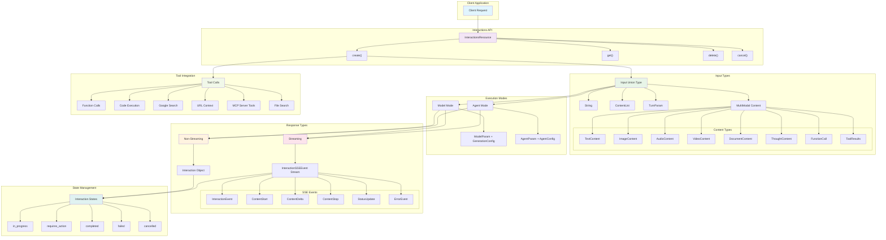

# Google GenAI Interactions API Analysis

## Overview

The latest Google GenAI release introduces a new Interactions API, an advanced conversational interface that provides richer capabilities than the traditional `generateContent` API. This API supports multimodal input, streaming responses, Agent mode, tool calling, and other advanced features.

## Architecture Diagram



## Core Interfaces

### InteractionsResource

The primary resource class provides the following methods:

- `create()` - Create a new interaction
- `get()` - Retrieve interaction details
- `delete()` - Delete an interaction
- `cancel()` - Cancel a background interaction

## Input Types (Input)

### Base Input Types

```python
Input: TypeAlias = Union[
    str,                           # Simple text input
    Iterable[ContentList],         # Content list
    Iterable[TurnParam],          # Conversation turns
    TextContentParam,             # Text content
    ImageContentParam,            # Image content
    AudioContentParam,            # Audio content
    DocumentContentParam,         # Document content
    VideoContentParam,            # Video content
    ThoughtContentParam,          # Thought content
    FunctionCallContentParam,     # Function call
    FunctionResultContentParam,   # Function result
    CodeExecutionCallContentParam,    # Code execution call
    CodeExecutionResultContentParam,  # Code execution result
    URLContextCallContentParam,       # URL context call
    URLContextResultContentParam,     # URL context result
    GoogleSearchCallContentParam,     # Google search call
    GoogleSearchResultContentParam,   # Google search result
    MCPServerToolCallContentParam,    # MCP server tool call
    MCPServerToolResultContentParam,  # MCP server tool result
    FileSearchResultContentParam,     # File search result
]
```

### Conversation Turns (Turn)

```python
class TurnParam(TypedDict, total=False):
    content: Union[str, Iterable[ContentUnionMember1]]
    """Conversation content"""

    role: str
    """Role: use 'user' for user input and 'model' for model output"""
```

## Create Interaction Parameters

### Model Interaction Parameters

```python
class BaseCreateModelInteractionParams(TypedDict, total=False):
    input: Required[Input]
    """Input content for the interaction"""

    model: Required[ModelParam]
    """Model name used to generate the interaction"""

    api_version: str

    background: bool
    """Whether to run the model interaction in the background"""

    generation_config: GenerationConfigParam
    """Configuration parameters for the model interaction"""

    previous_interaction_id: str
    """ID of the previous interaction, if any"""

    response_format: object
    """Force the response to be a JSON object conforming to the specified JSON schema"""

    response_mime_type: str
    """Response MIME type. Required when response_format is set"""

    response_modalities: List[Literal["text", "image", "audio"]]
    """Requested response modalities (text, image, audio)"""

    store: bool
    """Whether to store responses and requests for later retrieval"""

    system_instruction: str
    """System instruction for the interaction"""

    tools: Iterable[ToolParam]
    """List of tool declarations that the model may call during the interaction"""
```

### Agent Interaction Parameters

```python
class BaseCreateAgentInteractionParams(TypedDict, total=False):
    agent: Required[Union[str, Literal["deep-research-pro-preview-12-2025"]]]
    """Agent name used to generate the interaction"""

    input: Required[Input]
    """Input content for the interaction"""

    agent_config: AgentConfig
    """Agent configuration"""

    # ... other parameters are similar to model interaction parameters
```

## Response Types

### Interaction Object

```python
class Interaction(BaseModel):
    id: str
    """Unique identifier for the completed interaction"""

    status: Literal["in_progress", "requires_action", "completed", "failed", "cancelled"]
    """Interaction status"""

    agent: Union[str, Literal["deep-research-pro-preview-12-2025"], None] = None
    """Agent name used to generate the interaction"""

    created: Optional[datetime] = None
    """Creation time (ISO 8601 format)"""

    model: Optional[Model] = None
    """Model name used to generate the interaction"""

    object: Optional[Literal["interaction"]] = None
    """Object type, always 'interaction'"""

    outputs: Optional[List[Output]] = None
    """Model responses"""

    previous_interaction_id: Optional[str] = None
    """ID of the previous interaction"""

    role: Optional[str] = None
    """Interaction role"""

    updated: Optional[datetime] = None
    """Last update time (ISO 8601 format)"""

    usage: Optional[Usage] = None
    """Token usage statistics for the interaction request"""
```

## Streaming Response

### InteractionSSEEvent

```python
InteractionSSEEvent: TypeAlias = Union[
    InteractionEvent,           # Interaction event
    InteractionStatusUpdate,    # Status update
    ContentStart,              # Content start
    ContentDelta,              # Content delta
    ContentStop,               # Content stop
    ErrorEvent                 # Error event
]
```

### ContentDelta Detailed Structure

```python
class ContentDelta(BaseModel):
    delta: Optional[Delta] = None
    event_id: Optional[str] = None
    """Event ID token used to resume the interaction stream"""

    event_type: Optional[Literal["content.delta"]] = None
    index: Optional[int] = None
```

Supported delta types include:

- `DeltaTextDelta` - Text delta
- `DeltaImageDelta` - Image delta
- `DeltaAudioDelta` - Audio delta
- `DeltaVideoDelta` - Video delta
- `DeltaThoughtSummaryDelta` - Thought summary delta
- `DeltaFunctionCallDelta` - Function call delta
- `DeltaCodeExecutionCallDelta` - Code execution call delta
- `DeltaMCPServerToolCallDelta` - MCP server tool call delta
- and more...

## Special Features

### 1. Agent Mode

Supports predefined Agents such as `"deep-research-pro-preview-12-2025"` for deep research tasks.

### 2. Multimodal Support

Natively supports multiple input and output formats, including text, images, audio, video, and documents.

### 3. Tool Calling

Supports multiple tool types:

- Function Call
- Code Execution
- URL Context
- Google Search
- MCP Server Tools
- File Search

### 4. Background Execution

Supports long-running tasks in the background, with status and results retrievable by ID.

### 5. Streaming Response

Supports Server-Sent Events (SSE) streaming responses for real-time access to generated content.

### 6. Thought Process

Supports the `ThoughtContent` type, which can expose the model's thought process.

## API Usage Patterns

### 1. Basic Model Interaction

```python
# Non-streaming
interaction = client.interactions.create(
    input="Hello, world!",
    model="gemini-2.0-flash-exp"
)

# Streaming
stream = client.interactions.create(
    input="Hello, world!",
    model="gemini-2.0-flash-exp",
    stream=True
)
```

### 2. Agent Interaction

```python
interaction = client.interactions.create(
    agent="deep-research-pro-preview-12-2025",
    input="Research the latest developments in AI",
    agent_config={"max_iterations": 5}
)
```

### 3. Multi-Turn Conversation

```python
interaction = client.interactions.create(
    input=[
        {"role": "user", "content": "What is Python?"},
        {"role": "model", "content": "Python is a programming language..."},
        {"role": "user", "content": "Show me an example"}
    ],
    model="gemini-2.0-flash-exp"
)
```

### 4. Tool Calling

```python
interaction = client.interactions.create(
    input="What's the weather like today?",
    model="gemini-2.0-flash-exp",
    tools=[weather_tool]
)
```

## Comparison with the Traditional API

| Feature     | Interactions API  | Traditional `generateContent` |
| ----------- | ----------------- | ----------------------------- |
| Multi-turn conversation | ✅ Native support | ⚠️ Requires manual management |
| Streaming response | ✅ SSE event stream | ✅ Basic streaming |
| Background execution | ✅ Supported | ❌ Not supported |
| Agent mode | ✅ Supported | ❌ Not supported |
| State management | ✅ Automatic management | ❌ Requires manual management |
| Tool calling | ✅ Rich tool types | ✅ Basic tool calling |
| Thought process | ✅ Supported | ❌ Not supported |
| Multimodal | ✅ Full support | ✅ Supported |

## Summary

The Google GenAI Interactions API represents a major upgrade to conversational AI interfaces, offering more advanced abstractions and richer capabilities. It is especially well suited for building complex conversational applications, agent systems, and long-running AI tasks. The design philosophy of this API is closer to the needs of modern AI applications, giving developers more powerful and flexible tools.
