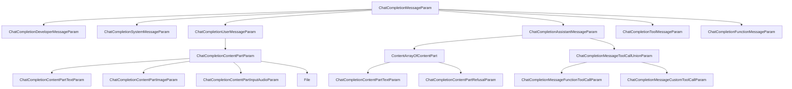

# OpenAI ChatCompletionMessageParam Type Definitions

## Overview

OpenAI's message type system is based on `ChatCompletionMessageParam`, which is a Union type that supports six different message roles.

## Type Hierarchy



## Primary Type Definition

### ChatCompletionMessageParam

**Type**: `TypeAlias`  
**Definition**: A Union type containing six message roles

```python
ChatCompletionMessageParam: TypeAlias = Union[
    ChatCompletionDeveloperMessageParam,
    ChatCompletionSystemMessageParam,
    ChatCompletionUserMessageParam,
    ChatCompletionAssistantMessageParam,
    ChatCompletionToolMessageParam,
    ChatCompletionFunctionMessageParam,
]
```

## Detailed Message Types by Role

### 1. ChatCompletionDeveloperMessageParam

**Role**: `developer`  
**Purpose**: Developer message used for high-level instructions that set model behavior

| Field     | Type                                                      | Required | Description                                               |
| --------- | --------------------------------------------------------- | -------- | --------------------------------------------------------- |
| `role`    | `Literal["developer"]`                                    | ✓        | Message role identifier                                   |
| `content` | `Union[str, Iterable[ChatCompletionContentPartTextParam]]` | ✓        | Developer message content                                 |
| `name`    | `str`                                                     | ✗        | Optional participant name for distinguishing same-role participants |

**Full Definition**:

```python
class ChatCompletionDeveloperMessageParam(TypedDict, total=False):
    content: Required[Union[str, Iterable[ChatCompletionContentPartTextParam]]]
    role: Required[Literal["developer"]]
    name: str
```

### 2. ChatCompletionSystemMessageParam

**Role**: `system`  
**Purpose**: System message used to set assistant behavior and context

| Field     | Type                                                      | Required | Description         |
| --------- | --------------------------------------------------------- | -------- | ------------------- |
| `role`    | `Literal["system"]`                                       | ✓        | Message role identifier |
| `content` | `Union[str, Iterable[ChatCompletionContentPartTextParam]]` | ✓        | System message content |
| `name`    | `str`                                                     | ✗        | Optional participant name |

**Full Definition**:

```python
class ChatCompletionSystemMessageParam(TypedDict, total=False):
    content: Required[Union[str, Iterable[ChatCompletionContentPartTextParam]]]
    role: Required[Literal["system"]]
    name: str
```

### 3. ChatCompletionUserMessageParam

**Role**: `user`  
**Purpose**: User message supporting text, images, audio, and files

| Field     | Type                                                 | Required | Description              |
| --------- | ---------------------------------------------------- | -------- | ------------------------ |
| `role`    | `Literal["user"]`                                    | ✓        | Message role identifier  |
| `content` | `Union[str, Iterable[ChatCompletionContentPartParam]]` | ✓      | User message content, supports multimodal input |
| `name`    | `str`                                                | ✗        | Optional participant name |

**Full Definition**:

```python
class ChatCompletionUserMessageParam(TypedDict, total=False):
    content: Required[Union[str, Iterable[ChatCompletionContentPartParam]]]
    role: Required[Literal["user"]]
    name: str
```

**Supported Content Types** (`ChatCompletionContentPartParam`):

- `ChatCompletionContentPartTextParam`: text content
- `ChatCompletionContentPartImageParam`: image content
- `ChatCompletionContentPartInputAudioParam`: audio input
- `File`: file content

### 4. ChatCompletionAssistantMessageParam

**Role**: `assistant`  
**Purpose**: Assistant message that can include text, tool calls, function calls, and audio responses

| Field           | Type                                                   | Required | Description                                                                 |
| --------------- | ------------------------------------------------------ | -------- | --------------------------------------------------------------------------- |
| `role`          | `Literal["assistant"]`                                 | ✓        | Message role identifier                                                     |
| `content`       | `Union[str, Iterable[ContentArrayOfContentPart], None]` | ✗       | Assistant message content; required unless `tool_calls` or `function_call` is specified |
| `audio`         | `Optional[Audio]`                                      | ✗        | Data from a previous audio response                                         |
| `function_call` | `Optional[FunctionCall]`                               | ✗        | **Deprecated**; replaced by `tool_calls`                                    |
| `name`          | `str`                                                  | ✗        | Optional participant name                                                   |
| `refusal`       | `Optional[str]`                                        | ✗        | Assistant refusal message                                                   |
| `tool_calls`    | `Iterable[ChatCompletionMessageToolCallUnionParam]`    | ✗        | Tool calls generated by the model                                           |

**Full Definition**:

```python
class ChatCompletionAssistantMessageParam(TypedDict, total=False):
    role: Required[Literal["assistant"]]
    audio: Optional[Audio]
    content: Union[str, Iterable[ContentArrayOfContentPart], None]
    function_call: Optional[FunctionCall]
    name: str
    refusal: Optional[str]
    tool_calls: Iterable[ChatCompletionMessageToolCallUnionParam]
```

**Nested Types**:

#### Audio

```python
class Audio(TypedDict, total=False):
    id: Required[str]  # Unique identifier for the previous audio response
```

#### FunctionCall (Deprecated)

```python
class FunctionCall(TypedDict, total=False):
    arguments: Required[str]  # Function arguments in JSON format
    name: Required[str]        # Name of the function to call
```

#### ContentArrayOfContentPart

```python
ContentArrayOfContentPart: TypeAlias = Union[
    ChatCompletionContentPartTextParam,
    ChatCompletionContentPartRefusalParam
]
```

### 5. ChatCompletionToolMessageParam

**Role**: `tool`  
**Purpose**: Tool response message used to return the result of a tool call

| Field           | Type                                                      | Required | Description                 |
| -------------- | --------------------------------------------------------- | -------- | --------------------------- |
| `role`         | `Literal["tool"]`                                         | ✓        | Message role identifier      |
| `content`      | `Union[str, Iterable[ChatCompletionContentPartTextParam]]` | ✓      | Tool message content        |
| `tool_call_id` | `str`                                                     | ✓        | The tool call ID this message responds to |

**Full Definition**:

```python
class ChatCompletionToolMessageParam(TypedDict, total=False):
    content: Required[Union[str, Iterable[ChatCompletionContentPartTextParam]]]
    role: Required[Literal["tool"]]
    tool_call_id: Required[str]
```

### 6. ChatCompletionFunctionMessageParam

**Role**: `function`  
**Purpose**: **Deprecated** function response message (replaced by the tool message)

| Field     | Type                 | Required | Description      |
| --------- | -------------------- | -------- | ---------------- |
| `role`    | `Literal["function"]` | ✓        | Message role identifier |
| `content` | `Optional[str]`      | ✓        | Function message content |
| `name`    | `str`                | ✓        | Function name    |

**Full Definition**:

```python
class ChatCompletionFunctionMessageParam(TypedDict, total=False):
    content: Required[Optional[str]]
    name: Required[str]
    role: Required[Literal["function"]]
```

## Content Part Types

### ChatCompletionContentPartTextParam

**Purpose**: Text content part

```python
class ChatCompletionContentPartTextParam(TypedDict, total=False):
    text: Required[str]            # Text content
    type: Required[Literal["text"]]  # Content type identifier
```

### ChatCompletionContentPartImageParam

**Purpose**: Image content part

```python
class ImageURL(TypedDict, total=False):
    url: Required[str]  # Image URL or base64-encoded image data
    detail: Literal["auto", "low", "high"]  # Image detail level

class ChatCompletionContentPartImageParam(TypedDict, total=False):
    image_url: Required[ImageURL]
    type: Required[Literal["image_url"]]
```

### ChatCompletionContentPartInputAudioParam

**Purpose**: Audio input content part

```python
class InputAudio(TypedDict, total=False):
    data: Required[str]  # Base64-encoded audio data
    format: Required[Literal["wav", "mp3"]]  # Audio format

class ChatCompletionContentPartInputAudioParam(TypedDict, total=False):
    input_audio: Required[InputAudio]
    type: Required[Literal["input_audio"]]
```

### ChatCompletionContentPartRefusalParam

**Purpose**: Refusal content part

```python
class ChatCompletionContentPartRefusalParam(TypedDict, total=False):
    refusal: Required[str]  # Model-generated refusal message
```

### File

**Purpose**: File content part

```python
class FileFile(TypedDict, total=False):
    file_data: str   # Base64-encoded file data
    file_id: str     # ID of the uploaded file
    filename: str    # File name

class File(TypedDict, total=False):
    file: Required[FileFile]
    type: Required[Literal["file"]]
```

## Tool Call Types

### ChatCompletionMessageToolCallUnionParam

**Definition**: A Union type supporting two tool call kinds

```python
ChatCompletionMessageToolCallUnionParam: TypeAlias = Union[
    ChatCompletionMessageFunctionToolCallParam,
    ChatCompletionMessageCustomToolCallParam
]
```

### ChatCompletionMessageFunctionToolCallParam

**Purpose**: Function tool call

```python
class Function(TypedDict, total=False):
    arguments: Required[str]  # Function arguments in JSON format
    name: Required[str]       # Function name

class ChatCompletionMessageFunctionToolCallParam(TypedDict, total=False):
    id: Required[str]                    # Tool call ID
    function: Required[Function]         # Function invoked by the model
    type: Required[Literal["function"]]  # Tool type
```

### ChatCompletionMessageCustomToolCallParam

**Purpose**: Custom tool call

```python
class Custom(TypedDict, total=False):
    input: Required[str]  # Input for the custom tool
    name: Required[str]   # Custom tool name

class ChatCompletionMessageCustomToolCallParam(TypedDict, total=False):
    id: Required[str]                  # Tool call ID
    custom: Required[Custom]           # Custom tool invoked by the model
    type: Required[Literal["custom"]]  # Tool type
```

## Tool Choice Types

### ChatCompletionToolChoiceOptionParam

**Purpose**: Controls whether and how the model uses tools

```python
ChatCompletionToolChoiceOptionParam: TypeAlias = Union[
    Literal["none", "auto", "required"],
    ChatCompletionAllowedToolChoiceParam,
    ChatCompletionNamedToolChoiceParam,
    ChatCompletionNamedToolChoiceCustomParam
]
```

**Possible Values**:

1. `"none"` - Do not use any tools
2. `"auto"` - Automatically decide whether to use tools
3. `"required"` - Tools must be used
4. `ChatCompletionAllowedToolChoiceParam` - Allowed tool choice parameter
5. `ChatCompletionNamedToolChoiceParam` - Named tool choice parameter
6. `ChatCompletionNamedToolChoiceCustomParam` - Named custom tool choice parameter

### ChatCompletionNamedToolChoiceParam

**Purpose**: Specifies a particular function tool to use

```python
class ChatCompletionNamedToolChoiceParam(TypedDict, total=False):
    function: Required[Function]
    type: Required[Literal["function"]]
```

| Field      | Type                            | Required | Description      |
| ---------- | ------------------------------- | -------- | ---------------- |
| `function` | `Required[Function]`            | ✓        | Function details |
| `type`     | `Required[Literal["function"]]` | ✓        | Tool type identifier |

### ChatCompletionNamedToolChoiceCustomParam

**Purpose**: Specifies a particular custom tool to use

```python
class ChatCompletionNamedToolChoiceCustomParam(TypedDict, total=False):
    custom: Required[Custom]
    type: Required[Literal["custom"]]
```

| Field     | Type                          | Required | Description        |
| --------- | ----------------------------- | -------- | ------------------ |
| `custom`  | `Required[Custom]`            | ✓        | Custom tool details |
| `type`    | `Required[Literal["custom"]]` | ✓        | Tool type identifier |

### ChatCompletionAllowedToolChoiceParam

**Purpose**: Specifies the allowed tool type

```python
class ChatCompletionAllowedToolChoiceParam(TypedDict, total=False):
    type: Required[Literal["tool_type"]]
    tool_type: Required[Literal["function", "custom"]]
```

| Field       | Type                                      | Required | Description       |
| ----------- | ----------------------------------------- | -------- | ----------------- |
| `type`      | `Required[Literal["tool_type"]]`          | ✓        | Choice type identifier |
| `tool_type` | `Required[Literal["function", "custom"]]` | ✓        | Allowed tool type |

## Key Feature Summary

### 1. Role System

- **6 roles**: developer, system, user, assistant, tool, function
- **Role hierarchy**: developer > system > user/assistant > tool/function
- **Deprecated role**: function (replaced by tool)

### 2. Multimodal Support

- **Text**: supported by all roles
- **Images**: supported only by the user role (via `ChatCompletionContentPartImageParam`)
- **Audio input**: supported only by the user role (via `ChatCompletionContentPartInputAudioParam`)
- **Audio output**: supported only by the assistant role (via the `Audio` field)
- **Files**: supported only by the user role (via the `File` type)

### 3. Tool Calling Mechanism

- **Tool calls**: `tool_calls` field in assistant messages
- **Tool responses**: tool messages linked via `tool_call_id`
- **Two tool types**: function tools and custom tools
- **Deprecated**: `function_call` field and the function role

### 4. Tool Choice Mechanism

- **Four modes**: none (do not use tools), auto (choose automatically), required (tools are mandatory), and specific tool selection
- **Specific tool selection**: a particular function tool or custom tool can be selected
- **Tool type restriction**: the choice can be limited to a specific tool type (function or custom)

### 5. Content Structure

- **Plain text**: use a string directly
- **Structured content**: use an array of content parts (`Iterable[ContentPart]`)
- **Type identifier**: each content part has a `type` field that identifies its type

### 6. Optional Fields

- **name**: all roles except tool and function support an optional `name` field
- **refusal**: the assistant role supports refusal messages
- **audio**: the assistant role supports references to audio responses

## Usage Examples

### Simple Text Messages

```python
# System message
system_msg: ChatCompletionSystemMessageParam = {
    "role": "system",
    "content": "You are a helpful assistant."
}

# User message
user_msg: ChatCompletionUserMessageParam = {
    "role": "user",
    "content": "Hello, how are you?"
}

# Assistant message
assistant_msg: ChatCompletionAssistantMessageParam = {
    "role": "assistant",
    "content": "I'm doing well, thank you!"
}
```

### Multimodal User Message

```python
user_msg: ChatCompletionUserMessageParam = {
    "role": "user",
    "content": [
        {
            "type": "text",
            "text": "What's in this image?"
        },
        {
            "type": "image_url",
            "image_url": {
                "url": "https://example.com/image.jpg",
                "detail": "high"
            }
        }
    ]
}
```

### Tool Call and Response

```python
# Assistant initiates a tool call
assistant_msg: ChatCompletionAssistantMessageParam = {
    "role": "assistant",
    "tool_calls": [
        {
            "id": "call_123",
            "type": "function",
            "function": {
                "name": "get_weather",
                "arguments": '{"location": "San Francisco"}'
            }
        }
    ]
}

# Tool response
tool_msg: ChatCompletionToolMessageParam = {
    "role": "tool",
    "tool_call_id": "call_123",
    "content": "The weather in San Francisco is sunny, 72°F"
}
```

## Notes

1. **TypedDict with total=False**: all types use `total=False`, which means all fields are optional by default unless marked with `Required`
2. **Required marker**: use `Required[T]` to mark required fields
3. **Deprecated features**:
   - `function_call` field (use `tool_calls` instead)
   - `ChatCompletionFunctionMessageParam` (use `ChatCompletionToolMessageParam` instead)
4. **Content requirement**: the `content` field of an assistant message is required when neither `tool_calls` nor `function_call` is present
5. **Tool call ID**: tool messages must be linked to the corresponding assistant tool call through `tool_call_id`

## Version Information

- **Source**: OpenAI Python SDK
- **Generated from**: OpenAPI specification
- **Package path**: `openai.types.chat`
