# OpenAI Responses API Message Type Definitions

This document describes the message type definitions used by the OpenAI Responses API, especially `ResponseInputItemParam` and its related types. These types power OpenAI's next-generation Responses API and provide richer capabilities and a more flexible message structure than the traditional Chat Completions API.

## Core Type Overview

The core message type in the OpenAI Responses API is `ResponseInputItemParam`, a union type that includes multiple kinds of input items.

```python
ResponseInputItemParam: TypeAlias = Union[
    EasyInputMessageParam,
    Message,
    ResponseOutputMessageParam,
    ResponseFileSearchToolCallParam,
    ResponseComputerToolCallParam,
    ComputerCallOutput,
    ResponseFunctionWebSearchParam,
    ResponseFunctionToolCallParam,
    FunctionCallOutput,
    ResponseReasoningItemParam,
    ResponseCompactionItemParamParam,
    ImageGenerationCall,
    ResponseCodeInterpreterToolCallParam,
    LocalShellCall,
    LocalShellCallOutput,
    ShellCall,
    ShellCallOutput,
    ApplyPatchCall,
    ApplyPatchCallOutput,
    McpListTools,
    McpApprovalRequest,
    McpApprovalResponse,
    McpCall,
    ResponseCustomToolCallOutputParam,
    ResponseCustomToolCallParam,
    ItemReference,
]
```

`ResponseInputParam` is a list of `ResponseInputItemParam`:

```python
ResponseInputParam: TypeAlias = List[ResponseInputItemParam]
```

## Type Diagram

The following Mermaid diagram shows the core type structure of the OpenAI Responses API:

```mermaid
classDiagram
    ResponseInputParam --> ResponseInputItemParam : List of

    ResponseInputItemParam <|-- EasyInputMessageParam
    ResponseInputItemParam <|-- Message
    ResponseInputItemParam <|-- ResponseOutputMessageParam
    ResponseInputItemParam <|-- ToolCallTypes
    ResponseInputItemParam <|-- ToolCallOutputTypes
    ResponseInputItemParam <|-- OtherSpecialTypes

    class ResponseInputParam {
        List[ResponseInputItemParam]
    }

    class ResponseInputItemParam {
        Union of many types
    }

    class EasyInputMessageParam {
        +content: Union[str, ResponseInputMessageContentListParam]
        +role: Literal["user", "assistant", "system", "developer"]
        +type: Literal["message"]
    }

    class Message {
        +content: ResponseInputMessageContentListParam
        +role: Literal["user", "system", "developer"]
        +status: Literal["in_progress", "completed", "incomplete"]
        +type: Literal["message"]
    }

    class ToolCallTypes {
        ResponseFunctionToolCallParam
        ResponseFunctionWebSearchParam
        ResponseFileSearchToolCallParam
        ResponseCodeInterpreterToolCallParam
        ResponseComputerToolCallParam
        ShellCall
        McpCall
        ...
    }

    class ToolCallOutputTypes {
        FunctionCallOutput
        ComputerCallOutput
        ShellCallOutput
        ...
    }

    class OtherSpecialTypes {
        ResponseReasoningItemParam
        ImageGenerationCall
        ItemReference
        ...
    }

    ResponseInputMessageContentListParam --> ResponseInputContentParam : List of

    class ResponseInputMessageContentListParam {
        List[ResponseInputContentParam]
    }

    ResponseInputContentParam <|-- ResponseInputTextParam
    ResponseInputContentParam <|-- ResponseInputImageParam
    ResponseInputContentParam <|-- ResponseInputFileParam

    class ResponseInputContentParam {
        Union of content types
    }

    class ResponseInputTextParam {
        +text: str
        +type: Literal["input_text"]
    }

    class ResponseInputImageParam {
        +detail: Literal["low", "high", "auto"]
        +type: Literal["input_image"]
        +file_id: Optional[str]
        +image_url: Optional[str]
    }

    class ResponseInputFileParam {
        +type: Literal["input_file"]
        +file_data: str
        +file_id: Optional[str]
        +file_url: str
        +filename: str
    }
```



## Basic Message Types

### EasyInputMessageParam

`EasyInputMessageParam` is a simplified message input type used to provide text, image, or audio input to the model.

```python
class EasyInputMessageParam(TypedDict, total=False):
    content: Required[Union[str, ResponseInputMessageContentListParam]]
    """
    Text, image, or audio input to the model for generating a response. It can also include a prior assistant response.
    """

    role: Required[Literal["user", "assistant", "system", "developer"]]
    """The role of the message input.

    Must be one of `user`, `assistant`, `system`, or `developer`.
    """

    type: Literal["message"]
    """The type of the message input. Always `message`."""
```

### Message

`Message` is a more structured message type, designed specifically for the Responses API.

```python
class Message(TypedDict, total=False):
    content: Required[ResponseInputMessageContentListParam]
    """
    A list containing one or more input items with different content types.
    """

    role: Required[Literal["user", "system", "developer"]]
    """The role of the message input. Must be one of `user`, `system`, or `developer`."""

    status: Literal["in_progress", "completed", "incomplete"]
    """The status of the item.

    Must be one of `in_progress`, `completed`, or `incomplete`. Populated when the item is returned by the API.
    """

    type: Literal["message"]
    """The type of the message input. Always set to `message`."""
```

## Message Content Types

Message content is defined by `ResponseInputMessageContentListParam`, which is a list of `ResponseInputContentParam`:

```python
ResponseInputContentParam: TypeAlias = Union[
    ResponseInputTextParam,
    ResponseInputImageParam,
    ResponseInputFileParam
]

ResponseInputMessageContentListParam: TypeAlias = List[ResponseInputContentParam]
```

### ResponseInputTextParam

```python
class ResponseInputTextParam(TypedDict, total=False):
    text: Required[str]
    """Text sent to the model."""

    type: Required[Literal["input_text"]]
    """The type of the input item. Always `input_text`."""
```

### ResponseInputImageParam

```python
class ResponseInputImageParam(TypedDict, total=False):
    detail: Required[Literal["low", "high", "auto"]]
    """The detail level of the image sent to the model.

    Must be one of `high`, `low`, or `auto`. Defaults to `auto`.
    """

    type: Required[Literal["input_image"]]
    """The type of the input item. Always `input_image`."""

    file_id: Optional[str]
    """The file ID of the image sent to the model."""

    image_url: Optional[str]
    """The URL of the image sent to the model.

    May be a fully qualified URL or a base64-encoded image in a data URL.
    """
```

### ResponseInputFileParam

```python
class ResponseInputFileParam(TypedDict, total=False):
    type: Required[Literal["input_file"]]
    """The type of the input item. Always `input_file`."""

    file_data: str
    """The file contents sent to the model."""

    file_id: Optional[str]
    """The file ID sent to the model."""

    file_url: str
    """The file URL sent to the model."""

    filename: str
    """The filename sent to the model."""
```

## Tool Call Types

The Responses API supports several tool call types, including:

### Function Call

```python
class ResponseFunctionToolCallParam(TypedDict, total=False):
    # Definition of a function tool call
    # ...
```

### Web Search

```python
class ResponseFunctionWebSearchParam(TypedDict, total=False):
    # Definition of a web search tool call
    # ...
```

### File Search

```python
class ResponseFileSearchToolCallParam(TypedDict, total=False):
    # Definition of a file search tool call
    # ...
```

### Code Interpreter

```python
class ResponseCodeInterpreterToolCallParam(TypedDict, total=False):
    # Definition of a code interpreter tool call
    # ...
```

### Computer Tool

```python
class ResponseComputerToolCallParam(TypedDict, total=False):
    # Definition of a computer tool call
    # ...
```

### Shell Call

```python
class ShellCall(TypedDict, total=False):
    action: Required[ShellCallAction]
    """Describes the shell command and constraints for running the tool call."""

    call_id: Required[str]
    """The unique ID of the shell tool call generated by the model."""

    type: Required[Literal["shell_call"]]
    """The type of the item. Always `shell_call`."""

    id: Optional[str]
    """The unique ID of the shell tool call.

    Populated when this item is returned by the API.
    """

    status: Optional[Literal["in_progress", "completed", "incomplete"]]
    """The status of the shell call.

    Must be one of `in_progress`, `completed`, or `incomplete`.
    """
```

## MCP Tool Call Types

OpenAI Responses API supports Model Context Protocol (MCP) tool calls, which allow the model to interact with external services. MCP is a standardized protocol that enables the model to access external tools and resources, extending its capabilities.

### MCP Related Type Overview

There are four MCP-related types in the `ResponseInputItemParam` union:

```python
ResponseInputItemParam: TypeAlias = Union[
    # ...other types...
    McpListTools,
    McpApprovalRequest,
    McpApprovalResponse,
    McpCall,
    # ...other types...
]
```

### McpCall

`McpCall` is the core type for MCP tool calls and represents a model's request to invoke an MCP tool.

```python
class McpCall(TypedDict, total=False):
    id: Required[str]
    """The unique ID of the tool call."""

    arguments: Required[str]
    """A JSON string containing the arguments passed to the tool."""

    name: Required[str]
    """The name of the tool being run."""

    server_label: Required[str]
    """The label of the MCP server running the tool."""

    type: Required[Literal["mcp_call"]]
    """The type of the item. Always `mcp_call`."""

    approval_request_id: Optional[str]
    """The unique identifier of the MCP tool call approval request. Include this value in a later `mcp_approval_response` input to approve or reject the corresponding tool call."""

    error: Optional[str]
    """Any tool call error, if present."""

    output: Optional[str]
    """The tool call output."""

    status: Literal["in_progress", "completed", "incomplete", "calling", "failed"]
    """The status of the tool call.

    Must be one of `in_progress`, `completed`, `incomplete`, `calling`, or `failed`.
    """
```

### McpListTools

The `McpListTools` type is used to list available MCP tools.

```python
class McpListTools(TypedDict, total=False):
    id: Required[str]
    """The unique ID of the MCP tool list request."""

    server_label: Required[str]
    """The label of the MCP server."""

    type: Required[Literal["mcp_list_tools"]]
    """The type of the item. Always `mcp_list_tools`."""

    error: Optional[str]
    """Any error encountered while listing tools."""

    output: Optional[str]
    """A JSON list of available tools."""

    status: Literal["in_progress", "completed", "incomplete", "calling", "failed"]
    """The status of the tool list request."""
```

### McpApprovalRequest

The `McpApprovalRequest` type is used to request user approval for an MCP tool call.

```python
class McpApprovalRequest(TypedDict, total=False):
    id: Required[str]
    """The unique ID of the approval request."""

    call: Required[McpCall]
    """The MCP tool call that requires approval."""

    type: Required[Literal["mcp_approval_request"]]
    """The type of the item. Always `mcp_approval_request`."""

    status: Literal["in_progress", "completed", "incomplete"]
    """The status of the approval request."""
```

### McpApprovalResponse

The `McpApprovalResponse` type is used for a user's response to an MCP tool call approval request.

```python
class McpApprovalResponse(TypedDict, total=False):
    id: Required[str]
    """The unique ID of the approval response."""

    approval_request_id: Required[str]
    """The ID of the corresponding approval request."""

    approved: Required[bool]
    """Whether the tool call was approved."""

    type: Required[Literal["mcp_approval_response"]]
    """The type of the item. Always `mcp_approval_response`."""

    status: Literal["in_progress", "completed", "incomplete"]
    """The status of the approval response."""
```

### MCP Tool Call Flow

The typical MCP tool call flow is as follows:

1. **Tool list request**: The model can request the list of tools available on a specific MCP server through `McpListTools`.

2. **Tool call**: The model invokes a specific MCP tool with `McpCall`, providing the necessary arguments.

3. **Approval request** (optional): If the tool call requires user approval, the system generates an `McpApprovalRequest`.

4. **Approval response** (optional): The user approves or rejects the tool call through `McpApprovalResponse`.

5. **Tool execution**: If the tool call is approved, or does not require approval, the system executes the tool call and updates the `McpCall` status and output.

### MCP Tool Call Example

```python
# List available tools
list_tools_request = {
    "id": "list_123",
    "server_label": "calculator-server",
    "type": "mcp_list_tools",
    "status": "calling"
}

# Tool call
tool_call = {
    "id": "call_456",
    "server_label": "calculator-server",
    "name": "calc_evaluate",
    "arguments": '{"expression": "26 * 9 / 5 + 32"}',
    "type": "mcp_call",
    "status": "calling"
}

# Approval request
approval_request = {
    "id": "approval_789",
    "call": tool_call,
    "type": "mcp_approval_request",
    "status": "in_progress"
}

# Approval response
approval_response = {
    "id": "response_012",
    "approval_request_id": "approval_789",
    "approved": True,
    "type": "mcp_approval_response",
    "status": "completed"
}

# Tool call result
tool_call_result = {
    "id": "call_456",
    "server_label": "calculator-server",
    "name": "calc_evaluate",
    "arguments": '{"expression": "26 * 9 / 5 + 32"}',
    "output": "78.8",
    "type": "mcp_call",
    "status": "completed"
}
```

## Tool Call Output Types

Tool call execution produces the following output types:

### Function Call Output

```python
class FunctionCallOutput(TypedDict, total=False):
    call_id: Required[str]
    """The unique ID of the function tool call generated by the model."""

    output: Required[Union[str, ResponseFunctionCallOutputItemListParam]]
    """The text, image, or file output of the function tool call."""

    type: Required[Literal["function_call_output"]]
    """The type of the function tool call output. Always `function_call_output`."""

    id: Optional[str]
    """The unique ID of the function tool call output.

    Populated when this item is returned by the API.
    """

    status: Optional[Literal["in_progress", "completed", "incomplete"]]
    """The status of the item.

    Must be one of `in_progress`, `completed`, or `incomplete`. Populated when the item is returned by the API.
    """
```

### Computer Call Output

```python
class ComputerCallOutput(TypedDict, total=False):
    call_id: Required[str]
    """The ID of the computer tool call that produced the output."""

    output: Required[ResponseComputerToolCallOutputScreenshotParam]
    """The computer screenshot image used with the computer use tool."""

    type: Required[Literal["computer_call_output"]]
    """The type of the computer tool call output. Always `computer_call_output`."""

    id: Optional[str]
    """The ID of the computer tool call output."""

    acknowledged_safety_checks: Optional[Iterable[ComputerCallOutputAcknowledgedSafetyCheck]]
    """Safety checks reported by the API as acknowledged by the developer."""

    status: Optional[Literal["in_progress", "completed", "incomplete"]]
    """The status of the message input.

    Must be one of `in_progress`, `completed`, or `incomplete`. Populated when the input item is returned by the API.
    """
```

### Shell Call Output

```python
class ShellCallOutput(TypedDict, total=False):
    call_id: Required[str]
    """The unique ID of the shell tool call generated by the model."""

    output: Required[Iterable[ResponseFunctionShellCallOutputContentParam]]
    """Captured stdout and stderr output chunks, together with their associated results."""

    type: Required[Literal["shell_call_output"]]
    """The type of the item. Always `shell_call_output`."""

    id: Optional[str]
    """The unique ID of the shell tool call output.

    Populated when this item is returned by the API.
    """

    max_output_length: Optional[int]
    """The maximum number of UTF-8 characters captured for the combined output of this shell call."""
```

## Other Special Types

### Reasoning Item

```python
class ResponseReasoningItemParam(TypedDict, total=False):
    # Definition of a reasoning item
    # ...
```

### Image Generation Call

```python
class ImageGenerationCall(TypedDict, total=False):
    id: Required[str]
    """The unique ID of the image generation call."""

    result: Required[Optional[str]]
    """The generated image, encoded as base64."""

    status: Required[Literal["in_progress", "completed", "generating", "failed"]]
    """The status of the image generation call."""

    type: Required[Literal["image_generation_call"]]
    """The type of the image generation call. Always `image_generation_call`."""
```

### Item Reference

```python
class ItemReference(TypedDict, total=False):
    id: Required[str]
    """The ID of the item to reference."""

    type: Optional[Literal["item_reference"]]
    """The type of the item to reference. Always `item_reference`."""
```

## Comparison with the Chat Completions API

The Responses API differs from the traditional Chat Completions API in the following major ways:

1. **Richer message structure**: The Responses API supports more complex message structures, including multiple content types and tool calls.

2. **Unified input/output format**: Input and output use the same type system, making multi-turn conversations more consistent.

3. **More tool types**: In addition to function calls, it also supports web search, file search, code interpreter, computer tools, and other tool types.

4. **State tracking**: Messages and tool calls both have status fields, so their processing progress can be tracked.

5. **Reasoning support**: The model's reasoning process is supported through `ResponseReasoningItemParam`.

6. **MCP support**: Model Context Protocol enables interaction with external services and extends model capabilities.

## Usage Examples

### Basic Text Message

```python
message = {
    "role": "user",
    "content": "Hello, please help me explain what machine learning is.",
    "type": "message"
}
```

### Message with an Image

```python
message = {
    "role": "user",
    "content": [
        {
            "type": "input_text",
            "text": "What is in this image?"
        },
        {
            "type": "input_image",
            "detail": "high",
            "image_url": "https://example.com/image.jpg"
        }
    ],
    "type": "message"
}
```

### Function Call

```python
function_call = {
    "type": "function_call",
    "name": "get_weather",
    "arguments": {
        "location": "Beijing",
        "unit": "celsius"
    }
}
```

### MCP Tool Call

```python
mcp_call = {
    "id": "mcp_call_123",
    "server_label": "calculator-server",
    "name": "calc_evaluate",
    "arguments": '{"expression": "26 * 9 / 5 + 32"}',
    "type": "mcp_call",
    "status": "calling"
}
```

## Conclusion

The OpenAI Responses API provides a powerful and flexible message type system that supports multiple content types and tool calls. Compared with the traditional Chat Completions API, it offers richer capabilities and a more unified interface, making it suitable for more complex application scenarios. In particular, the MCP tool call mechanism allows the model to interact with external services and greatly expands its capabilities.

When designing an intermediate representation (IR), you need to consider how to map these rich types to other providers' message formats, or how to convert between different providers.
