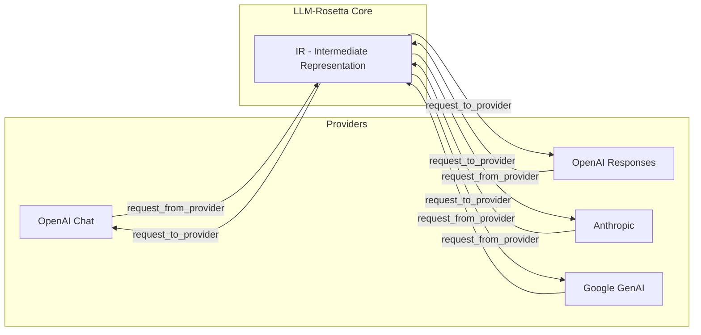
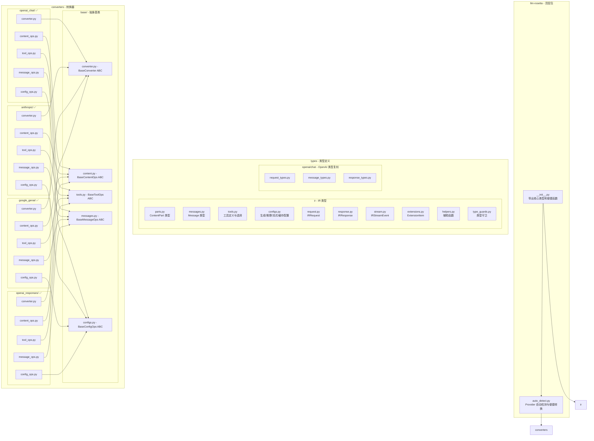
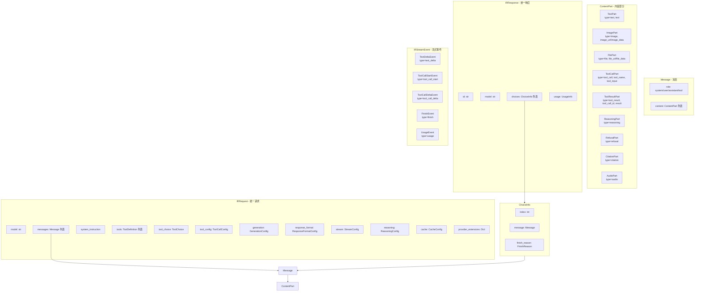
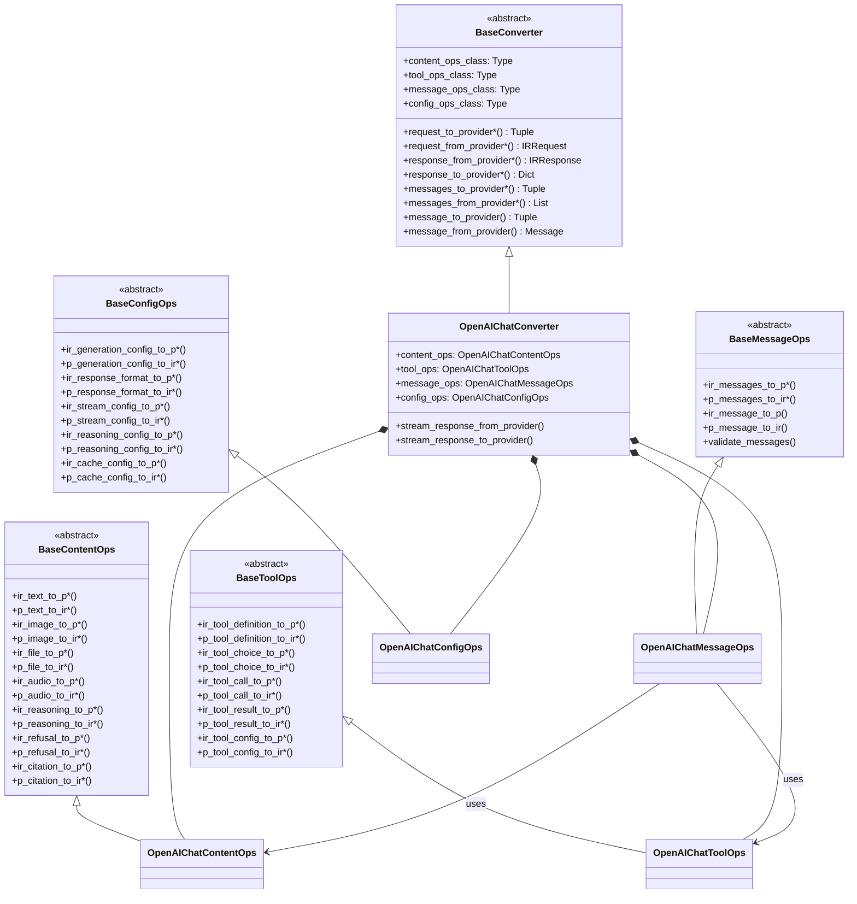
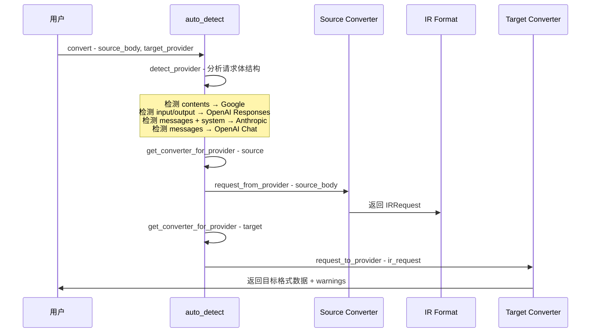
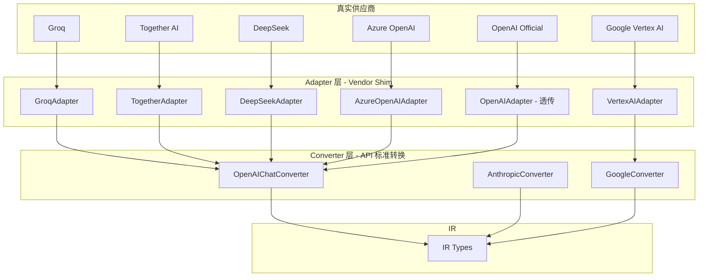
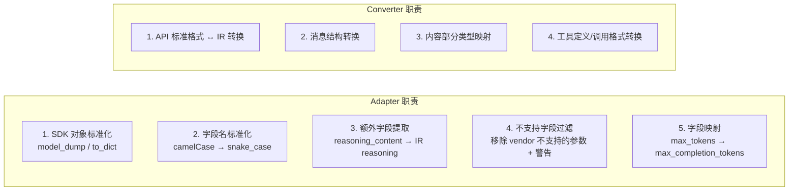
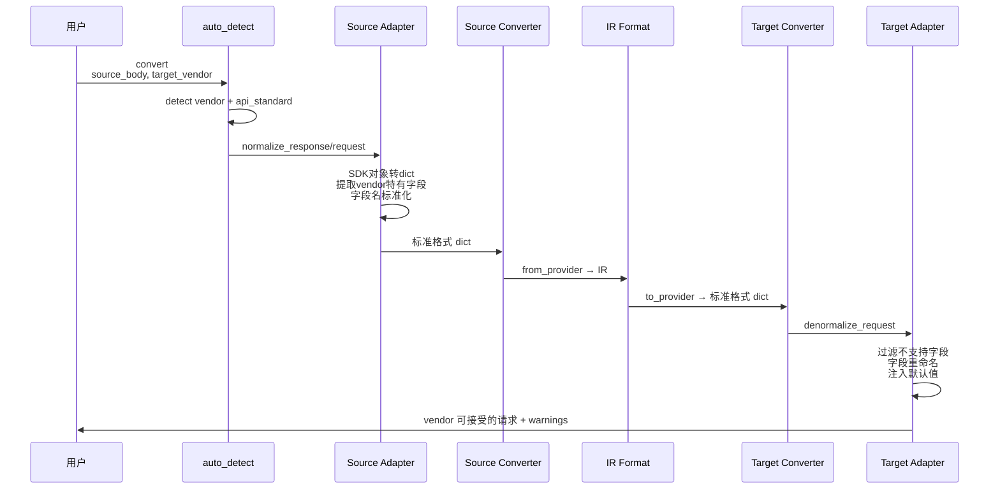

# LLM-Rosetta 项目架构

LLM-Rosetta（LLM Intermediate Representation）是一个用于在不同 LLM Provider API 格式之间进行转换的 Python 库。核心思想是通过统一的中间表示（IR）作为枢纽，实现 Provider 之间的格式互转。

## 1. 整体架构：Hub-and-Spoke 模式



转换流程：`Provider A 格式 → Converter A.request_from_provider → IRRequest → Converter B.request_to_provider → Provider B 格式`

响应流程：`Provider Response → Converter.response_from_provider → IRResponse → Converter.response_to_provider → Provider Response`

流式流程：`Provider SSE Chunk → Converter.stream_response_from_provider → IRStreamEvent → Converter.stream_response_to_provider → Provider SSE Chunk`

## 2. 包结构总览



## 3. IR 类型系统



## 4. Converter 底层向上分层架构（Bottom-Up Ops Pattern）

所有 4 个 converter 均已完成 Bottom-Up Ops Pattern 重构，采用 Ops 组合模式。

### 4.1 Ops 分层设计

```mermaid
graph TB
    subgraph L3 - Converter 顶层
        direction LR
        req_to[request_to_provider]
        req_from[request_from_provider]
        resp_to[response_to_provider]
        resp_from[response_from_provider]
        msg_to[messages_to_provider]
        msg_from[messages_from_provider]
        stream_from[stream_response_from_provider]
        stream_to[stream_response_to_provider]
    end

    subgraph L2 - ConfigOps
        direction LR
        gen_to[ir_generation_config_to_p]
        gen_from[p_generation_config_to_ir]
        rf_to[ir_response_format_to_p]
        rf_from[p_response_format_to_ir]
        sc_to[ir_stream_config_to_p]
        sc_from[p_stream_config_to_ir]
        rc_to[ir_reasoning_config_to_p]
        rc_from[p_reasoning_config_to_ir]
        cc_to[ir_cache_config_to_p]
        cc_from[p_cache_config_to_ir]
    end

    subgraph L1 - MessageOps
        direction LR
        msgs_to[ir_messages_to_p]
        msgs_from[p_messages_to_ir]
    end

    subgraph L0.5 - ToolOps
        direction LR
        td_to[ir_tool_definition_to_p]
        td_from[p_tool_definition_to_ir]
        tc_to[ir_tool_choice_to_p]
        tc_from[p_tool_choice_to_ir]
        tcall_to[ir_tool_call_to_p]
        tcall_from[p_tool_call_to_ir]
        tr_to[ir_tool_result_to_p]
        tr_from[p_tool_result_to_ir]
        tcfg_to[ir_tool_config_to_p]
        tcfg_from[p_tool_config_to_ir]
    end

    subgraph L0 - ContentOps
        direction LR
        text_to[ir_text_to_p]
        text_from[p_text_to_ir]
        img_to[ir_image_to_p]
        img_from[p_image_to_ir]
        file_to[ir_file_to_p]
        file_from[p_file_to_ir]
        audio_to[ir_audio_to_p]
        audio_from[p_audio_to_ir]
        reason_to[ir_reasoning_to_p]
        reason_from[p_reasoning_to_ir]
        refusal_to[ir_refusal_to_p]
        refusal_from[p_refusal_to_ir]
        cite_to[ir_citation_to_p]
        cite_from[p_citation_to_ir]
    end

    req_to --> msgs_to
    req_to --> gen_to
    req_to --> rf_to
    req_to --> sc_to
    req_to --> rc_to
    req_to --> cc_to
    req_to --> td_to
    req_to --> tc_to
    req_to --> tcfg_to

    req_from --> msgs_from
    req_from --> gen_from
    req_from --> td_from
    req_from --> tc_from

    resp_from --> msgs_from
    resp_to --> msgs_to

    msgs_to --> text_to
    msgs_to --> img_to
    msgs_to --> tcall_to
    msgs_to --> tr_to
    msgs_to --> reason_to

    msgs_from --> text_from
    msgs_from --> img_from
    msgs_from --> tcall_from
    msgs_from --> tr_from
    msgs_from --> reason_from
```



### 4.2 Converter 组合模式



### 4.3 重构状态

| Converter | 状态 | 文件结构 | PR |
|-----------|------|----------|----|
| OpenAI Chat | ✅ 已完成 | `content_ops.py` + `tool_ops.py` + `message_ops.py` + `config_ops.py` + `converter.py` | PR #16 |
| Anthropic | ✅ 已完成 | `content_ops.py` + `tool_ops.py` + `message_ops.py` + `config_ops.py` + `converter.py` | PR #22 |
| Google GenAI | ✅ 已完成 | `content_ops.py` + `tool_ops.py` + `message_ops.py` + `config_ops.py` + `converter.py` | PR #23 |
| OpenAI Responses | ✅ 已完成 | `content_ops.py` + `tool_ops.py` + `message_ops.py` + `config_ops.py` + `converter.py` | PR #24 |

## 5. 自动检测与便捷转换流程



## 6. Provider 格式差异对照

| 概念      | OpenAI Chat           | OpenAI Responses        | Anthropic       | Google GenAI               |
| --------- | --------------------- | ----------------------- | --------------- | -------------------------- |
| 消息容器  | messages              | input/output            | messages        | contents                   |
| 系统指令  | messages role=system  | instructions            | system 参数     | system_instruction         |
| 助手角色  | assistant             | assistant               | assistant       | model                      |
| 工具调用  | tool_calls 数组       | function_call 项        | tool_use 块     | function_call Part         |
| 工具结果  | tool 角色消息         | function_call_output 项 | tool_result 块  | function_response Part     |
| 图像      | image_url 类型        | input_image 类型        | image + source  | inline_data Part           |
| 文件      | 不支持                | input_file 类型         | document 类型   | inline_data/file_data Part |
| 推理      | 不支持                | reasoning 项            | thinking 块     | thought=true Part          |
| 最大Token | max_completion_tokens | max_output_tokens       | max_tokens 必需 | config.max_output_tokens   |

## 7. Adapter 层设计提案

### 问题分析

当前架构中，Converter 直接面对"API 标准格式"（如 OpenAI Chat Completions 标准）。但实际的网络供应商（Vendor）在使用这些标准时存在差异：

| 差异类型         | 示例                                                                                                 |
| ---------------- | ---------------------------------------------------------------------------------------------------- |
| **子集实现**     | Groq 不支持 `response_format.json_schema`；Together AI 不支持 `logprobs`                             |
| **额外字段**     | DeepSeek 在 assistant message 中添加 `reasoning_content`；Azure OpenAI 添加 `content_filter_results` |
| **字段重命名**   | 某些 vendor 使用 `max_tokens` 而非 `max_completion_tokens`                                           |
| **默认值差异**   | 某些 vendor 的 `temperature` 默认值不同，或范围不同                                                  |
| **SDK 对象差异** | Pydantic model vs plain dict，camelCase vs snake_case                                                |

当前代码中已有的"隐式 shim"：

- 4 个 converter 都有 `model_dump()` 调用处理 SDK 对象
- Google converter 同时处理 `function_call`（SDK）和 `functionCall`（REST）两种命名
- `provider_extensions` 字段用于透传 vendor 特有参数

### 提案：引入 Adapter 层

在 Converter 和真实 Vendor 之间引入 Adapter 层，作为 API 标准与具体 Vendor 实现之间的 shim：



### Adapter 的职责



### 接口设计

```python
class BaseAdapter:
    # Adapter 标识
    vendor_name: str           # e.g. 'groq', 'deepseek', 'azure'
    api_standard: str          # e.g. 'openai_chat', 'anthropic', 'google'

    # 能力声明：该 vendor 支持的特性子集
    supported_features: set    # e.g. {'tools', 'streaming', 'json_mode'}
    unsupported_fields: set    # e.g. {'logprobs', 'response_format.json_schema'}

    def normalize_request(self, vendor_request: Any) -> dict:
        """Vendor 请求 → API 标准格式 dict"""
        # 1. SDK 对象转 dict
        # 2. 字段名标准化
        # 3. 提取 vendor 特有字段到 provider_extensions
        pass

    def normalize_response(self, vendor_response: Any) -> dict:
        """Vendor 响应 → API 标准格式 dict"""
        # 1. SDK 对象转 dict
        # 2. 提取额外字段（如 reasoning_content）
        pass

    def denormalize_request(self, standard_request: dict) -> dict:
        """API 标准格式 dict → Vendor 可接受的请求"""
        # 1. 过滤不支持的字段（+ 生成警告）
        # 2. 字段重命名
        # 3. 注入 vendor 特有默认值
        pass

    def get_warnings(self, standard_request: dict) -> list:
        """检查请求中使用了哪些该 vendor 不支持的特性"""
        pass
```

### 具体 Adapter 示例

```python
class GroqAdapter(BaseAdapter):
    vendor_name = 'groq'
    api_standard = 'openai_chat'
    unsupported_fields = {'logprobs', 'top_logprobs', 'response_format.json_schema', 'n'}

    def denormalize_request(self, standard_request):
        result = {k: v for k, v in standard_request.items()
                  if k not in self.unsupported_fields}
        # Groq 使用 max_tokens 而非 max_completion_tokens
        if 'max_completion_tokens' in result:
            result['max_tokens'] = result.pop('max_completion_tokens')
        return result

class DeepSeekAdapter(BaseAdapter):
    vendor_name = 'deepseek'
    api_standard = 'openai_chat'

    def normalize_response(self, vendor_response):
        data = super().normalize_response(vendor_response)
        # 提取 DeepSeek 特有的 reasoning_content
        for choice in data.get('choices', []):
            msg = choice.get('message', {})
            if 'reasoning_content' in msg:
                # 将 reasoning_content 转换为标准的 reasoning 结构
                # 供 Converter 进一步转换为 IR ReasoningPart
                msg['_vendor_reasoning'] = msg.pop('reasoning_content')
        return data

class PassthroughAdapter(BaseAdapter):
    """透传 Adapter，用于官方 SDK/API 无需额外处理的场景"""
    def normalize_request(self, request): return request
    def normalize_response(self, response): return response
    def denormalize_request(self, request): return request
```

### 完整转换流程（引入 Adapter 后）



### 关键设计原则

1. **Adapter 是可选的**：对于直接使用标准 API 格式的场景，可以跳过 Adapter（使用 PassthroughAdapter）
2. **Adapter 只做标准化，不做格式转换**：格式转换（如 messages ↔ contents）仍由 Converter 负责
3. **多个 Vendor 共享一个 Converter**：Groq、Together AI、DeepSeek 都使用 OpenAIChatConverter，只是各自有不同的 Adapter
4. **Vendor 变化只改 Adapter**：当某个 vendor 更新 API 时，只需修改对应的 Adapter，Converter 保持稳定
5. **能力声明式**：Adapter 通过 `supported_features` / `unsupported_fields` 声明能力，便于自动生成兼容性报告

### 目录结构建议

```
src/llm-rosetta/
├── adapters/                    # 新增 Adapter 层
│   ├── __init__.py
│   ├── base.py                  # BaseAdapter
│   ├── passthrough.py           # PassthroughAdapter
│   ├── openai_compatible/       # OpenAI 兼容系列
│   │   ├── __init__.py
│   │   ├── openai.py            # OpenAI 官方
│   │   ├── azure.py             # Azure OpenAI
│   │   ├── groq.py              # Groq
│   │   ├── together.py          # Together AI
│   │   └── deepseek.py          # DeepSeek
│   ├── anthropic_compatible/    # Anthropic 兼容系列
│   │   ├── __init__.py
│   │   └── anthropic.py         # Anthropic 官方
│   └── google_compatible/       # Google 兼容系列
│       ├── __init__.py
│       ├── google.py            # Google GenAI
│       └── vertex.py            # Vertex AI
├── converters/                  # 现有 Converter 层（不变）
│   ├── base/
│   ├── anthropic/
│   ├── google_genai/
│   ├── openai_chat/
│   └── openai_responses/
└── types/                       # 现有类型定义（不变）
```

## 8. 测试结构

```
tests/
├── test_auto_detect.py              # 自动检测测试
├── test_converters_base.py          # 基础转换器测试
├── test_ir_types.py                 # IR 类型测试
├── converters/
│   ├── test_base.py                 # Base converter 测试
│   ├── openai_chat/                 # 分层测试 ✅
│   │   ├── test_content_ops.py
│   │   ├── test_tool_ops.py
│   │   ├── test_message_ops.py
│   │   ├── test_config_ops.py
│   │   └── test_converter.py
│   ├── anthropic/                   # 分层测试 ✅
│   │   ├── test_content_ops.py
│   │   ├── test_tool_ops.py
│   │   ├── test_message_ops.py
│   │   ├── test_config_ops.py
│   │   └── test_converter.py
│   ├── google_genai/                # 分层测试 ✅
│   │   ├── test_content_ops.py
│   │   ├── test_tool_ops.py
│   │   ├── test_message_ops.py
│   │   ├── test_config_ops.py
│   │   └── test_converter.py
│   └── openai_responses/            # 分层测试 ✅
│       ├── test_content_ops.py
│       ├── test_tool_ops.py
│       ├── test_message_ops.py
│       ├── test_config_ops.py
│       └── test_converter.py
├── integration/
│   ├── test_openai_chat_sdk_e2e.py
│   ├── test_openai_chat_rest_e2e.py
│   ├── test_anthropic_sdk_e2e.py
│   ├── test_anthropic_rest_e2e.py
│   ├── test_google_genai_sdk_e2e.py
│   ├── test_google_genai_rest_e2e.py
│   ├── test_openai_responses_sdk_e2e.py
│   └── test_openai_responses_rest_e2e.py
└── test_types/
    ├── ir/test_ir_types.py
    ├── openai/chat/test_type_compatibility.py
    ├── google_genai/test_type_compatibility.py
    ├── openai_responses/test_type_compatibility.py
    └── test_anthropic_types.py
```
