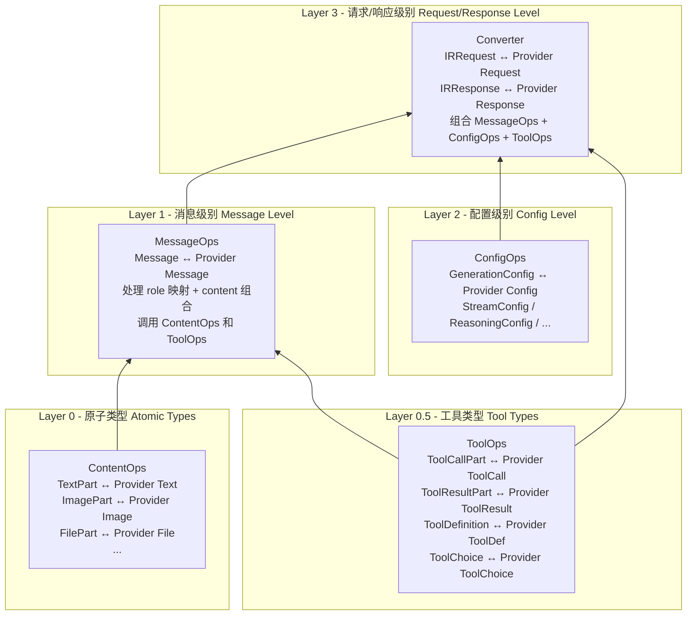
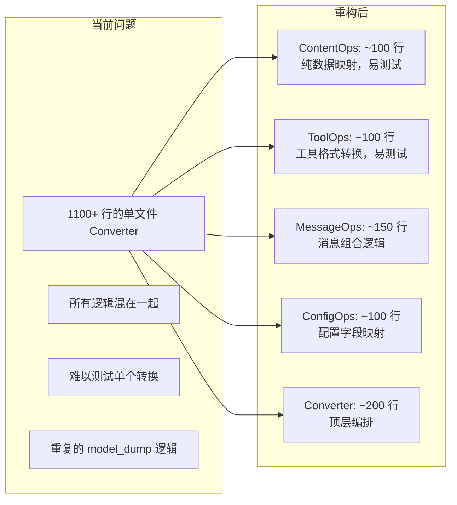
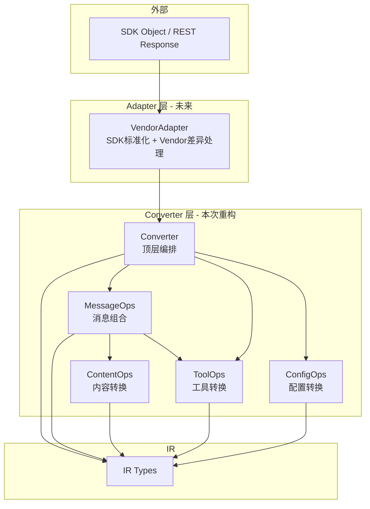

# Converter 重构设计方案

## 1. 设计原则

### 底向上翻译（Bottom-Up Translation）

每种 LLM API 的数据结构都是嵌套的。我们的翻译策略是从最细粒度的原子类型开始，逐层向上组合：



### 每层的职责边界

| 层级 | 类 | 输入/输出 | 职责 |
|------|-----|----------|------|
| L0 | ContentOps | IR Part ↔ Provider Part | 单个内容部分的格式转换（纯数据映射） |
| L0.5 | ToolOps | IR Tool* ↔ Provider Tool* | 工具定义/调用/结果的格式转换 |
| L1 | MessageOps | IR Message ↔ Provider Message | role 映射 + content 列表遍历 + 调用 L0/L0.5 |
| L2 | ConfigOps | IR Config ↔ Provider Config | 配置参数的字段映射和范围转换 |
| L3 | Converter | IRRequest ↔ Provider Request | 顶层编排：组合 messages + tools + configs |

## 2. 接口设计

### Layer 0: ContentOps（静态方法，无状态）

```python
class OpenAIChatContentOps(BaseContentOps):
    """OpenAI Chat 的内容部分转换"""

    @staticmethod
    def ir_text_to_p(ir_text: TextPart) -> dict:
        return {"type": "text", "text": ir_text["text"]}

    @staticmethod
    def p_text_to_ir(p_text: dict) -> TextPart:
        return TextPart(type="text", text=p_text["text"])

    @staticmethod
    def ir_image_to_p(ir_image: ImagePart) -> dict:
        # 处理 image_url / image_data 的差异
        ...

    @staticmethod
    def p_image_to_ir(p_image: dict) -> ImagePart:
        # 处理 data URI 解析等
        ...

    # ir_file_to_p → 不支持，抛出 NotImplementedError
    # ir_reasoning_to_p → 不支持，返回 None + warning
```

### Layer 0.5: ToolOps（静态方法，无状态）

```python
class OpenAIChatToolOps(BaseToolOps):
    """OpenAI Chat 的工具相关转换"""

    @staticmethod
    def ir_tool_definition_to_p(ir_tool: ToolDefinition) -> dict:
        return {
            "type": "function",
            "function": {
                "name": ir_tool["name"],
                "description": ir_tool.get("description", ""),
                "parameters": ir_tool.get("parameters", {}),
            }
        }

    @staticmethod
    def ir_tool_call_to_p(ir_tc: ToolCallPart) -> dict:
        return {
            "id": ir_tc["tool_call_id"],
            "type": "function",
            "function": {
                "name": ir_tc["tool_name"],
                "arguments": json.dumps(ir_tc["tool_input"]),
            }
        }

    @staticmethod
    def ir_tool_choice_to_p(ir_tc: ToolChoice) -> Union[str, dict]:
        mode = ir_tc.get("mode")
        if mode == "auto": return "auto"
        if mode == "none": return "none"
        if mode == "required": return "required"
        if mode == "tool":
            return {"type": "function", "function": {"name": ir_tc["tool_name"]}}
```

### Layer 1: MessageOps（可以有状态，如上下文）

```python
class OpenAIChatMessageOps(BaseMessageOps):
    """OpenAI Chat 的消息级别转换"""

    def __init__(self, content_ops, tool_ops):
        self.content_ops = content_ops
        self.tool_ops = tool_ops

    def ir_message_to_p(self, ir_msg: Message, context=None) -> Tuple[list, list]:
        """单个 IR Message → 一个或多个 Provider Messages

        注意：IR 的一个 user message 可能包含 tool_result，
        在 OpenAI Chat 中需要拆分为 user message + tool messages
        """
        role = ir_msg["role"]
        warnings = []

        if role == "system":
            text = self._extract_text(ir_msg["content"])
            return [{"role": "system", "content": text}], warnings

        elif role == "user":
            # 遍历 content，调用 content_ops 转换每个 part
            user_parts = []
            tool_messages = []
            for part in ir_msg["content"]:
                if part["type"] == "tool_result":
                    tool_messages.append({
                        "role": "tool",
                        "tool_call_id": part["tool_call_id"],
                        "content": str(part["result"]),
                    })
                else:
                    converted = self._convert_content_part(part)
                    if converted: user_parts.append(converted)

            messages = []
            if user_parts:
                messages.append({"role": "user", "content": user_parts})
            messages.extend(tool_messages)
            return messages, warnings

        elif role == "assistant":
            # 处理 text + tool_calls
            ...
```

### Layer 2: ConfigOps（静态方法）

```python
class OpenAIChatConfigOps(BaseConfigOps):
    """OpenAI Chat 的配置转换"""

    @staticmethod
    def ir_generation_config_to_p(ir_config: GenerationConfig) -> dict:
        result = {}
        field_map = {
            "temperature": "temperature",
            "top_p": "top_p",
            "max_tokens": "max_completion_tokens",
            "frequency_penalty": "frequency_penalty",
            "presence_penalty": "presence_penalty",
            "seed": "seed",
            "logprobs": "logprobs",
            "n": "n",
        }
        for ir_field, p_field in field_map.items():
            if ir_field in ir_config:
                result[p_field] = ir_config[ir_field]

        # stop_sequences → stop
        if "stop_sequences" in ir_config:
            stop = list(ir_config["stop_sequences"])
            result["stop"] = stop[0] if len(stop) == 1 else stop

        return result
```

### Layer 3: Converter（顶层编排）

```python
class OpenAIChatConverter(BaseConverter):
    """OpenAI Chat Completions API 转换器"""

    # 声明使用的 Ops 类
    content_ops_class = OpenAIChatContentOps
    tool_ops_class = OpenAIChatToolOps
    message_ops_class = OpenAIChatMessageOps
    config_ops_class = OpenAIChatConfigOps

    def __init__(self):
        self.content_ops = self.content_ops_class()
        self.tool_ops = self.tool_ops_class()
        self.message_ops = self.message_ops_class(self.content_ops, self.tool_ops)
        self.config_ops = self.config_ops_class()

    def request_to_provider(self, ir_request: IRRequest) -> Tuple[dict, list]:
        """IRRequest → OpenAI Chat request body dict"""
        warnings = []
        result = {"model": ir_request["model"]}

        # 1. system_instruction → system message
        if "system_instruction" in ir_request:
            result.setdefault("messages", []).append(
                {"role": "system", "content": ir_request["system_instruction"]}
            )

        # 2. messages → 调用 message_ops
        messages, msg_warnings = self.message_ops.ir_messages_to_p(ir_request["messages"])
        warnings.extend(msg_warnings)
        result.setdefault("messages", []).extend(messages)

        # 3. tools → 调用 tool_ops
        if "tools" in ir_request:
            result["tools"] = [self.tool_ops.ir_tool_definition_to_p(t) for t in ir_request["tools"]]

        # 4. tool_choice → 调用 tool_ops
        if "tool_choice" in ir_request:
            result["tool_choice"] = self.tool_ops.ir_tool_choice_to_p(ir_request["tool_choice"])

        # 5. generation config → 调用 config_ops
        if "generation" in ir_request:
            result.update(self.config_ops.ir_generation_config_to_p(ir_request["generation"]))

        # 6. 其他配置...
        ...

        return result, warnings

    def request_from_provider(self, provider_request: dict) -> IRRequest:
        """OpenAI Chat request body dict → IRRequest"""
        # 标准化 SDK 对象
        provider_request = self._normalize(provider_request)
        ...

    def response_from_provider(self, provider_response: dict) -> IRResponse:
        """OpenAI Chat response body dict → IRResponse"""
        provider_response = self._normalize(provider_response)
        ...

    def response_to_provider(self, ir_response: IRResponse) -> dict:
        """IRResponse → OpenAI Chat response body dict"""
        ...

    @staticmethod
    def _normalize(data: Any) -> dict:
        """标准化输入：SDK 对象 → dict"""
        if hasattr(data, "model_dump"):
            return data.model_dump()
        if not isinstance(data, dict):
            raise ValueError("Input must be a dict or SDK object with model_dump()")
        return data
```

## 3. 底向上翻译的优势



### 具体优势

1. **可独立测试**：每个 Ops 类都是静态方法，可以直接单元测试
   ```python
   def test_text_to_provider():
       result = OpenAIChatContentOps.ir_text_to_p(TextPart(type="text", text="hello"))
       assert result == {"type": "text", "text": "hello"}
   ```

2. **可复用**：不同 Converter 可以共享部分 Ops（如 OpenAI Chat 和 OpenAI Responses 可以共享 ContentOps 的部分实现）

3. **关注点分离**：每层只关心自己的结构差异
   - ContentOps：`TextPart.text` → `{"type": "text", "text": ...}`
   - MessageOps：`Message(role, content)` → `{"role": ..., "content": [...]}`
   - Converter：`IRRequest(model, messages, tools, ...)` → `{"model": ..., "messages": [...], "tools": [...]}`

4. **渐进式实现**：可以先实现 ContentOps + ToolOps，再实现 MessageOps，最后实现 Converter

## 4. 文件结构

```
src/llm-rosetta/converters/
├── base/
│   ├── __init__.py
│   ├── converter.py      # BaseConverter（显式接口）
│   ├── content.py        # BaseContentOps
│   ├── tools.py          # BaseToolOps
│   ├── messages.py       # BaseMessageOps
│   └── configs.py        # BaseConfigOps
├── openai_chat/
│   ├── __init__.py
│   ├── converter.py      # OpenAIChatConverter（~200行，顶层编排）
│   ├── content_ops.py    # OpenAIChatContentOps（~100行）
│   ├── tool_ops.py       # OpenAIChatToolOps（~100行）
│   ├── message_ops.py    # OpenAIChatMessageOps（~150行）
│   └── config_ops.py     # OpenAIChatConfigOps（~100行）
├── anthropic/
│   ├── converter.py
│   ├── content_ops.py
│   ├── tool_ops.py
│   ├── message_ops.py
│   └── config_ops.py
├── google/
│   └── ...
└── openai_responses/
    └── ...
```

## 5. 实施计划

以 OpenAI Chat Converter 为起点：

1. **Phase 1**: 实现 `OpenAIChatContentOps`（TextPart、ImagePart 的双向转换）
2. **Phase 2**: 实现 `OpenAIChatToolOps`（ToolDefinition、ToolCallPart、ToolResultPart、ToolChoice 的双向转换）
3. **Phase 3**: 实现 `OpenAIChatMessageOps`（Message 的双向转换，调用 ContentOps + ToolOps）
4. **Phase 4**: 实现 `OpenAIChatConfigOps`（GenerationConfig、StreamConfig 等的双向转换）
5. **Phase 5**: 实现 `OpenAIChatConverter`（顶层编排，实现显式接口）
6. **Phase 6**: 迁移测试，确保所有现有测试通过
7. **Phase 7**: 删除旧的 converter 实现

## 6. 与 Adapter 层的关系



- **本次重构**：聚焦 Converter 层的底向上拆分
- **Adapter 层**：后续独立实现，不影响 Converter 的设计
- **Converter 只接受标准 dict**：Adapter 负责 SDK 对象 → dict 的标准化
- **过渡期**：Converter 内置 `_normalize()` 方法兼容 SDK 对象输入