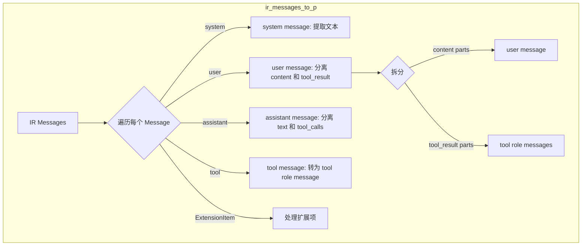
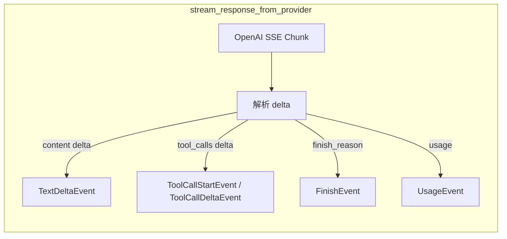

# OpenAI Chat Converter 全面重构实施计划

## 1. 概述

基于 `plans/converter_redesign.md` 的底向上翻译设计，对 OpenAI Chat Completions Converter 进行全面重构。将现有的 1100+ 行单文件 converter 拆分为 5 个独立模块，并新增 stream 支持和 IRStreamEvent 类型。

## 2. 现状分析

### 现有代码问题

- [`converter.py`](src/llm-rosetta/converters/openai_chat/converter.py) 包含 1102 行代码，所有逻辑混在一起
- 使用旧的 `to_provider`/`from_provider` 万能接口，需要内部做类型检测
- 依赖 `utils/` 中的 [`ToolCallConverter`](src/llm-rosetta/utils/tool_call_converter.py)、[`ToolConverter`](src/llm-rosetta/utils/tool_converter.py)、[`FieldMapper`](src/llm-rosetta/utils/field_mapper.py)，这些工具类的逻辑应该内化到 Ops 类中
- 不支持 stream chunk 级别的转换
- 缺少 `request_to_provider`、`request_from_provider` 等显式接口

### 现有 Base 类已就绪

- [`BaseConverter`](src/llm-rosetta/converters/base/converter.py) - 已定义 6 个显式抽象方法
- [`BaseContentOps`](src/llm-rosetta/converters/base/content.py) - 已定义所有内容类型的双向转换抽象方法
- [`BaseToolOps`](src/llm-rosetta/converters/base/tools.py) - 已定义工具定义/选择/调用/结果/配置的双向转换抽象方法
- [`BaseMessageOps`](src/llm-rosetta/converters/base/messages.py) - 已定义批量消息转换抽象方法
- [`BaseConfigOps`](src/llm-rosetta/converters/base/configs.py) - 已定义生成/响应格式/流式/推理/缓存配置的双向转换抽象方法

## 3. 目标文件结构

```
src/llm-rosetta/converters/openai_chat/
├── __init__.py          # 导出 OpenAIChatConverter 及各 Ops 类
├── converter.py         # OpenAIChatConverter - 顶层编排 (~250行)
├── content_ops.py       # OpenAIChatContentOps - 内容转换 (~120行)
├── tool_ops.py          # OpenAIChatToolOps - 工具转换 (~150行)
├── message_ops.py       # OpenAIChatMessageOps - 消息转换 (~200行)
└── config_ops.py        # OpenAIChatConfigOps - 配置转换 (~120行)

src/llm-rosetta/types/ir/
└── stream.py            # IRStreamEvent 类型定义 (~80行)

tests/converters/openai_chat/
├── __init__.py
├── test_content_ops.py  # ContentOps 单元测试
├── test_tool_ops.py     # ToolOps 单元测试
├── test_message_ops.py  # MessageOps 单元测试
├── test_config_ops.py   # ConfigOps 单元测试
├── test_converter.py    # Converter 集成测试 (non-stream + stream)
└── test_full_conversion.py  # 完整往返转换测试
```

## 4. 各模块详细设计

### 4.1 IRStreamEvent 类型 (`src/llm-rosetta/types/ir/stream.py`)

新增 IR 层面的 stream 事件类型，用于支持 SSE chunk 级别的实时转换。

```python
class TextDeltaEvent(TypedDict):
    type: Required[Literal["text_delta"]]
    text: Required[str]
    choice_index: NotRequired[int]

class ToolCallStartEvent(TypedDict):
    type: Required[Literal["tool_call_start"]]
    tool_call_id: Required[str]
    tool_name: Required[str]
    choice_index: NotRequired[int]

class ToolCallDeltaEvent(TypedDict):
    type: Required[Literal["tool_call_delta"]]
    tool_call_id: Required[str]
    arguments_delta: Required[str]  # JSON string fragment
    choice_index: NotRequired[int]

class FinishEvent(TypedDict):
    type: Required[Literal["finish"]]
    finish_reason: Required[FinishReason]
    choice_index: NotRequired[int]

class UsageEvent(TypedDict):
    type: Required[Literal["usage"]]
    usage: Required[UsageInfo]

IRStreamEvent = Union[
    TextDeltaEvent,
    ToolCallStartEvent,
    ToolCallDeltaEvent,
    FinishEvent,
    UsageEvent,
]
```

### 4.2 OpenAIChatContentOps (`content_ops.py`)

静态方法，无状态。处理 TextPart、ImagePart 的双向转换。

**关键转换逻辑：**

| 方法 | 输入 | 输出 | 说明 |
|------|------|------|------|
| `ir_text_to_p` | `TextPart` | `dict` | `{"type": "text", "text": ...}` |
| `p_text_to_ir` | `dict/str` | `TextPart` | 支持字符串和 dict 两种输入 |
| `ir_image_to_p` | `ImagePart` | `dict` | URL → `image_url`，base64 → data URI |
| `p_image_to_ir` | `dict` | `ImagePart` | 解析 data URI 为 `image_data` |
| `ir_file_to_p` | `FilePart` | - | 抛出 `NotImplementedError` |
| `ir_audio_to_p` | `AudioPart` | - | 抛出 `NotImplementedError` |
| `ir_reasoning_to_p` | `ReasoningPart` | `None` | 返回 None + warning |
| `ir_refusal_to_p` | `RefusalPart` | `dict` | 映射到 assistant message 的 refusal 字段 |
| `ir_citation_to_p` | `CitationPart` | `dict` | 映射到 annotations |

**从现有代码提取的逻辑：**
- [`_ir_image_to_p`](src/llm-rosetta/converters/openai_chat/converter.py:914) - 图像 URL/base64 转换
- [`_p_image_to_ir`](src/llm-rosetta/converters/openai_chat/converter.py:931) - data URI 解析
- [`_ir_text_to_p`](src/llm-rosetta/converters/openai_chat/converter.py:894) - 文本转换

### 4.3 OpenAIChatToolOps (`tool_ops.py`)

静态方法，无状态。处理工具定义、调用、结果、选择的双向转换。

**关键转换逻辑：**

| 方法 | 输入 | 输出 | 说明 |
|------|------|------|------|
| `ir_tool_definition_to_p` | `ToolDefinition` | `dict` | 扁平 → 嵌套 `{"type":"function","function":{...}}` |
| `p_tool_definition_to_ir` | `dict` | `ToolDefinition` | 嵌套 → 扁平 |
| `ir_tool_choice_to_p` | `ToolChoice` | `str/dict` | `mode:"any"` → `"required"` |
| `p_tool_choice_to_ir` | `str/dict` | `ToolChoice` | `"required"` → `mode:"any"` |
| `ir_tool_call_to_p` | `ToolCallPart` | `dict` | `tool_input` dict → JSON string `arguments` |
| `p_tool_call_to_ir` | `dict` | `ToolCallPart` | JSON string → dict |
| `ir_tool_result_to_p` | `ToolResultPart` | `dict` | → `{"role":"tool","tool_call_id":...,"content":...}` |
| `p_tool_result_to_ir` | `dict` | `ToolResultPart` | tool role message → ToolResultPart |
| `ir_tool_config_to_p` | `ToolCallConfig` | `dict` | `disable_parallel` → `parallel_tool_calls` 取反 |
| `p_tool_config_to_ir` | `dict` | `ToolCallConfig` | `parallel_tool_calls` → `disable_parallel` 取反 |

**设计决策：**
- 不再依赖 `utils/ToolCallConverter` 和 `utils/ToolConverter`，将 OpenAI Chat 特定的转换逻辑直接内化
- `utils/` 中的工具类保留给其他 converter 使用，但 OpenAI Chat 的 Ops 类自包含

### 4.4 OpenAIChatMessageOps (`message_ops.py`)

有状态（持有 content_ops 和 tool_ops 引用）。处理消息级别的双向转换。

**关键转换逻辑：**



**IR → Provider 消息映射：**

| IR Message | Provider Message | 说明 |
|------------|-----------------|------|
| `role:"system"` | `{"role":"system","content":"..."}` | 文本拼接 |
| `role:"user"` + TextPart/ImagePart | `{"role":"user","content":[...]}` | 多模态内容 |
| `role:"user"` + ToolResultPart | `{"role":"tool","tool_call_id":"...","content":"..."}` | 拆分为独立 tool message |
| `role:"assistant"` + TextPart | `{"role":"assistant","content":"..."}` | 文本拼接 |
| `role:"assistant"` + ToolCallPart | `{"role":"assistant","tool_calls":[...]}` | 工具调用列表 |
| `role:"tool"` + ToolResultPart | `{"role":"tool","tool_call_id":"...","content":"..."}` | 直接映射 |

**Provider → IR 消息映射：**

| Provider Message | IR Message | 说明 |
|-----------------|------------|------|
| `role:"system"` | `SystemMessage` | 文本 → TextPart |
| `role:"user"` + string | `UserMessage` | 字符串 → TextPart |
| `role:"user"` + array | `UserMessage` | 各 part 分别转换 |
| `role:"assistant"` + content + tool_calls | `AssistantMessage` | 合并为 content list |
| `role:"tool"` | `ToolMessage` | → ToolResultPart |
| `role:"function"` | `ToolMessage` | 已弃用，生成 legacy ID |

### 4.5 OpenAIChatConfigOps (`config_ops.py`)

静态方法，无状态。处理各种配置的双向转换。

**GenerationConfig 字段映射：**

| IR Field | OpenAI Field | 转换 |
|----------|-------------|------|
| `temperature` | `temperature` | 直接映射 |
| `top_p` | `top_p` | 直接映射 |
| `top_k` | - | 不支持，warning |
| `max_tokens` | `max_completion_tokens` | 字段重命名 |
| `stop_sequences` | `stop` | List → str/List |
| `frequency_penalty` | `frequency_penalty` | 直接映射 |
| `presence_penalty` | `presence_penalty` | 直接映射 |
| `logit_bias` | `logit_bias` | 直接映射 |
| `seed` | `seed` | 直接映射 |
| `logprobs` | `logprobs` | 直接映射 |
| `top_logprobs` | `top_logprobs` | 直接映射 |
| `n` | `n` | 直接映射 |

**其他配置：**

| 配置类型 | IR → Provider | Provider → IR |
|---------|--------------|--------------|
| StreamConfig | `enabled` → `stream`, `include_usage` → `stream_options` | 反向 |
| ReasoningConfig | `effort` → `reasoning_effort` | 反向 |
| CacheConfig | `key` → `prompt_cache_key`, `retention` → `prompt_cache_retention` | 反向 |
| ResponseFormatConfig | `type` + `json_schema` → `response_format` | 反向 |

### 4.6 OpenAIChatConverter (`converter.py`)

顶层编排，实现 BaseConverter 的 6 个显式方法 + 2 个 stream 方法。

**类结构：**

```python
class OpenAIChatConverter(BaseConverter):
    content_ops_class = OpenAIChatContentOps
    tool_ops_class = OpenAIChatToolOps
    message_ops_class = OpenAIChatMessageOps
    config_ops_class = OpenAIChatConfigOps

    def __init__(self):
        self.content_ops = self.content_ops_class()
        self.tool_ops = self.tool_ops_class()
        self.message_ops = self.message_ops_class(self.content_ops, self.tool_ops)
        self.config_ops = self.config_ops_class()

    # 显式接口
    def request_to_provider(ir_request) -> Tuple[dict, List[str]]
    def request_from_provider(provider_request) -> IRRequest
    def response_from_provider(provider_response) -> IRResponse
    def response_to_provider(ir_response) -> dict
    def messages_to_provider(messages) -> Tuple[List, List[str]]
    def messages_from_provider(provider_messages) -> List[Message]

    # Stream 支持
    def stream_response_from_provider(chunk: dict) -> List[IRStreamEvent]
    def stream_response_to_provider(ir_event: IRStreamEvent) -> dict

    # 兼容性
    @staticmethod
    def _normalize(data) -> dict  # SDK 对象 → dict
```

**`request_to_provider` 编排流程：**

```mermaid
graph TB
    IRReq[IRRequest] --> MODEL[提取 model]
    IRReq --> SYS[system_instruction → system message]
    IRReq --> MSGS[messages → message_ops.ir_messages_to_p]
    IRReq --> TOOLS[tools → tool_ops.ir_tool_definition_to_p]
    IRReq --> TC[tool_choice → tool_ops.ir_tool_choice_to_p]
    IRReq --> TCFG[tool_config → tool_ops.ir_tool_config_to_p]
    IRReq --> GEN[generation → config_ops.ir_generation_config_to_p]
    IRReq --> RF[response_format → config_ops.ir_response_format_to_p]
    IRReq --> STR[stream → config_ops.ir_stream_config_to_p]
    IRReq --> RSN[reasoning → config_ops.ir_reasoning_config_to_p]
    IRReq --> CACHE[cache → config_ops.ir_cache_config_to_p]
    IRReq --> EXT[provider_extensions → 直接合并]
    
    MODEL --> RESULT[Provider Request Dict]
    SYS --> RESULT
    MSGS --> RESULT
    TOOLS --> RESULT
    TC --> RESULT
    TCFG --> RESULT
    GEN --> RESULT
    RF --> RESULT
    STR --> RESULT
    RSN --> RESULT
    CACHE --> RESULT
    EXT --> RESULT
```



**Stream chunk 转换流程：**



## 5. 实施顺序

按底向上的顺序实施，每层完成后可独立测试：

1. **IRStreamEvent 类型** - 新增 `src/llm-rosetta/types/ir/stream.py`，更新 `__init__.py` 导出
2. **ContentOps** - 最底层，纯数据映射，无依赖
3. **ToolOps** - 底层，纯数据映射，无依赖
4. **MessageOps** - 中层，依赖 ContentOps + ToolOps
5. **ConfigOps** - 中层，无依赖
6. **Converter** - 顶层，组合所有 Ops 类
7. **更新 `__init__.py`** - 导出新模块
8. **单元测试** - 各 Ops 类独立测试
9. **集成测试** - Converter 完整测试
10. **迁移现有测试** - 确保兼容性

## 6. 测试策略

### 单元测试（各 Ops 类）

每个 Ops 类的每个方法都需要测试：
- 正常输入的正确转换
- 边界情况（空值、缺失字段）
- 往返转换一致性（IR → Provider → IR）

### 集成测试（Converter）

- 完整的 `request_to_provider` / `request_from_provider` 往返
- 完整的 `response_from_provider` / `response_to_provider` 往返
- `messages_to_provider` / `messages_from_provider` 往返
- Stream chunk 转换测试
- SDK 对象输入的 `_normalize` 测试

### 现有测试迁移

- [`test_openai_chat_converter.py`](tests/converters/test_openai_chat_converter.py) 中的测试需要迁移到新接口
- [`test_openai_chat_full_conversion.py`](tests/converters/test_openai_chat_full_conversion.py) 中的测试需要更新导入路径
- 旧的 `to_provider`/`from_provider` 接口将被移除，相关测试需要重写

## 7. 与现有代码的关系

### 保留的依赖

- [`BaseConverter`](src/llm-rosetta/converters/base/converter.py) - 继承
- [`BaseContentOps`](src/llm-rosetta/converters/base/content.py) - 继承
- [`BaseToolOps`](src/llm-rosetta/converters/base/tools.py) - 继承
- [`BaseMessageOps`](src/llm-rosetta/converters/base/messages.py) - 继承
- [`BaseConfigOps`](src/llm-rosetta/converters/base/configs.py) - 继承
- 所有 IR 类型定义 - 使用

### 不再依赖

- `utils/ToolCallConverter` - OpenAI Chat 特定逻辑内化到 ToolOps
- `utils/ToolConverter` - OpenAI Chat 特定逻辑内化到 ToolOps
- `utils/FieldMapper` - 不再需要多字段名兼容，直接使用标准字段名

### 删除的代码

- 现有的 [`converter.py`](src/llm-rosetta/converters/openai_chat/converter.py) 将被完全替换

## 8. 风险与注意事项

1. **向后兼容性**：旧的 `to_provider`/`from_provider` 接口将被移除，需要更新所有调用方
2. **测试覆盖**：确保新实现覆盖所有现有测试场景
3. **ToolResultPart 在 user message 中的处理**：IR 的 user message 可能包含 ToolResultPart，需要拆分为独立的 tool role message
4. **ToolMessage 角色**：IR 新增了 `role:"tool"` 的 ToolMessage，需要正确处理
5. **Stream 状态管理**：stream chunk 转换需要维护状态（如当前正在构建的 tool_call）