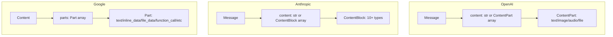

# Provider 消息类型对比分析

## 概述

本文档对比分析 OpenAI、Anthropic 和 Google GenAI 三家 LLM provider 的消息类型系统，识别它们的共同点和差异点，为设计中间表示（IR）提供基础。

## 核心类型对比

| Provider      | 核心类型                                                             | 设计理念                                                       |
| ------------- | -------------------------------------------------------------------- | -------------------------------------------------------------- |
| **OpenAI**    | [`ChatCompletionMessageParam`](openai.md#chatcompletionmessageparam) | 基于角色的 Union 类型，6 种角色，每种角色有独立的消息类型      |
| **Anthropic** | [`MessageParam`](anthropic.md#messageparam)                          | 极简设计，仅 2 种角色，通过内容块（Content Block）实现复杂功能 |
| **Google**    | [`ContentListUnionDict`](google.md#contentlistuniondict)             | 高度灵活的 Union 类型，支持多种表示方式（对象/字典/字符串）    |

## 角色系统对比

### 角色类型

| 角色          | OpenAI     | Anthropic       | Google                    | 说明                      |
| ------------- | ---------- | --------------- | ------------------------- | ------------------------- |
| **system**    | ✓          | ✗ (system 参数) | ✗ (GenerateContentConfig) | 系统提示                  |
| **developer** | ✓          | ✗               | ✗                         | 开发者指令（OpenAI 特有） |
| **user**      | ✓          | ✓               | ✓                         | 用户消息                  |
| **assistant** | ✓          | ✓               | ✗ (使用 model)            | 助手/模型响应             |
| **model**     | ✗          | ✗               | ✓                         | 模型响应（Google 特有）   |
| **tool**      | ✓          | ✗ (内容块)      | ✗ (Part 字段)             | 工具响应                  |
| **function**  | ✓ (已弃用) | ✗               | ✗                         | 函数响应（已弃用）        |

### 角色设计差异

**OpenAI**:

- 最多角色类型（6 种）
- 明确区分不同参与者
- developer 角色用于高级控制
- tool 和 function 角色专门处理工具调用

**Anthropic**:

- 最少角色类型（2 种）
- system 通过 API 的 system 参数传递，支持多个 system 消息，每个消息可以是文本块
- 工具交互通过内容块实现
- 简化但功能完整

**Google**:

- 2 种角色（user, model）
- model 替代 assistant
- system 通过 GenerateContentConfig 的 system_instruction 参数传递，支持多条指令
- 灵活的类型系统补偿角色数量少

## 消息内容结构对比

### 内容组织方式



### 内容类型支持

| 内容类型     | OpenAI | Anthropic | Google | 实现方式                   |
| ------------ | ------ | --------- | ------ | -------------------------- |
| **文本**     | ✓      | ✓         | ✓      | 所有 provider 都支持       |
| **图片**     | ✓      | ✓         | ✓      | URL 或 base64              |
| **音频输入** | ✓      | ✗         | ✗      | OpenAI 特有                |
| **音频输出** | ✓      | ✗         | ✗      | OpenAI 特有（引用）        |
| **文档**     | ✗      | ✓         | ✗      | Anthropic 特有（PDF/文本） |
| **文件**     | ✓      | ✗         | ✓      | OpenAI 和 Google 支持      |
| **搜索结果** | ✗      | ✓         | ✗      | Anthropic 特有             |
| **思考过程** | ✗      | ✓         | ✓      | Anthropic 和 Google 支持   |
| **代码执行** | ✗      | ✗         | ✓      | Google 特有                |

## 工具调用机制对比

### 工具调用流程

**OpenAI**:

```python
# Assistant发起
{
    "role": "assistant",
    "tool_calls": [{
        "id": "call_123",
        "type": "function",
        "function": {"name": "get_weather", "arguments": "{}"}
    }]
}

# Tool响应
{
    "role": "tool",
    "tool_call_id": "call_123",
    "content": "result"
}
```

**Anthropic**:

```python
# Assistant发起
{
    "role": "assistant",
    "content": [{
        "type": "tool_use",
        "id": "toolu_123",
        "name": "get_weather",
        "input": {}
    }]
}

# User响应
{
    "role": "user",
    "content": [{
        "type": "tool_result",
        "tool_use_id": "toolu_123",
        "content": "result"
    }]
}
```

**Google**:

```python
# Model发起
{
    "role": "model",
    "parts": [{
        "function_call": {
            "name": "get_weather",
            "args": {}
        }
    }]
}

# User响应
{
    "role": "user",
    "parts": [{
        "function_response": {
            "name": "get_weather",
            "response": {}
        }
    }]
}
```

### 工具调用特性对比

| 特性           | OpenAI       | Anthropic      | Google    |
| -------------- | ------------ | -------------- | --------- |
| **调用方式**   | 消息字段     | 内容块         | Part 字段 |
| **响应角色**   | tool         | user           | user      |
| **ID 关联**    | tool_call_id | tool_use_id    | name 匹配 |
| **多工具调用** | ✓            | ✓              | ✓         |
| **自定义工具** | ✓            | ✗              | ✗         |
| **服务器工具** | ✗            | ✓ (web_search) | ✗         |

### 工具选择机制对比

| 特性             | OpenAI                                             | Anthropic                           | Google                                               |
| ---------------- | -------------------------------------------------- | ----------------------------------- | ---------------------------------------------------- |
| **选择类型**     | auto/none/any/function                             | auto/none/any/tool                  | AUTO/NONE/ANY                                        |
| **指定工具**     | `{"type": "function", "function": {"name": "fn"}}` | `{"type": "tool", "name": "tool"}`  | 通过`allowed_function_names`列表，同时 Mode 设为 ANY |
| **并行工具使用** | 通过`parallel_tool_calls`参数控制                  | 通过`disable_parallel_tool_use`控制 | 模型自主决定                                         |
| **配置位置**     | API 参数`tool_choice`                              | API 参数`tool_choice`               | 嵌套配置（ToolConfig → FunctionCallingConfig）       |
| **默认行为**     | auto（模型自行决定）                               | auto（模型自行决定）                | AUTO（模型自行决定）                                 |

## 特殊功能对比

### System Prompt

| Provider      | 支持 | 实现方式                                                        |
| ------------- | ---- | --------------------------------------------------------------- |
| **OpenAI**    | ✓    | 作为角色为`system`的消息                                        |
| **Anthropic** | ✓    | API 的`system`参数，支持多个文本块，不作为消息历史的一部分      |
| **Google**    | ✓    | `GenerateContentConfig`的`system_instruction`参数，支持多条指令 |

### 工具选择机制

| Provider      | 支持 | 实现方式                                                             |
| ------------- | ---- | -------------------------------------------------------------------- |
| **OpenAI**    | ✓    | `tool_choice`参数，支持 auto/none/any/function 四种模式              |
| **Anthropic** | ✓    | `tool_choice`参数，支持 auto/none/any/tool 四种模式                  |
| **Google**    | ✓    | 嵌套配置对象，支持 AUTO/NONE/ANY/ANY+allowed_function_names 四种模式 |

### Prompt Caching

| Provider      | 支持 | 实现方式            |
| ------------- | ---- | ------------------- |
| **OpenAI**    | ✗    | 不支持              |
| **Anthropic** | ✓    | `cache_control`字段 |
| **Google**    | ✗    | 不支持              |

### 思考过程（Reasoning）

| Provider      | 支持 | 实现方式                               |
| ------------- | ---- | -------------------------------------- |
| **OpenAI**    | ✗    | 不支持                                 |
| **Anthropic** | ✓    | ThinkingBlock 和 RedactedThinkingBlock |
| **Google**    | ✓    | Part.thought 字段                      |

### 引用系统（Citations）

| Provider      | 支持 | 实现方式       |
| ------------- | ---- | -------------- |
| **OpenAI**    | ✗    | 不支持         |
| **Anthropic** | ✓    | citations 字段 |
| **Google**    | ✗    | 不支持         |

## 类型系统设计哲学

### OpenAI

- **严格类型**: 使用 TypedDict，每个角色有明确的类型定义
- **角色导向**: 通过不同角色类型区分功能
- **向后兼容**: 保留已弃用的 function 相关类型
- **多模态扩展**: 通过 ContentPart 支持多种媒体类型
- **工具控制**: 通过`tool_choice`和`parallel_tool_calls`精细控制工具使用

### Anthropic

- **内容块架构**: 所有功能通过内容块实现
- **极简角色**: 只有 user 和 assistant 两种角色
- **功能丰富**: 10+种内容块类型支持各种场景
- **缓存优化**: 内置 Prompt Caching 支持
- **工具选择**: 支持四种工具选择模式，包括并行工具使用控制

### Google

- **类型灵活**: 同一内容可以用多种方式表示
- **自动转换**: 在对象、字典、字符串之间自动转换
- **Part 架构**: 通过 Part 的不同字段支持各种内容
- **代码执行**: 内置代码执行支持
- **嵌套配置**: 通过嵌套的配置对象控制函数调用行为

## 转换挑战

### 1. 角色映射

**挑战**:

- OpenAI 有 6 种角色，Anthropic 和 Google 只有 2 种
- system 角色在 Anthropic 中是 API 的 system 参数，支持多个文本块
- system 角色在 Google 中是 GenerateContentConfig 的 system_instruction 参数，支持多条指令
- tool 角色在 Anthropic 中是内容块，在 Google 中是 Part 字段

**解决方案**:

- 建立角色映射表
- system 消息需要特殊处理，根据目标 provider 转换为对应的 API 参数
- tool/function 消息转换为对应的内容块或 Part 字段

### 2. 工具调用

**挑战**:

- 三家的工具调用机制完全不同
- ID 关联方式不同
- 响应角色不同

**解决方案**:

- 统一的工具调用 IR
- 保留所有必要的 ID 信息
- 转换时重新生成符合目标格式的 ID

### 3. 工具选择机制

**挑战**:

- 选择模式命名不同（auto/AUTO, none/NONE, any/ANY）
- 指定特定工具的方式不同
- 并行工具使用控制方式不同
- Google 使用嵌套配置对象

**解决方案**:

- 统一的工具选择 IR
- 标准化选择模式名称
- 提供并行工具使用的统一控制
- 转换时处理不同的配置结构

### 3. 特有功能

**挑战**:

- 某些功能只有特定 provider 支持
- 如何处理不支持的功能

**解决方案**:

- IR 中保留所有功能的字段
- 转换时提供降级策略
- 记录不支持的功能并警告用户

### 4. 类型灵活性

**挑战**:

- Google 支持多种表示方式
- OpenAI 和 Anthropic 使用固定结构

**解决方案**:

- IR 使用规范化的结构
- 从 Google 转换时标准化输入
- 转换到 Google 时选择最合适的表示

## 共同点总结

尽管三家 provider 的设计差异很大，但它们都支持以下核心功能：

1. **基本消息**: 文本消息的发送和接收
2. **角色区分**: 区分用户和模型的消息
3. **多模态**: 支持文本和图片
4. **工具调用**: 支持函数/工具调用机制
5. **工具选择**: 支持控制模型是否和如何使用工具
6. **对话历史**: 支持多轮对话

这些共同点为设计统一的 IR 提供了基础。

## 差异点总结

主要差异在于：

1. **角色系统**: 从 2 种到 6 种不等
2. **内容组织**: 内容部分 vs 内容块 vs Part
3. **工具调用**: 消息字段 vs 内容块 vs Part 字段
4. **工具选择**: 不同的配置方式和选项（如并行工具使用控制）
5. **特殊功能**: 各有独特功能（缓存、思考、代码执行等）
6. **类型灵活性**: 从严格到灵活不等

这些差异需要在 IR 设计中仔细考虑和处理。

## 下一步

基于以上分析，我们将设计一个中间表示（IR），它需要：

1. 支持所有 provider 的核心功能
2. 能够表示 provider 特有的功能
3. 提供清晰的转换规则
4. 处理不兼容的情况

详见[IR 设计文档](ir_design.md)。
