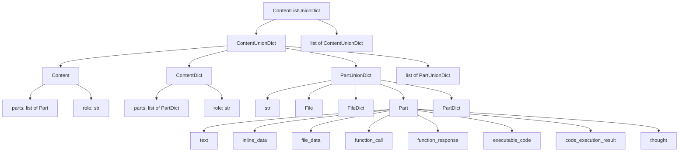

# Google GenAI ContentListUnionDict 类型定义

## 概述

Google GenAI 的消息类型系统基于`ContentListUnionDict`，这是一个非常灵活的 Union 类型，支持多种不同的内容表示方式。

## 类型层次结构



## 主要类型别名

### ContentListUnionDict

**定义**: `ContentListUnionDict = typing.Union[google.genai.types.Content, google.genai.types.ContentDict, str, google.genai.types.File, google.genai.types.FileDict, google.genai.types.Part, google.genai.types.PartDict, list[typing.Union[str, google.genai.types.File, google.genai.types.FileDict, google.genai.types.Part, google.genai.types.PartDict]], list[typing.Union[google.genai.types.Content, google.genai.types.ContentDict, str, google.genai.types.File, google.genai.types.FileDict, google.genai.types.Part, google.genai.types.PartDict, list[typing.Union[str, google.genai.types.File, google.genai.types.FileDict, google.genai.types.Part, google.genai.types.PartDict]]]]]`

**组成**:

- `<class 'google.genai.types.Content'>`
- `<class 'google.genai.types.ContentDict'>`
- `<class 'str'>`
- `<class 'google.genai.types.File'>`
- `<class 'google.genai.types.FileDict'>`
- `<class 'google.genai.types.Part'>`
- `<class 'google.genai.types.PartDict'>`
- `list[typing.Union[str, google.genai.types.File, google.genai.types.FileDict, google.genai.types.Part, google.genai.types.PartDict]]`
- `list[typing.Union[google.genai.types.Content, google.genai.types.ContentDict, str, google.genai.types.File, google.genai.types.FileDict, google.genai.types.Part, google.genai.types.PartDict, list[typing.Union[str, google.genai.types.File, google.genai.types.FileDict, google.genai.types.Part, google.genai.types.PartDict]]]]`

### ContentUnionDict

**定义**: `ContentUnionDict = typing.Union[google.genai.types.Content, google.genai.types.ContentDict, str, google.genai.types.File, google.genai.types.FileDict, google.genai.types.Part, google.genai.types.PartDict, list[typing.Union[str, google.genai.types.File, google.genai.types.FileDict, google.genai.types.Part, google.genai.types.PartDict]]]`

**组成**:

- `<class 'google.genai.types.Content'>`
- `<class 'google.genai.types.ContentDict'>`
- `<class 'str'>`
- `<class 'google.genai.types.File'>`
- `<class 'google.genai.types.FileDict'>`
- `<class 'google.genai.types.Part'>`
- `<class 'google.genai.types.PartDict'>`
- `list[typing.Union[str, google.genai.types.File, google.genai.types.FileDict, google.genai.types.Part, google.genai.types.PartDict]]`

### PartUnionDict

**定义**: `PartUnionDict = typing.Union[str, google.genai.types.File, google.genai.types.FileDict, google.genai.types.Part, google.genai.types.PartDict]`

**组成**:

- `<class 'str'>`
- `<class 'google.genai.types.File'>`
- `<class 'google.genai.types.FileDict'>`
- `<class 'google.genai.types.Part'>`
- `<class 'google.genai.types.PartDict'>`

## 主要类定义

### Content

Contains the multi-part content of a message.

**继承**: BaseModel

**字段**:

| 字段    | 类型                                             | 说明 |
| ------- | ------------------------------------------------ | ---- |
| `parts` | `typing.Optional[list[google.genai.types.Part]]` |      |
| `role`  | `typing.Optional[str]`                           |      |

### ContentDict

Contains the multi-part content of a message.

**继承**: dict

**字段**:

| 字段    | 类型                                                 | 说明 |
| ------- | ---------------------------------------------------- | ---- |
| `parts` | `typing.Optional[list[google.genai.types.PartDict]]` |      |
| `role`  | `typing.Optional[str]`                               |      |

### File

A file uploaded to the API.

**继承**: BaseModel

**字段**:

| 字段              | 类型                                             | 说明 |
| ----------------- | ------------------------------------------------ | ---- |
| `name`            | `typing.Optional[str]`                           |      |
| `display_name`    | `typing.Optional[str]`                           |      |
| `mime_type`       | `typing.Optional[str]`                           |      |
| `size_bytes`      | `typing.Optional[int]`                           |      |
| `create_time`     | `typing.Optional[datetime.datetime]`             |      |
| `expiration_time` | `typing.Optional[datetime.datetime]`             |      |
| `update_time`     | `typing.Optional[datetime.datetime]`             |      |
| `sha256_hash`     | `typing.Optional[str]`                           |      |
| `uri`             | `typing.Optional[str]`                           |      |
| `download_uri`    | `typing.Optional[str]`                           |      |
| `state`           | `typing.Optional[google.genai.types.FileState]`  |      |
| `source`          | `typing.Optional[google.genai.types.FileSource]` |      |
| `video_metadata`  | `typing.Optional[dict[str, typing.Any]]`         |      |
| `error`           | `typing.Optional[google.genai.types.FileStatus]` |      |

### FileDict

A file uploaded to the API.

**继承**: dict

**字段**:

| 字段              | 类型                                                 | 说明 |
| ----------------- | ---------------------------------------------------- | ---- |
| `name`            | `typing.Optional[str]`                               |      |
| `display_name`    | `typing.Optional[str]`                               |      |
| `mime_type`       | `typing.Optional[str]`                               |      |
| `size_bytes`      | `typing.Optional[int]`                               |      |
| `create_time`     | `typing.Optional[datetime.datetime]`                 |      |
| `expiration_time` | `typing.Optional[datetime.datetime]`                 |      |
| `update_time`     | `typing.Optional[datetime.datetime]`                 |      |
| `sha256_hash`     | `typing.Optional[str]`                               |      |
| `uri`             | `typing.Optional[str]`                               |      |
| `download_uri`    | `typing.Optional[str]`                               |      |
| `state`           | `typing.Optional[google.genai.types.FileState]`      |      |
| `source`          | `typing.Optional[google.genai.types.FileSource]`     |      |
| `video_metadata`  | `typing.Optional[dict[str, typing.Any]]`             |      |
| `error`           | `typing.Optional[google.genai.types.FileStatusDict]` |      |

### Part

A datatype containing media content.

Exactly one field within a Part should be set, representing the specific type
of content being conveyed. Using multiple fields within the same `Part`
instance is considered invalid.

**继承**: BaseModel

**字段**:

| 字段                    | 类型                                                      | 说明 |
| ----------------------- | --------------------------------------------------------- | ---- |
| `media_resolution`      | `typing.Optional[google.genai.types.PartMediaResolution]` |      |
| `code_execution_result` | `typing.Optional[google.genai.types.CodeExecutionResult]` |      |
| `executable_code`       | `typing.Optional[google.genai.types.ExecutableCode]`      |      |
| `file_data`             | `typing.Optional[google.genai.types.FileData]`            |      |
| `function_call`         | `typing.Optional[google.genai.types.FunctionCall]`        |      |
| `function_response`     | `typing.Optional[google.genai.types.FunctionResponse]`    |      |
| `inline_data`           | `typing.Optional[google.genai.types.Blob]`                |      |
| `text`                  | `typing.Optional[str]`                                    |      |
| `thought`               | `typing.Optional[bool]`                                   |      |
| `thought_signature`     | `typing.Optional[bytes]`                                  |      |
| `video_metadata`        | `typing.Optional[google.genai.types.VideoMetadata]`       |      |

### PartDict

A datatype containing media content.

Exactly one field within a Part should be set, representing the specific type
of content being conveyed. Using multiple fields within the same `Part`
instance is considered invalid.

**继承**: dict

**字段**:

| 字段                    | 类型                                                          | 说明 |
| ----------------------- | ------------------------------------------------------------- | ---- |
| `media_resolution`      | `typing.Optional[google.genai.types.PartMediaResolutionDict]` |      |
| `code_execution_result` | `typing.Optional[google.genai.types.CodeExecutionResultDict]` |      |
| `executable_code`       | `typing.Optional[google.genai.types.ExecutableCodeDict]`      |      |
| `file_data`             | `typing.Optional[google.genai.types.FileDataDict]`            |      |
| `function_call`         | `typing.Optional[google.genai.types.FunctionCallDict]`        |      |
| `function_response`     | `typing.Optional[google.genai.types.FunctionResponseDict]`    |      |
| `inline_data`           | `typing.Optional[google.genai.types.BlobDict]`                |      |
| `text`                  | `typing.Optional[str]`                                        |      |
| `thought`               | `typing.Optional[bool]`                                       |      |
| `thought_signature`     | `typing.Optional[bytes]`                                      |      |
| `video_metadata`        | `typing.Optional[google.genai.types.VideoMetadataDict]`       |      |

## 工具选择类型详解

### ToolConfig

**用途**: 配置模型如何使用工具

```python
class ToolConfig(TypedDict, total=False):
    function_calling_config: NotRequired[FunctionCallingConfig]
```

| 字段                      | 类型                    | 必需 | 说明         |
| ------------------------- | ----------------------- | ---- | ------------ |
| `function_calling_config` | `FunctionCallingConfig` | ✗    | 函数调用配置 |

### FunctionCallingConfig

**用途**: 配置函数调用行为

```python
class FunctionCallingConfig(TypedDict, total=False):
    mode: NotRequired[FunctionCallingMode]
    allowed_function_names: NotRequired[List[str]]
    disable_functions: NotRequired[bool]
```

| 字段                     | 类型                  | 必需 | 说明                 |
| ------------------------ | --------------------- | ---- | -------------------- |
| `mode`                   | `FunctionCallingMode` | ✗    | 函数调用模式         |
| `allowed_function_names` | `List[str]`           | ✗    | 允许调用的函数名列表 |
| `disable_functions`      | `bool`                | ✗    | 是否禁用函数调用     |

### FunctionCallingMode

**用途**: 定义函数调用模式

```python
class FunctionCallingMode(str, Enum):
    AUTO = "AUTO"
    ANY = "ANY"
    NONE = "NONE"
```

| 值     | 说明                     |
| ------ | ------------------------ |
| `AUTO` | 模型自动决定是否调用函数 |
| `ANY`  | 允许模型调用任何可用函数 |
| `NONE` | 不允许模型调用任何函数   |

## 使用示例

### 简单文本消息

```python
# 使用字符串
content = "Hello, how are you?"

# 使用Content对象
content = types.Content(parts=[types.Part(text="Hello, how are you?")])

# 使用字典
content = {"parts": [{"text": "Hello, how are you?"}]}
```

### 多模态消息

```python
# 使用Content对象
content = types.Content(
    parts=[
        types.Part(text="What's in this image?"),
        types.Part(inline_data=types.Blob(
            mime_type="image/jpeg",
            data=base64.b64encode(image_bytes).decode()
        ))
    ]
)

# 使用字典
content = {
    "parts": [
        {"text": "What's in this image?"},
        {"inline_data": {
            "mime_type": "image/jpeg",
            "data": base64.b64encode(image_bytes).decode()
        }}
    ]
}
```

### 对话历史

```python
# 使用Content对象列表
contents = [
    types.Content(role="user", parts=[types.Part(text="Hello, how are you?")]),
    types.Content(role="model", parts=[types.Part(text="I'm doing well, thank you!")]),
    types.Content(role="user", parts=[types.Part(text="Tell me about yourself.")])
]

# 使用字典列表
contents = [
    {"role": "user", "parts": [{"text": "Hello, how are you?"}]},
    {"role": "model", "parts": [{"text": "I'm doing well, thank you!"}]},
    {"role": "user", "parts": [{"text": "Tell me about yourself."}]}
]
```

## 关键特性总结

### 1. 角色系统

- **2 种角色**: user, model
- **无 system 角色**: 系统提示通过 API 的其他参数传递
- **无 function 角色**: 函数调用通过 Part 字段实现

### 2. Part 架构

- **Part 接口**: 所有内容类型都是 Part
- **类型标识**: 每个 Part 都有`part_type`字段
- **可组合**: 一条消息可以包含多个不同类型的 Part

### 3. 多模态支持

- **文本**: TextPart
- **内联数据**: InlineDataPart（支持多种 MIME 类型）
- **文件数据**: FilePart（支持多种文件类型）
- **视频**: VideoPart（支持多种视频格式）

### 4. 工具调用机制

- **函数声明**: FunctionDeclaration
- **函数调用**: FunctionCall
- **函数响应**: FunctionResponse
- **双向流程**: model 发起 → function 响应

### 5. 工具选择机制

- **四种模式**:
  - AUTO（自动选择是否使用函数）
  - ANY（允许使用任何函数）
  - NONE（不使用任何函数）
  - ANY+allowed_function_names（强制选择特定函数）
- **函数名过滤**: 可以通过`allowed_function_names`限制可用函数，当与 ANY 模式结合使用时形成第四种模式
- **完全禁用**: 可以通过`disable_functions`完全禁用函数调用
- **配置层级**: 通过嵌套的配置对象（ToolConfig → FunctionCallingConfig）设置

### 6. 高级特性

- **流式响应**: 支持流式生成和处理
- **多轮对话**: 通过消息历史实现
- **安全过滤**: 内置内容过滤机制
- **多模型支持**: 适配不同的 Google AI 模型

## MCP 工具调用机制

### 概述

Google GenAI SDK 支持通过 Model Context Protocol (MCP)与外部工具进行交互。MCP 是一种标准化协议，允许模型与外部服务进行通信，从而扩展模型的能力。

### 关键组件

#### 1. MCP 工具适配器

Google GenAI SDK 使用`McpToGenAiToolAdapter`类将 MCP 工具转换为 Gemini 可用的工具：

```python
class McpToGenAiToolAdapter:
    """Adapter for working with MCP tools in a GenAI client."""

    def __init__(
        self,
        session: "mcp.ClientSession",
        list_tools_result: "mcp_types.ListToolsResult",
    ) -> None:
        self._mcp_session = session
        self._list_tools_result = list_tools_result

    async def call_tool(
        self, function_call: FunctionCall
    ) -> "mcp_types.CallToolResult":
        """Calls a function on the MCP server."""
        name = function_call.name if function_call.name else ""
        arguments = dict(function_call.args) if function_call.args else {}

        return typing.cast(
            "mcp_types.CallToolResult",
            await self._mcp_session.call_tool(
                name=name,
                arguments=arguments,
            ),
        )

    @property
    def tools(self) -> list[Tool]:
        """Returns a list of Google GenAI tools."""
        return mcp_to_gemini_tools(self._list_tools_result.tools)
```

#### 2. MCP 工具转换

SDK 提供了将 MCP 工具转换为 Gemini 工具的函数：

```python
def mcp_to_gemini_tool(tool: McpTool) -> types.Tool:
    """Translates an MCP tool to a Google GenAI tool."""
    return types.Tool(
        function_declarations=[{
            "name": tool.name,
            "description": tool.description,
            "parameters": types.Schema.from_json_schema(
                json_schema=types.JSONSchema(
                    **_filter_to_supported_schema(tool.inputSchema)
                )
            ),
        }]
    )

def mcp_to_gemini_tools(tools: list[McpTool]) -> list[types.Tool]:
    """Translates a list of MCP tools to a list of Google GenAI tools."""
    return [mcp_to_gemini_tool(tool) for tool in tools]
```

#### 3. MCP 会话处理

SDK 支持检测和处理 MCP 会话：

```python
def has_mcp_tool_usage(tools: types.ToolListUnion) -> bool:
    """Checks whether the list of tools contains any MCP tools or sessions."""
    if McpClientSession is None:
        return False
    for tool in tools:
        if isinstance(tool, McpTool) or isinstance(tool, McpClientSession):
            return True
    return False

def has_mcp_session_usage(tools: types.ToolListUnion) -> bool:
    """Checks whether the list of tools contains any MCP sessions."""
    if McpClientSession is None:
        return False
    for tool in tools:
        if isinstance(tool, McpClientSession):
            return True
    return False
```

### 使用流程

1. **初始化 MCP 服务器**：创建 MCP 服务器参数并初始化连接
2. **创建 MCP 会话**：使用服务器连接创建 ClientSession
3. **将 MCP 会话传递给模型**：在 generate_content 调用中将 MCP 会话作为工具传递
4. **自动工具调用**：SDK 会自动处理工具调用和响应

### 使用示例

```python
import os
import asyncio
from datetime import datetime
from mcp import ClientSession, StdioServerParameters
from mcp.client.stdio import stdio_client
from google import genai

client = genai.Client()

# 创建stdio连接的服务器参数
server_params = StdioServerParameters(
    command="npx",  # 可执行文件
    args=["-y", "@philschmid/weather-mcp"],  # MCP服务器
    env=None,  # 可选环境变量
)

async def run():
    async with stdio_client(server_params) as (read, write):
        async with ClientSession(read, write) as session:
            # 提示获取伦敦当天的天气
            prompt = f"What is the weather in London in {datetime.now().strftime('%Y-%m-%d')}?"

            # 初始化客户端和服务器之间的连接
            await session.initialize()

            # 向模型发送带有MCP函数声明的请求
            response = await client.aio.models.generate_content(
                model="gemini-2.5-flash",
                contents=prompt,
                config=genai.types.GenerateContentConfig(
                    temperature=0,
                    tools=[session],  # 使用会话，将自动调用工具
                    # 如果不希望SDK自动调用工具，可以取消下面的注释
                    # automatic_function_calling=genai.types.AutomaticFunctionCallingConfig(
                    #     disable=True
                    # ),
                ),
            )
            print(response.text)

# 启动asyncio事件循环并运行主函数
asyncio.run(run())
```

### 内部工作原理

1. **工具转换**：当检测到 MCP 会话或工具时，SDK 会将其转换为 Gemini 可用的工具格式
2. **自动函数调用**：默认情况下，SDK 会自动处理函数调用，但可以通过配置禁用
3. **会话管理**：SDK 会管理 MCP 会话的生命周期，确保正确初始化和关闭
4. **错误处理**：SDK 提供了错误处理机制，可以捕获和处理 MCP 工具调用中的错误

### 注意事项

1. **异步操作**：MCP 工具调用是异步的，需要在异步环境中使用
2. **工具兼容性**：并非所有 MCP 工具都与自动函数调用兼容，SDK 会在检测到不兼容工具时发出警告
3. **版本标记**：SDK 会在 API 请求头中添加 MCP 版本标记，以便跟踪使用情况
4. **JSON Schema 转换**：SDK 会过滤 MCP 工具的输入模式，确保只包含 Gemini 支持的字段

## 注意事项

1. **类型灵活性**: Google GenAI 的类型系统非常灵活，同一内容可以有多种表示方式
2. **自动转换**: API 会自动在不同表示之间转换，但显式使用正确的类型可以避免潜在问题
3. **字典表示**: 在大多数情况下，使用字典表示是最简单的方式
4. **对象表示**: 使用对象表示可以获得更好的类型检查和 IDE 支持
5. **字符串限制**: 简单字符串只适用于纯文本内容，不支持角色或多模态

## 版本信息

- **来源**: Google GenAI Python SDK
- **包路径**: `google.genai.types`
