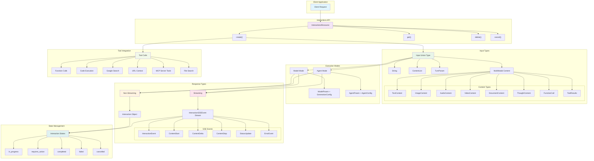

# Google GenAI Interactions API 类型分析

## 概述

Google GenAI 最新版本引入了全新的 Interactions API，这是一个高级的对话交互接口，提供了比传统 `generateContent` 更丰富的功能。该 API 支持多模态输入、流式响应、Agent 模式、工具调用等高级特性。

## 架构图



## 核心接口

### InteractionsResource

主要的资源类，提供以下方法：

- `create()` - 创建新的交互
- `get()` - 获取交互详情
- `delete()` - 删除交互
- `cancel()` - 取消后台运行的交互

## 输入类型 (Input)

### 基础输入类型

```python
Input: TypeAlias = Union[
    str,                           # 简单文本输入
    Iterable[ContentList],         # 内容列表
    Iterable[TurnParam],          # 对话轮次
    TextContentParam,             # 文本内容
    ImageContentParam,            # 图像内容
    AudioContentParam,            # 音频内容
    DocumentContentParam,         # 文档内容
    VideoContentParam,            # 视频内容
    ThoughtContentParam,          # 思考内容
    FunctionCallContentParam,     # 函数调用
    FunctionResultContentParam,   # 函数结果
    CodeExecutionCallContentParam,    # 代码执行调用
    CodeExecutionResultContentParam,  # 代码执行结果
    URLContextCallContentParam,       # URL上下文调用
    URLContextResultContentParam,     # URL上下文结果
    GoogleSearchCallContentParam,     # Google搜索调用
    GoogleSearchResultContentParam,   # Google搜索结果
    MCPServerToolCallContentParam,    # MCP服务器工具调用
    MCPServerToolResultContentParam,  # MCP服务器工具结果
    FileSearchResultContentParam,     # 文件搜索结果
]
```

### 对话轮次 (Turn)

```python
class TurnParam(TypedDict, total=False):
    content: Union[str, Iterable[ContentUnionMember1]]
    """对话内容"""

    role: str
    """角色：用户输入使用'user'，模型输出使用'model'"""
```

## 创建交互参数

### 模型交互参数

```python
class BaseCreateModelInteractionParams(TypedDict, total=False):
    input: Required[Input]
    """交互的输入内容"""

    model: Required[ModelParam]
    """用于生成交互的模型名称"""

    api_version: str

    background: bool
    """是否在后台运行模型交互"""

    generation_config: GenerationConfigParam
    """模型交互的配置参数"""

    previous_interaction_id: str
    """前一个交互的ID（如果有）"""

    response_format: object
    """强制生成的响应为符合指定JSON schema的JSON对象"""

    response_mime_type: str
    """响应的MIME类型。设置response_format时必需"""

    response_modalities: List[Literal["text", "image", "audio"]]
    """请求的响应模态（文本、图像、音频）"""

    store: bool
    """是否存储响应和请求以供后续检索"""

    system_instruction: str
    """交互的系统指令"""

    tools: Iterable[ToolParam]
    """模型在交互期间可能调用的工具声明列表"""
```

### Agent 交互参数

```python
class BaseCreateAgentInteractionParams(TypedDict, total=False):
    agent: Required[Union[str, Literal["deep-research-pro-preview-12-2025"]]]
    """用于生成交互的Agent名称"""

    input: Required[Input]
    """交互的输入内容"""

    agent_config: AgentConfig
    """Agent的配置"""

    # ... 其他参数与模型交互类似
```

## 响应类型

### Interaction 对象

```python
class Interaction(BaseModel):
    id: str
    """交互完成的唯一标识符"""

    status: Literal["in_progress", "requires_action", "completed", "failed", "cancelled"]
    """交互的状态"""

    agent: Union[str, Literal["deep-research-pro-preview-12-2025"], None] = None
    """用于生成交互的Agent名称"""

    created: Optional[datetime] = None
    """创建时间（ISO 8601格式）"""

    model: Optional[Model] = None
    """用于生成交互的模型名称"""

    object: Optional[Literal["interaction"]] = None
    """对象类型，始终为'interaction'"""

    outputs: Optional[List[Output]] = None
    """模型的响应"""

    previous_interaction_id: Optional[str] = None
    """前一个交互的ID"""

    role: Optional[str] = None
    """交互的角色"""

    updated: Optional[datetime] = None
    """最后更新时间（ISO 8601格式）"""

    usage: Optional[Usage] = None
    """交互请求的token使用统计"""
```

## 流式响应

### InteractionSSEEvent

```python
InteractionSSEEvent: TypeAlias = Union[
    InteractionEvent,           # 交互事件
    InteractionStatusUpdate,    # 状态更新
    ContentStart,              # 内容开始
    ContentDelta,              # 内容增量
    ContentStop,               # 内容结束
    ErrorEvent                 # 错误事件
]
```

### ContentDelta 详细结构

```python
class ContentDelta(BaseModel):
    delta: Optional[Delta] = None
    event_id: Optional[str] = None
    """用于恢复交互流的事件ID token"""

    event_type: Optional[Literal["content.delta"]] = None
    index: Optional[int] = None
```

Delta 支持的类型包括：

- `DeltaTextDelta` - 文本增量
- `DeltaImageDelta` - 图像增量
- `DeltaAudioDelta` - 音频增量
- `DeltaVideoDelta` - 视频增量
- `DeltaThoughtSummaryDelta` - 思考摘要增量
- `DeltaFunctionCallDelta` - 函数调用增量
- `DeltaCodeExecutionCallDelta` - 代码执行调用增量
- `DeltaMCPServerToolCallDelta` - MCP 服务器工具调用增量
- 等等...

## 特殊功能

### 1. Agent 模式

支持预定义的 Agent，如 `"deep-research-pro-preview-12-2025"`，用于深度研究任务。

### 2. 多模态支持

原生支持文本、图像、音频、视频、文档等多种输入和输出格式。

### 3. 工具调用

支持多种工具类型：

- 函数调用 (Function Call)
- 代码执行 (Code Execution)
- URL 上下文 (URL Context)
- Google 搜索 (Google Search)
- MCP 服务器工具 (MCP Server Tools)
- 文件搜索 (File Search)

### 4. 后台执行

支持后台运行长时间任务，可以通过 ID 查询状态和结果。

### 5. 流式响应

支持 Server-Sent Events (SSE)流式响应，实时获取生成内容。

### 6. 思考过程

支持 `ThoughtContent` 类型，可以展示模型的思考过程。

## API 使用模式

### 1. 基础模型交互

```python
# 非流式
interaction = client.interactions.create(
    input="Hello, world!",
    model="gemini-2.0-flash-exp"
)

# 流式
stream = client.interactions.create(
    input="Hello, world!",
    model="gemini-2.0-flash-exp",
    stream=True
)
```

### 2. Agent 交互

```python
interaction = client.interactions.create(
    agent="deep-research-pro-preview-12-2025",
    input="Research the latest developments in AI",
    agent_config={"max_iterations": 5}
)
```

### 3. 多轮对话

```python
interaction = client.interactions.create(
    input=[
        {"role": "user", "content": "What is Python?"},
        {"role": "model", "content": "Python is a programming language..."},
        {"role": "user", "content": "Show me an example"}
    ],
    model="gemini-2.0-flash-exp"
)
```

### 4. 工具调用

```python
interaction = client.interactions.create(
    input="What's the weather like today?",
    model="gemini-2.0-flash-exp",
    tools=[weather_tool]
)
```

## 与传统 API 的对比

| 特性       | Interactions API  | 传统 generateContent |
| ---------- | ----------------- | -------------------- |
| 多轮对话   | ✅ 原生支持       | ⚠️ 需要手动管理      |
| 流式响应   | ✅ SSE 事件流     | ✅ 基础流式          |
| 后台执行   | ✅ 支持           | ❌ 不支持            |
| Agent 模式 | ✅ 支持           | ❌ 不支持            |
| 状态管理   | ✅ 自动管理       | ❌ 需要手动管理      |
| 工具调用   | ✅ 丰富的工具类型 | ✅ 基础工具调用      |
| 思考过程   | ✅ 支持           | ❌ 不支持            |
| 多模态     | ✅ 全面支持       | ✅ 支持              |

## 总结

Google GenAI 的 Interactions API 代表了对话 AI 接口的重大升级，提供了更高级的抽象和更丰富的功能。它特别适合构建复杂的对话应用、Agent 系统和需要长时间运行的 AI 任务。这个 API 的设计理念更接近于现代 AI 应用的需求，为开发者提供了更强大和灵活的工具。
